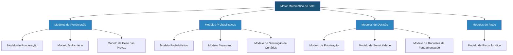

# 📊 10_MODELOS_MATEMATICOS — Modelos Matemáticos Aplicados ao Direito

## Visão Geral

Este diretório contém a documentação completa dos **Modelos Matemáticos** integrados ao Sigma—Juris Intelligence Framework (SJIF). Os modelos matemáticos representam a camada quantitativa do framework, transformando dados jurídicos brutos em métricas objetivas, probabilidades e índices que auxiliam a tomada de decisão estratégica no Direito.

> [!IMPORTANT]
> Os modelos matemáticos do SJIF **não substituem** o julgamento humano. Eles fornecem subsídios quantitativos para decisões que permanecem sob a responsabilidade do profissional do Direito.

## Arquitetura dos Modelos

## Conteúdo do Diretório

| Arquivo | Descrição |
|---------|-----------|
| [cap29_modelos_matematicos.md](cap29_modelos_matematicos.md) | **Capítulo 29** — Estatística, Modelos Preditivos, Modelos de Risco, Otimização |
| [modelo_ponderacao.md](modelo_ponderacao.md) | Modelo de Ponderação — Balanceamento de fatores jurídicos |
| [modelo_probabilistico.md](modelo_probabilistico.md) | Modelo Probabilístico — Estimativa de probabilidades de resultado |
| [modelo_multicriterio.md](modelo_multicriterio.md) | Modelo Multicritério — Avaliação com múltiplos critérios simultâneos |
| [modelo_bayesiano.md](modelo_bayesiano.md) | Modelo Bayesiano — Atualização de probabilidades com novas evidências |
| [modelo_sensibilidade.md](modelo_sensibilidade.md) | Modelo de Sensibilidade — Análise do impacto de variações nos parâmetros |
| [modelo_priorizacao.md](modelo_priorizacao.md) | Modelo de Priorização — Ordenamento de ações e demandas |
| [modelo_peso_provas.md](modelo_peso_provas.md) | Modelo de Peso das Provas — Valoração quantitativa de evidências |
| [modelo_robustez_fundamentacao.md](modelo_robustez_fundamentacao.md) | Modelo de Robustez da Fundamentação — Avaliação da solidez argumentativa |
| [modelo_risco_juridico.md](modelo_risco_juridico.md) | Modelo de Risco Jurídico — Quantificação de riscos legais |
| [modelo_simulacao_cenarios.md](modelo_simulacao_cenarios.md) | Modelo de Simulação de Cenários — Projeção de resultados possíveis |

## Capítulos Relacionados

- [Capítulo 20: Gestão de Riscos Jurídicos](../04_MOTORES/)
- [Capítulo 23: Motor de Coerência Jurídica](../04_MOTORES/)
- [Capítulo 24: Motor Decisório Jurídico](../04_MOTORES/)
- [Capítulo 27: Ontologia Jurídica](../14_ONTOLOGIA_GRAFO/cap27_ontologia_juridica.md)
- [Capítulo 28: Grafo de Conhecimento Jurídico](../14_ONTOLOGIA_GRAFO/cap28_grafo_conhecimento.md)
- [Capítulo 30: Inteligência Artificial Aplicada ao Direito](../11_INTELIGENCIA_ARTIFICIAL/cap30_ia_direito.md)
- [Capítulo 35: Biblioteca de Indicadores (KPIs e KRIs)](../09_INDICADORES/)
- [Capítulo 36: Biblioteca de Estratégias](../05_BIBLIOTECAS/)

## Princípios de Uso

1. **Transparência** — Todos os modelos devem ter seus parâmetros, fórmulas e premissas documentados e auditáveis
2. **Complementaridade** — Os resultados dos modelos complementam, mas não substituem, a análise qualitativa do jurista
3. **Calibração** — Os modelos devem ser continuamente calibrados com dados reais para manter sua precisão
4. **Integração** — Cada modelo se integra com os motores especializados do SJIF para alimentar análises mais complexas

---
> Sigma—Juris Intelligence Framework (SJIF) v1.0 | Propriedade de Charles de Paula Eugênio — Sigma Sihf Soluções Analíticas Ltda
