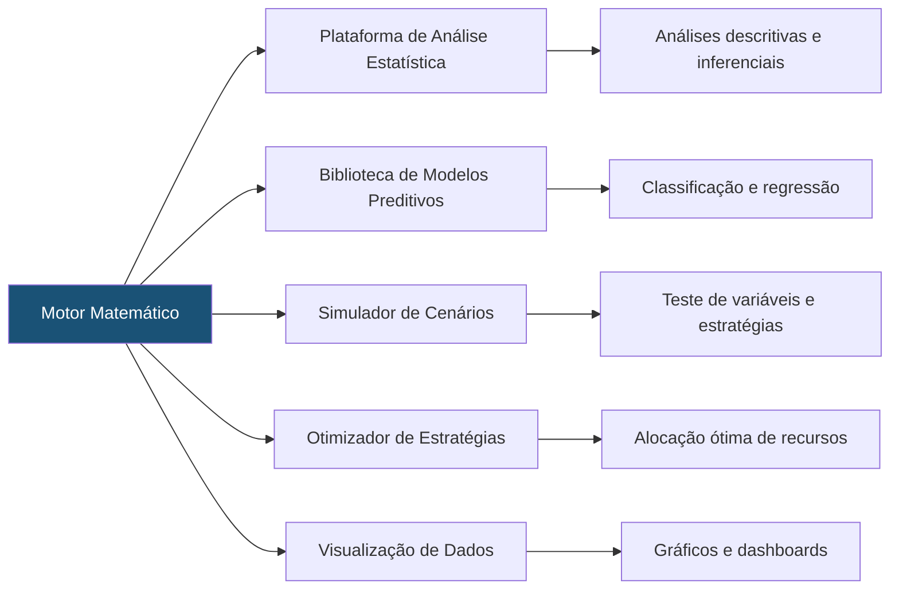

# Capítulo 29: Modelos Matemáticos Aplicados ao Direito

## 29.1 A Quantificação do Jurídico: Precisão e Previsibilidade

Tradicionalmente, o Direito é percebido como uma disciplina predominantemente qualitativa, focada na interpretação de normas e na argumentação. No entanto, a crescente disponibilidade de dados jurídicos e o avanço das ferramentas analíticas têm permitido a aplicação de **Modelos Matemáticos ao Direito**, introduzindo um novo nível de precisão e, em certos aspectos, previsibilidade.

No contexto do Sigma—Juris Intelligence Framework (SJIF), a aplicação de modelos matemáticos visa transformar dados brutos em **insights quantificáveis**, auxiliando na tomada de decisões estratégicas, na avaliação de riscos e na otimização de processos.

> [!NOTE]
> Os modelos matemáticos do SJIF operam como ferramentas analíticas complementares. A interpretação final e a responsabilidade pela decisão jurídica permanecem com o profissional do Direito.

---

## 29.2 Utilização de Estatística e Probabilidade na Análise Jurídica

A estatística e a probabilidade fornecem as ferramentas para quantificar fenômenos jurídicos, identificar padrões e inferir conclusões a partir de grandes volumes de dados. O SJIF emprega essas técnicas para ir além da análise anedótica.

### 29.2.1 Análise Descritiva

- **Frequência e Distribuição**: Medir a ocorrência de eventos jurídicos (ex.: número de processos por tipo, frequência de decisões favoráveis/desfavoráveis)
- **Medidas de Tendência Central**: Calcular médias, medianas e modas para entender o comportamento típico (ex.: tempo médio de tramitação, valor médio de condenações)
- **Medidas de Dispersão**: Avaliar a variabilidade dos dados (ex.: desvio padrão do tempo de julgamento, amplitude dos valores de indenização)

### 29.2.2 Análise Inferencial

- **Testes de Hipóteses**: Verificar se uma hipótese sobre um fenômeno jurídico é estatisticamente suportada pelos dados (ex.: se uma nova lei realmente reduziu o número de litígios)
- **Intervalos de Confiança**: Estimar um intervalo dentro do qual um parâmetro populacional provavelmente se encontra (ex.: a taxa de sucesso em um tipo de ação)
- **Correlação e Regressão**: Identificar relações entre variáveis (ex.: se o tempo de processo está correlacionado com o valor da causa; se a presença de certas provas prediz um resultado favorável)

### 29.2.3 Aplicações no SJIF

| Aplicação | Motor/Capítulo | Uso Estatístico |
|-----------|---------------|-----------------|
| Análise de Desempenho | Capítulo 18 | Quantificar performance de escritórios e departamentos |
| Auditoria Jurídica | Capítulo 22 | Avaliar probabilidade de passivos e contingências |
| Engenharia da Prova | Capítulo 8 | Estimar a força probatória de diferentes evidências |
| Gestão de Riscos | Capítulo 20 | Calcular probabilidades e impactos de riscos |

---

## 29.3 Modelagem Preditiva de Resultados e Riscos

A modelagem preditiva utiliza algoritmos matemáticos e estatísticos para prever resultados futuros com base em dados históricos. No Direito, isso se traduz na capacidade de estimar a probabilidade de sucesso em um litígio ou a ocorrência de um risco jurídico.

### 29.3.1 Modelos de Classificação

- **Regressão Logística**: Prever a probabilidade de um resultado binário (ex.: vitória/derrota) com base em variáveis como tipo de ação, tribunal, provas e julgador
- **Árvores de Decisão e Random Forests**: Construir modelos que classificam casos em diferentes categorias de resultado, identificando as variáveis mais influentes
- **Máquinas de Vetores de Suporte (SVM)**: Encontrar o hiperplano que melhor separa os casos em diferentes classes de resultado

### 29.3.2 Modelos de Regressão

- **Regressão Linear**: Prever um valor contínuo (ex.: o valor de uma indenização) com base em variáveis preditoras

### 29.3.3 Modelagem de Riscos

- **Modelos de Sobrevivência**: Estimar a probabilidade de um evento de risco (ex.: a materialização de um passivo) ocorrer ao longo do tempo
- **Simulações de Monte Carlo**: Simular milhares de cenários possíveis para avaliar a distribuição de resultados e o impacto de diferentes variáveis sobre os riscos

### 29.3.4 Desafios e Limitações

> [!WARNING]
> A aplicação de modelos preditivos ao Direito possui limitações intrínsecas que devem ser consideradas.

- **Qualidade dos Dados**: A precisão dos modelos depende da qualidade e da representatividade dos dados históricos
- **Complexidade do Direito**: A natureza multifacetada do Direito, com fatores subjetivos e éticos, impõe limites à previsibilidade puramente matemática
- **Interpretabilidade**: Alguns modelos mais complexos (ex.: redes neurais) podem ser difíceis de interpretar, o que é um desafio em um campo que exige justificativa e fundamentação

---

## 29.4 Otimização de Estratégias Processuais

Os modelos matemáticos podem ser utilizados para otimizar a alocação de recursos e a escolha de estratégias em litígios e negociações, buscando maximizar os resultados esperados.

### 29.4.1 Teoria dos Jogos

- **Análise de Interações Estratégicas**: Modelar as decisões de múltiplos agentes (partes, advogados, juízes) em um litígio, considerando possíveis ações e reações
- **Identificação de Equilíbrios de Nash**: Encontrar estratégias ótimas onde nenhum jogador tem incentivo para mudar sua ação, dadas as ações dos outros
- **Aplicação**: Avaliar a melhor estratégia para propor um acordo, contestar uma ação ou interpor um recurso

### 29.4.2 Programação Linear e Otimização

- **Alocação de Recursos**: Otimizar a distribuição de tempo e recursos (humanos, financeiros) em um portfólio de casos
- **Seleção de Estratégias**: Escolher a combinação de ações que maximiza a probabilidade de resultado desejado, dadas as restrições de recursos

### 29.4.3 Árvores de Decisão e Análise de Decisão

- **Modelagem de Cenários**: Representar graficamente as possíveis sequências de eventos e decisões em um processo
- **Cálculo de Valor Esperado**: Avaliar o valor esperado de cada caminho decisório, auxiliando na escolha da estratégia com melhor resultado médio

---

## 29.5 Os 10 Modelos Matemáticos do SJIF

O SJIF implementa **10 modelos matemáticos especializados**, cada um projetado para uma dimensão específica da análise jurídica:

| # | Modelo | Propósito Principal |
|---|--------|-------------------|
| 1 | [Modelo de Ponderação](modelo_ponderacao.md) | Balanceamento de fatores jurídicos conflitantes |
| 2 | [Modelo Probabilístico](modelo_probabilistico.md) | Estimativa de probabilidades de resultado |
| 3 | [Modelo Multicritério](modelo_multicriterio.md) | Avaliação com múltiplos critérios simultâneos |
| 4 | [Modelo Bayesiano](modelo_bayesiano.md) | Atualização de probabilidades com novas evidências |
| 5 | [Modelo de Sensibilidade](modelo_sensibilidade.md) | Análise de impacto de variações nos parâmetros |
| 6 | [Modelo de Priorização](modelo_priorizacao.md) | Ordenamento de ações e demandas |
| 7 | [Modelo de Peso das Provas](modelo_peso_provas.md) | Valoração quantitativa de evidências |
| 8 | [Modelo de Robustez da Fundamentação](modelo_robustez_fundamentacao.md) | Avaliação da solidez argumentativa |
| 9 | [Modelo de Risco Jurídico](modelo_risco_juridico.md) | Quantificação e classificação de riscos |
| 10 | [Modelo de Simulação de Cenários](modelo_simulacao_cenarios.md) | Projeção de resultados possíveis |

---

## 29.6 O Motor de Modelagem Matemática do SJIF

O **Motor de Modelagem Matemática** (parte do BLOCO V — Módulos e Motores Especializados) é o componente do SJIF que implementa e gerencia a aplicação dos modelos. Suas funcionalidades incluem:

- **Plataforma de Análise Estatística**: Ferramentas para análises descritivas e inferenciais sobre dados jurídicos
- **Biblioteca de Modelos Preditivos**: Implementações de algoritmos de classificação e regressão para prever resultados
- **Simulador de Cenários**: Permite testar diferentes estratégias e variáveis para entender seu impacto nos resultados
- **Otimizador de Estratégias**: Sugere a alocação de recursos e a escolha de ações que maximizem os objetivos
- **Visualização de Dados**: Apresenta os resultados de forma clara e intuitiva, através de gráficos e dashboards
- **Integração com Outros Motores**: Recebe dados do Motor Jurisprudencial, Motor de Gestão de Riscos e outros, e fornece insights quantitativos para o Motor Estratégico e o Motor Decisório Jurídico

---

## 29.7 Conclusão

Ao integrar Modelos Matemáticos, o SJIF capacita os profissionais do direito a tomar decisões mais informadas e estratégicas, baseadas em evidências quantificáveis. Ele transforma a **intuição em análise**, a **incerteza em probabilidade** e a **experiência em dados**, elevando a prática jurídica a um patamar de maior rigor científico e eficácia.

> [!TIP]
> A quantificação do jurídico, quando aplicada com ética e discernimento, torna-se uma poderosa ferramenta para a busca da justiça e da eficiência.

### Referências Cruzadas

- [Capítulo 8: Engenharia da Prova](../03_FRAMEWORK/)
- [Capítulo 20: Gestão de Riscos Jurídicos](../04_MOTORES/)
- [Capítulo 22: Auditoria Jurídica](../04_MOTORES/)
- [Capítulo 27: Ontologia Jurídica](../14_ONTOLOGIA_GRAFO/cap27_ontologia_juridica.md)
- [Capítulo 28: Grafo de Conhecimento Jurídico](../14_ONTOLOGIA_GRAFO/cap28_grafo_conhecimento.md)
- [Capítulo 30: Inteligência Artificial Aplicada ao Direito](../11_INTELIGENCIA_ARTIFICIAL/cap30_ia_direito.md)

---
> Sigma—Juris Intelligence Framework (SJIF) v1.0 | Propriedade de Charles de Paula Eugênio — Sigma Sihf Soluções Analíticas Ltda
