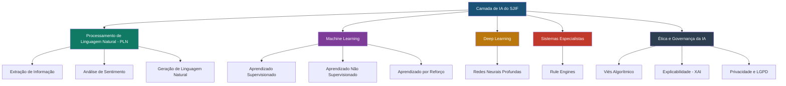

# 🤖 11_INTELIGENCIA_ARTIFICIAL — Inteligência Artificial Aplicada ao Direito

## Visão Geral

Este diretório contém a documentação completa da camada de **Inteligência Artificial** do Sigma—Juris Intelligence Framework (SJIF). A IA é uma capacidade transversal que permeia e potencializa todos os motores e módulos do framework, atuando como a força motriz que transforma dados jurídicos em inteligência acionável.

> [!IMPORTANT]
> A IA no SJIF é concebida como **Inteligência Jurídica Aumentada**: ela amplifica as capacidades do profissional do Direito sem substituir seu julgamento, ética e criatividade.

## Arquitetura da IA no SJIF

## Conteúdo do Diretório

### Capítulo Principal

| Arquivo | Descrição |
|---------|-----------|
| [cap30_ia_direito.md](cap30_ia_direito.md) | **Capítulo 30** — Tipos de IA, Aplicações, Desafios, Ética e Integração |

### Processamento de Linguagem Natural (PLN)

| Arquivo | Descrição |
|---------|-----------|
| [pln/extracao_informacao.md](pln/extracao_informacao.md) | Extração de entidades e relações de textos jurídicos |
| [pln/analise_sentimento.md](pln/analise_sentimento.md) | Análise de sentimento no contexto jurídico |
| [pln/geracao_linguagem.md](pln/geracao_linguagem.md) | Geração de linguagem natural para documentos jurídicos |

### Machine Learning

| Arquivo | Descrição |
|---------|-----------|
| [machine_learning/aprendizado_supervisionado.md](machine_learning/aprendizado_supervisionado.md) | Classificação e previsão com dados rotulados |
| [machine_learning/aprendizado_nao_supervisionado.md](machine_learning/aprendizado_nao_supervisionado.md) | Agrupamento e descoberta de padrões |
| [machine_learning/aprendizado_reforco.md](machine_learning/aprendizado_reforco.md) | Otimização de estratégias por tentativa e erro |

### Deep Learning

| Arquivo | Descrição |
|---------|-----------|
| [deep_learning/redes_neurais.md](deep_learning/redes_neurais.md) | Redes neurais para reconhecimento de padrões complexos |

### Sistemas Especialistas

| Arquivo | Descrição |
|---------|-----------|
| [sistemas_especialistas/rule_engines.md](sistemas_especialistas/rule_engines.md) | Motores de regras para raciocínio jurídico automatizado |

### Ética da IA

| Arquivo | Descrição |
|---------|-----------|
| [etica_ia/vies_algoritmico.md](etica_ia/vies_algoritmico.md) | Prevenção e mitigação de viés algorítmico |
| [etica_ia/explicabilidade.md](etica_ia/explicabilidade.md) | IA Explicável (XAI) — transparência nas decisões |
| [etica_ia/privacidade.md](etica_ia/privacidade.md) | Privacidade e conformidade com a LGPD |

## Capítulos Relacionados

- [Capítulo 23: Motor de Coerência Jurídica](../04_MOTORES/)
- [Capítulo 24: Motor Decisório Jurídico](../04_MOTORES/)
- [Capítulo 25: Módulo Jurídico Forense](../04_MOTORES/)
- [Capítulo 26: Motores Especializados](../04_MOTORES/)
- [Capítulo 27: Ontologia Jurídica](../14_ONTOLOGIA_GRAFO/cap27_ontologia_juridica.md)
- [Capítulo 28: Grafo de Conhecimento Jurídico](../14_ONTOLOGIA_GRAFO/cap28_grafo_conhecimento.md)
- [Capítulo 29: Modelos Matemáticos](../10_MODELOS_MATEMATICOS/cap29_modelos_matematicos.md)
- [Capítulo 40: Kernel Mestre Jurídico](../01_KERNEL/)

## Integração com Motores do SJIF

A IA se integra transversalmente com todos os motores:

| Motor | Uso da IA |
|-------|-----------|
| Motor de Coerência Jurídica | PLN + ML para identificar omissões e contradições |
| Motor Decisório Jurídico | ML + Estatística para padrões decisórios |
| Motor Normativo | PLN para consolidação e análise de vigência |
| Motor Jurisprudencial | ML para identificação de precedentes e evolução de teses |
| Grafo de Conhecimento | IA para extração de entidades e relações |
| Modelos Matemáticos | IA implementa algoritmos de modelagem preditiva |

---
> Sigma—Juris Intelligence Framework (SJIF) v1.0 | Propriedade de Charles de Paula Eugênio — Sigma Sihf Soluções Analíticas Ltda
