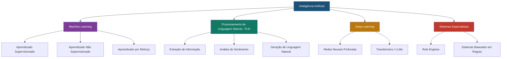
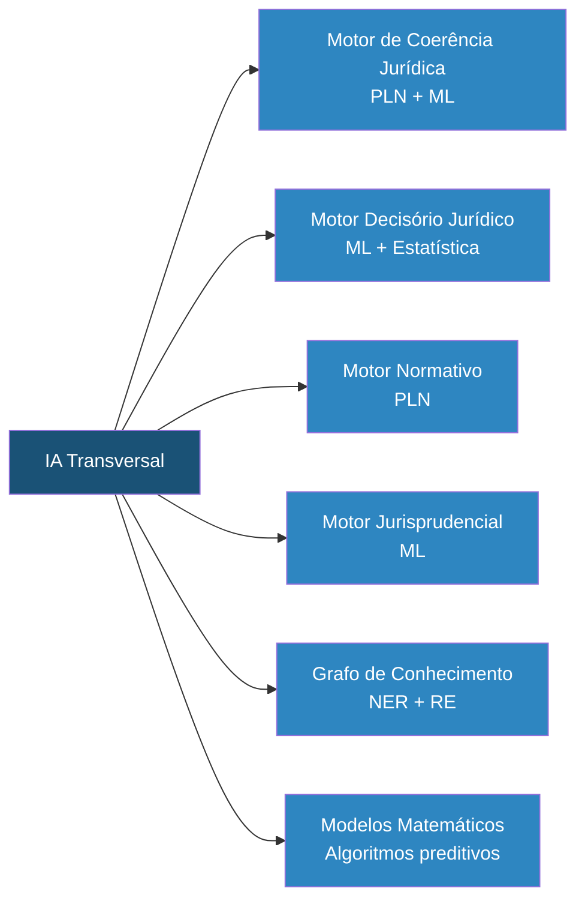

# Capítulo 30: Inteligência Artificial Aplicada ao Direito

## 30.1 A Revolução da IA no Cenário Jurídico: Novas Fronteiras para o SJIF

A **Inteligência Artificial (IA)** representa uma das mais significativas transformações tecnológicas da era moderna, e seu impacto no campo jurídico é profundo e crescente. Longe de ser uma mera ferramenta de automação, a IA aplicada ao Direito (Legal AI) abrange um conjunto de tecnologias que permitem a máquinas simular capacidades cognitivas humanas — como aprendizado, raciocínio, percepção e compreensão da linguagem — para auxiliar e aprimorar a prática jurídica.

No contexto do Sigma—Juris Intelligence Framework (SJIF), a IA é o **motor que impulsiona** a capacidade do sistema de processar vastos volumes de dados, identificar padrões complexos, gerar insights preditivos e otimizar a tomada de decisões.

> [!IMPORTANT]
> A IA no SJIF não visa substituir o profissional do Direito, mas sim ampliar suas capacidades, liberando-o de tarefas repetitivas e permitindo foco em atividades de maior valor agregado.

---

## 30.2 Definição e Tipos de Inteligência Artificial

### 30.2.1 Definição de IA

A IA pode ser definida como a capacidade de um sistema computacional de:
- **Perceber** seu ambiente
- **Raciocinar** sobre ele
- **Aprender** com a experiência
- **Tomar ações** que maximizem suas chances de atingir um objetivo

No contexto jurídico, isso se traduz em sistemas que podem analisar contratos, prever resultados de litígios ou auxiliar na pesquisa jurídica.

### 30.2.2 Tipos de IA Relevantes para o Direito

| Tipo | Descrição | Aplicação Jurídica |
|------|-----------|-------------------|
| **Machine Learning** | Sistemas que aprendem a partir de dados sem programação explícita | Classificação de documentos, previsão de resultados |
| **PLN** | Computadores que entendem, interpretam e geram linguagem humana | Análise de textos jurídicos, extração de entidades |
| **Deep Learning** | Redes neurais com múltiplas camadas para representações de dados complexas | Reconhecimento de padrões, PLN avançado |
| **Sistemas Especialistas** | Sistemas baseados em regras que emulam conhecimento de especialistas | Aconselhamento jurídico automatizado |

Para detalhamento de cada tipo, consulte os subdiretórios especializados:
- [Machine Learning](machine_learning/)
- [PLN](pln/)
- [Deep Learning](deep_learning/)
- [Sistemas Especialistas](sistemas_especialistas/)

---

## 30.3 Aplicações da Inteligência Artificial no Direito

A IA tem revolucionado diversas áreas da prática jurídica, oferecendo soluções inovadoras para desafios antigos.

### 30.3.1 Pesquisa Jurídica Avançada

- **Busca Semântica**: Motores que entendem o significado dos termos, retornando resultados mais relevantes (Motor Normativo, Jurisprudencial e Doutrinário)
- **Análise de Precedentes**: Identificação automática de precedentes vinculantes e jurisprudência dominante

### 30.3.2 Análise e Revisão de Documentos

- **Extração de Cláusulas e Dados**: Extração automática de cláusulas, datas, partes e valores de contratos
- **Revisão Contratual**: Comparar contratos com modelos padrão, identificar inconsistências e cláusulas de risco
- **Análise de Petições e Sentenças**: Identificar argumentos, fatos, provas e decisões em documentos processuais

### 30.3.3 Previsão de Resultados e Avaliação de Riscos

- **Modelagem Preditiva**: Machine Learning para prever probabilidade de sucesso em litígios (Capítulo 29)
- **Análise de Padrões Decisórios**: Identificar tendências e preferências de julgadores (Motor Decisório Jurídico)

### 30.3.4 Automação de Tarefas

- **Geração de Documentos**: Automação da criação de petições, contratos e pareceres
- **Gestão de Processos**: Automatizar acompanhamento de prazos, organização de documentos e comunicação com clientes

### 30.3.5 Compliance e Governança

- **Monitoramento de Conformidade**: IA para monitorar grandes volumes de dados e identificar violações
- **Análise de Riscos**: Identificar e avaliar riscos de não conformidade, corrupção e fraude

---

## 30.4 Desafios e Considerações Éticas na Aplicação da IA no Direito

### 30.4.1 Desafios Técnicos

| Desafio | Descrição |
|---------|-----------|
| **Qualidade dos Dados** | Eficácia depende de dados jurídicos de qualidade, volume e representatividade |
| **Complexidade da Linguagem** | Ambiguidade, vagueza e especificidade da linguagem jurídica |
| **Interpretabilidade** | Modelos de Deep Learning podem ser "caixas pretas" |

### 30.4.2 Desafios Éticos e Regulatórios

> [!CAUTION]
> A aplicação da IA no Direito levanta questões éticas críticas que devem ser abordadas com rigor.

- **Viés Algorítmico**: Dados de treinamento com preconceitos históricos podem perpetuar ou amplificar discriminações → Ver [etica_ia/vies_algoritmico.md](etica_ia/vies_algoritmico.md)
- **Responsabilidade**: Definição de responsabilidade por erros ou falhas de sistemas de IA
- **Transparência e Explicabilidade**: Necessidade de decisões compreensíveis e justificáveis → Ver [etica_ia/explicabilidade.md](etica_ia/explicabilidade.md)
- **Privacidade e Proteção de Dados**: Conformidade com LGPD e regulamentos de proteção de dados → Ver [etica_ia/privacidade.md](etica_ia/privacidade.md)
- **Autonomia Profissional**: IA como auxiliar, não substituta do profissional do Direito
- **Acesso à Justiça**: IA pode democratizar o acesso à informação, mas não deve criar novas barreiras digitais

---

## 30.5 Integração da IA nos Motores do SJIF

No SJIF, a Inteligência Artificial não é um módulo isolado, mas uma **capacidade transversal** que permeia e potencializa todos os motores e módulos.

### 30.5.1 Exemplos de Integração

| Motor | Tecnologia de IA | Função |
|-------|-----------------|--------|
| Motor de Coerência Jurídica (Cap. 23) | PLN + ML | Identificar omissões, contradições e fragilidades |
| Motor Decisório Jurídico (Cap. 24) | ML + Estatística | Identificar padrões decisórios e simular raciocínios |
| Motor Normativo (Cap. 26) | PLN | Consolidar normas, analisar vigência, identificar conflitos |
| Motor Jurisprudencial (Cap. 26) | ML | Identificar precedentes e mapear evolução de teses |
| Grafo de Conhecimento (Cap. 28) | NER + Extração de Relações | Construir e enriquecer o grafo |
| Modelos Matemáticos (Cap. 29) | Algoritmos de ML | Modelagem preditiva e otimização |

---

## 30.6 O Futuro da IA no SJIF: Rumo à Inteligência Jurídica Aumentada

O SJIF, ao integrar a Inteligência Artificial de forma estratégica e ética, busca criar um sistema de **inteligência jurídica aumentada**. Isso significa que a IA amplifica as capacidades do profissional, liberando-o para:

- **Formulação de estratégias complexas**
- **Negociação e aconselhamento estratégico**
- **Exercício do julgamento ético e criativo**

> [!TIP]
> A IA no SJIF é uma aliada poderosa na busca por uma justiça mais eficiente, acessível e previsível, impulsionando a evolução da prática jurídica para um novo patamar de excelência e inovação.

### Referências Cruzadas

- [Capítulo 23: Motor de Coerência Jurídica](../04_MOTORES/)
- [Capítulo 24: Motor Decisório Jurídico](../04_MOTORES/)
- [Capítulo 25: Módulo Jurídico Forense](../04_MOTORES/)
- [Capítulo 27: Ontologia Jurídica](../14_ONTOLOGIA_GRAFO/cap27_ontologia_juridica.md)
- [Capítulo 28: Grafo de Conhecimento Jurídico](../14_ONTOLOGIA_GRAFO/cap28_grafo_conhecimento.md)
- [Capítulo 29: Modelos Matemáticos](../10_MODELOS_MATEMATICOS/cap29_modelos_matematicos.md)
- [Capítulo 40: Kernel Mestre Jurídico](../01_KERNEL/)

---
> Sigma—Juris Intelligence Framework (SJIF) v1.0 | Propriedade de Charles de Paula Eugênio — Sigma Sihf Soluções Analíticas Ltda
