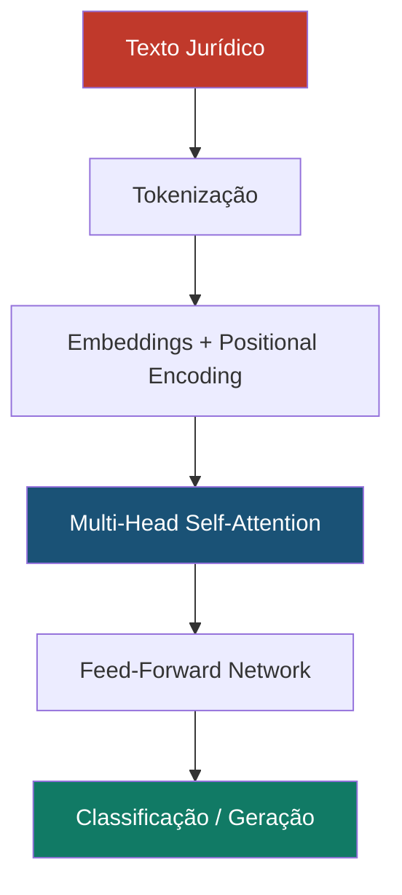

# Redes Neurais para Reconhecimento de Padrões Jurídicos Complexos

## Visão Geral

As **Redes Neurais Artificiais** e o **Deep Learning** representam a fronteira mais avançada do Machine Learning, utilizando arquiteturas inspiradas no cérebro humano com múltiplas camadas de neurônios artificiais para aprender representações hierárquicas de dados. No SJIF, redes neurais profundas são aplicadas em tarefas que exigem compreensão contextual de linguagem jurídica, reconhecimento de padrões complexos e processamento de informações não estruturadas em escala.

---

## Arquiteturas Principais

### Transformer (Arquitetura Dominante em PLN Jurídico)

| Modelo | Base | Uso no SJIF |
|--------|------|------------|
| **BERT** | Encoder (bidirecional) | Classificação de documentos, NER, análise de sentimento |
| **GPT** | Decoder (autorregressivo) | Geração de texto jurídico, sumarização |
| **BERTimbau** | BERT treinado em português | PLN jurídico em pt-BR |
| **Legal-BERT** | BERT fine-tuned em corpus legal | Tarefas específicas do domínio jurídico |
| **T5** | Encoder-Decoder | Tradução, sumarização, Q&A jurídico |

### Redes Recorrentes (LSTM / GRU)

| Arquitetura | Uso no SJIF |
|------------|------------|
| **LSTM** | Análise sequencial de textos longos, captura de dependências temporais |
| **Bi-LSTM** | NER e classificação de sequências jurídicas |

### Redes Convolucionais (CNN para Texto)

| Arquitetura | Uso no SJIF |
|------------|------------|
| **TextCNN** | Classificação rápida de documentos curtos |
| **CNN + Attention** | Identificação de cláusulas relevantes em contratos |

### Graph Neural Networks (GNN)

| Arquitetura | Uso no SJIF |
|------------|------------|
| **GCN** | Raciocínio sobre o Grafo de Conhecimento Jurídico |
| **GAT** | Identificação de padrões em redes de relações jurídicas |

---

## Aplicações no SJIF

### PLN Avançado

- **Compreensão de linguagem jurídica**: Entender o significado contextual de termos ambíguos
- **Sumarização de documentos longos**: Resumir sentenças, acórdãos e peças processuais
- **Pergunta e Resposta (Q&A)**: Responder perguntas sobre legislação, jurisprudência e processos
- **Tradução jurídica**: Traduzir conceitos entre diferentes tradições jurídicas

### Reconhecimento de Padrões Complexos

- **Padrões decisórios**: Identificar tendências de julgadores que transcendem análises estatísticas simples
- **Detecção de fraudes**: Identificar padrões de comportamento processual que indicam fraude
- **Análise de similaridade**: Encontrar casos similares em bases com milhões de processos

### Processamento Multimodal

- **OCR inteligente**: Extrair texto de documentos escaneados com baixa qualidade
- **Análise de documentos manuscritos**: Processar documentos históricos ou manuscritos

---

## Pipeline de Deep Learning no SJIF

1. **Pré-treinamento**: Modelo base treinado em grande corpus de texto (geral ou jurídico)
2. **Fine-tuning**: Ajuste do modelo com dados jurídicos específicos (rotulados)
3. **Avaliação**: Métricas de performance em conjunto de teste
4. **Deploy**: Integração como API nos motores do SJIF
5. **Monitoramento**: Acompanhamento contínuo da performance em produção

---

## Desafios Específicos

> [!WARNING]
> Redes neurais profundas apresentam desafios importantes no contexto jurídico.

- **Opacidade ("Caixa Preta")**: Difícil explicar como o modelo chegou a uma conclusão — ver [Explicabilidade](../etica_ia/explicabilidade.md)
- **Custo computacional**: Treinamento e inferência podem exigir hardware especializado (GPUs)
- **Dados de treinamento**: Necessidade de grandes volumes de dados jurídicos de qualidade
- **Alucinação**: Modelos generativos podem inventar leis, artigos ou jurisprudência inexistentes
- **Viés amplificado**: Redes neurais podem amplificar vieses presentes nos dados — ver [Viés Algorítmico](../etica_ia/vies_algoritmico.md)
- **Atualizabilidade**: Dificuldade em incorporar mudanças legislativas sem retreinamento

---

## Integração com Motores do SJIF

| Motor | Uso de Redes Neurais |
|-------|---------------------|
| **Motor de Coerência** (Cap. 23) | Análise semântica profunda de consistência argumentativa |
| **Motor Decisório Jurídico** (Cap. 24) | Análise de padrões decisórios complexos |
| **Motor Normativo** (Cap. 26) | Compreensão e consolidação de normas |
| **Motor Jurisprudencial** (Cap. 26) | Busca semântica e análise de similaridade |
| **Grafo de Conhecimento** (Cap. 28) | GNNs para raciocínio sobre o grafo |
| **MJF** (Cap. 25) | PLN avançado para análise documental integral |

### Referências Cruzadas

- [Capítulo 30: Inteligência Artificial](../cap30_ia_direito.md)
- [Aprendizado Supervisionado](../machine_learning/aprendizado_supervisionado.md)
- [Extração de Informação](../pln/extracao_informacao.md)
- [Geração de Linguagem Natural](../pln/geracao_linguagem.md)
- [Explicabilidade (XAI)](../etica_ia/explicabilidade.md)
- [Viés Algorítmico](../etica_ia/vies_algoritmico.md)

---
> Sigma—Juris Intelligence Framework (SJIF) v1.0 | Propriedade de Charles de Paula Eugênio — Sigma Sihf Soluções Analíticas Ltda
