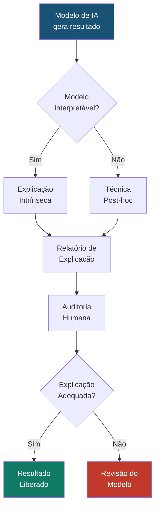

# IA Explicável (Explainable AI — XAI)

## Visão Geral

A **IA Explicável (XAI — eXplainable Artificial Intelligence)** é o conjunto de técnicas e princípios que permitem que as decisões, predições e recomendações de sistemas de IA sejam compreensíveis por seres humanos. No Direito, onde a **fundamentação** é um princípio constitucional (art. 93, IX, CF/88) e onde toda decisão deve ser justificada, a explicabilidade não é um luxo — é uma **necessidade jurídica**.

No SJIF, a XAI é um princípio transversal que se aplica a todos os motores e modelos, garantindo que o profissional do Direito possa compreender, auditar e confiar nos insights gerados pelo sistema.

---

## Por que a Explicabilidade é Essencial no Direito?

> [!IMPORTANT]
> No Direito, diferentemente de outros domínios, a explicabilidade não é opcional — é um **requisito legal e constitucional**.

| Fundamento | Base Legal | Implicação |
|-----------|-----------|-----------|
| **Fundamentação das Decisões** | Art. 93, IX, CF/88 | Toda decisão deve ser fundamentada |
| **Revisão de Decisões Automatizadas** | Art. 20, LGPD | Direito de solicitar revisão por humano |
| **Contraditório e Ampla Defesa** | Art. 5º, LV, CF/88 | Partes devem poder contestar o raciocínio |
| **Devido Processo Legal** | Art. 5º, LIV, CF/88 | Processo deve ser justo e transparente |
| **Motivação de Atos Administrativos** | Art. 50, Lei 9.784/99 | Atos devem ser motivados |

---

## Técnicas de XAI no SJIF

### Explicabilidade Intrínseca (Modelos Interpretáveis por Design)

| Técnica | Descrição | Uso no SJIF |
|---------|-----------|------------|
| **Árvores de Decisão** | Modelo com regras visíveis em formato de árvore | Classificação de processos |
| **Regressão Logística** | Coeficientes indicam influência de cada variável | Previsão de resultados |
| **Sistemas de Regras** | Regras IF-THEN explícitas | Verificação de prazos e requisitos |
| **Modelos Lineares** | Contribuição linear de cada variável | Estimativa de valores |

### Explicabilidade Post-hoc (Explica Modelos "Caixa Preta")

| Técnica | Descrição | Uso no SJIF |
|---------|-----------|------------|
| **LIME** | Explica predições individuais com aproximação local | Por que esta petição foi classificada como X? |
| **SHAP** | Valores de Shapley para contribuição de cada feature | Quais fatores mais influenciaram o resultado? |
| **Attention Maps** | Visualiza quais partes do texto o modelo "olhou" | Quais trechos da sentença foram mais relevantes? |
| **Counterfactual Explanations** | "O resultado mudaria se..." | Se o prazo fosse diferente, o recurso seria admissível? |

---

## Framework de Explicabilidade do SJIF

### Níveis de Explicação

| Nível | Público-Alvo | Tipo de Explicação |
|-------|-------------|-------------------|
| **Técnico** | Data Scientists, Desenvolvedores | SHAP values, métricas, logs |
| **Profissional** | Advogados, Juristas | Fatores decisivos, regras aplicadas, precedentes |
| **Executivo** | Gestores, Diretores | Resumo visual, confiança, riscos |
| **Judicial** | Juízes, Tribunais | Fundamentação auditável, cadeia de raciocínio |

---

## Requisitos de Explicabilidade por Motor

| Motor | Requisito de Explicabilidade |
|-------|------------------------------|
| **Motor Decisório Jurídico** (Cap. 24) | Explicar quais fatores levaram à previsão de resultado |
| **Motor de Coerência** (Cap. 23) | Mostrar exatamente quais regras de consistência foram violadas |
| **Motor de Gestão de Riscos** (Cap. 26) | Detalhar como probabilidade e impacto foram calculados |
| **Motor Jurisprudencial** (Cap. 26) | Explicar critérios de similaridade entre precedentes |
| **Modelos Matemáticos** (Cap. 29) | Documentar fórmulas, parâmetros e premissas |

---

## Desafios

- **Trade-off Performance vs. Interpretabilidade**: Modelos mais explicáveis tendem a ser menos precisos
- **Explicações Enganosas**: Uma explicação simples pode não refletir a complexidade real do modelo
- **Escala**: Gerar explicações para milhares de decisões automatizadas
- **Subjetividade**: O que é uma explicação "suficiente" varia entre públicos
- **Custo Computacional**: Técnicas como SHAP podem ser computacionalmente caras

---

## Integração com Motores do SJIF

| Motor | Uso da XAI |
|-------|-----------|
| **Todos os Motores** | Geração de explicações para cada insight produzido |
| **Motor de Auditoria** (Cap. 26) | Auditoria da qualidade das explicações |
| **Motor de Compliance** (Cap. 26) | Verificação de conformidade com requisitos de explicabilidade |
| **Grafo de Conhecimento** (Cap. 28) | Visualização do caminho de raciocínio no grafo |

### Referências Cruzadas

- [Capítulo 30: Inteligência Artificial](../cap30_ia_direito.md)
- [Viés Algorítmico](vies_algoritmico.md)
- [Privacidade e LGPD](privacidade.md)
- [Sistemas Especialistas — Rule Engines](../sistemas_especialistas/rule_engines.md)
- [Deep Learning — Redes Neurais](../deep_learning/redes_neurais.md)

---
> Sigma—Juris Intelligence Framework (SJIF) v1.0 | Propriedade de Charles de Paula Eugênio — Sigma Sihf Soluções Analíticas Ltda
