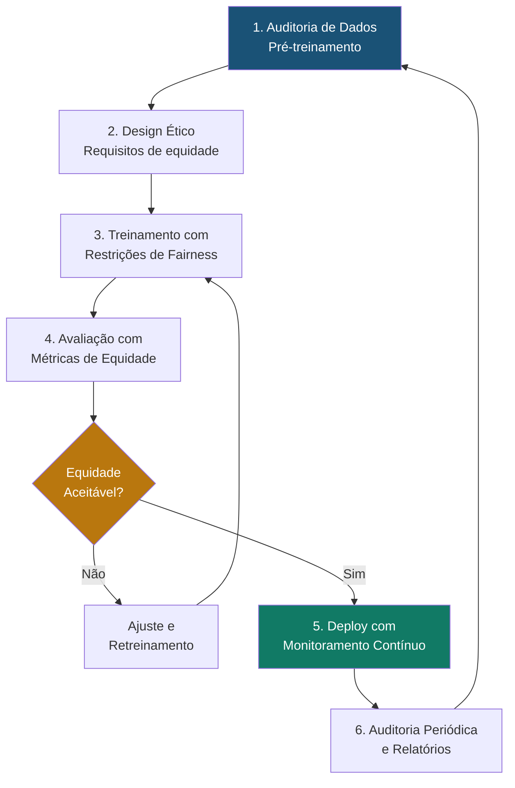

# Prevenção e Mitigação de Viés Algorítmico

## Visão Geral

O **Viés Algorítmico** é uma das preocupações éticas mais críticas na aplicação de Inteligência Artificial ao Direito. Ocorre quando sistemas de IA produzem resultados sistematicamente injustos, discriminatórios ou distorcidos, geralmente como reflexo de preconceitos presentes nos dados de treinamento, nas escolhas de design ou nas premissas do modelo. No campo jurídico, onde decisões podem afetar direitos fundamentais, liberdade e patrimônio, a prevenção do viés algorítmico é uma **prioridade ética inegociável** do SJIF.

---

## Tipos de Viés no Contexto Jurídico

| Tipo de Viés | Descrição | Exemplo Jurídico |
|-------------|-----------|-----------------|
| **Viés de Dados Históricos** | Dados refletem discriminações passadas | Modelos treinados em decisões históricas podem perpetuar preconceitos raciais ou de gênero |
| **Viés de Seleção** | Dados de treinamento não representam a população | Treinar apenas com casos de grandes centros urbanos |
| **Viés de Confirmação** | Modelo reforça padrões existentes | Sistema que prioriza teses que já são dominantes, ignorando argumentos inovadores |
| **Viés de Proxy** | Variável substituta captura indiretamente atributos protegidos | CEP como proxy para raça/classe social |
| **Viés de Agregação** | Tratar grupos heterogêneos como homogêneos | Aplicar mesma análise para jurisdições com tradições muito distintas |
| **Viés de Medição** | Métricas de avaliação favorecem certos grupos | Acurácia global alta, mas performance péssima em casos de minorias |

---

## Estratégias de Prevenção no SJIF

### Pré-Processamento (Antes do Treinamento)

1. **Auditoria de Dados**: Analisar distribuições nos dados de treinamento para identificar sub-representações
2. **Balanceamento**: Técnicas de oversampling/undersampling para equilibrar classes
3. **Remoção de Proxies**: Identificar e remover variáveis que atuam como proxies de atributos protegidos
4. **Diversificação de Fontes**: Incluir dados de múltiplas jurisdições, tribunais e períodos

### In-Processing (Durante o Treinamento)

1. **Regularização de Fairness**: Adicionar penalidades de equidade à função de custo
2. **Restrições de Equidade**: Forçar o modelo a atender critérios de equidade (demographic parity, equalized odds)
3. **Treinamento Adversarial**: Treinar modelo para não ser capaz de prever atributos protegidos

### Pós-Processamento (Após o Treinamento)

1. **Calibração**: Ajustar probabilidades para serem equitativas entre grupos
2. **Threshold Adjustment**: Ajustar limiares de decisão por grupo para equalizar métricas
3. **Auditoria Contínua**: Monitorar outputs em produção para detectar viés emergente

---

## Métricas de Equidade

| Métrica | Descrição | Fórmula Simplificada |
|---------|-----------|---------------------|
| **Demographic Parity** | Taxa de resultado positivo igual entre grupos | P(Ŷ=1\|G=a) = P(Ŷ=1\|G=b) |
| **Equalized Odds** | Taxa de verdadeiros positivos igual entre grupos | P(Ŷ=1\|Y=1,G=a) = P(Ŷ=1\|Y=1,G=b) |
| **Predictive Parity** | Precisão igual entre grupos | P(Y=1\|Ŷ=1,G=a) = P(Y=1\|Ŷ=1,G=b) |
| **Individual Fairness** | Casos similares recebem tratamentos similares | d(f(x), f(x')) ≤ ε quando d(x, x') ≤ δ |

---

## Framework de Governança Anti-Viés do SJIF

---

## Marco Legal e Normativo

> [!IMPORTANT]
> O viés algorítmico não é apenas uma questão ética, mas também legal no contexto brasileiro.

- **Constituição Federal**: Art. 5º — Princípio da igualdade e da não discriminação
- **LGPD (Lei 13.709/2018)**: Art. 20 — Direito de revisão de decisões automatizadas
- **Marco Civil da Internet**: Princípios de neutralidade e não discriminação
- **Projeto de Lei sobre IA**: Regulamentação específica em discussão no Congresso Nacional
- **Regulamento Europeu de IA (EU AI Act)**: Referência internacional para IA de alto risco

---

## Integração com Motores do SJIF

| Motor | Medida Anti-Viés |
|-------|-----------------|
| **Motor Decisório Jurídico** (Cap. 24) | Auditoria de viés em padrões decisórios |
| **Motor de Compliance** (Cap. 26) | Verificação de conformidade com normas anti-discriminação |
| **Motor de Coerência** (Cap. 23) | Detecção de viés na argumentação |
| **Todos os Motores** | Monitoramento contínuo e relatórios de equidade |

### Referências Cruzadas

- [Capítulo 30: Inteligência Artificial](../cap30_ia_direito.md)
- [Explicabilidade (XAI)](explicabilidade.md)
- [Privacidade e LGPD](privacidade.md)
- [Aprendizado Supervisionado](../machine_learning/aprendizado_supervisionado.md)

---
> Sigma—Juris Intelligence Framework (SJIF) v1.0 | Propriedade de Charles de Paula Eugênio — Sigma Sihf Soluções Analíticas Ltda
