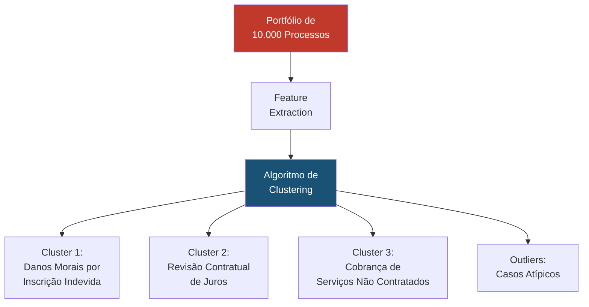

# Aprendizado Não Supervisionado para Agrupamento Jurídico

## Visão Geral

O **Aprendizado Não Supervisionado** é a técnica de Machine Learning que identifica padrões, estruturas e agrupamentos em dados não rotulados — ou seja, sem que as respostas corretas sejam fornecidas previamente. No SJIF, esta técnica é utilizada para descobrir padrões ocultos em grandes volumes de dados jurídicos, agrupar documentos semelhantes, identificar temas emergentes na jurisprudência e segmentar portfólios de processos.

---

## Técnicas Principais

### Algoritmos de Clustering (Agrupamento)

| Algoritmo | Descrição | Uso no SJIF |
|-----------|-----------|------------|
| **K-Means** | Agrupa dados em K clusters por proximidade de centroide | Agrupamento de processos por similaridade |
| **DBSCAN** | Agrupa por densidade, detecta outliers | Identificar processos atípicos |
| **Hierarchical Clustering** | Gera dendrograma hierárquico de agrupamentos | Taxonomia de tipos de ação |
| **LDA (Latent Dirichlet Allocation)** | Modelagem de tópicos em textos | Descobrir temas em jurisprudência |

### Técnicas de Redução de Dimensionalidade

| Técnica | Descrição | Uso no SJIF |
|---------|-----------|------------|
| **PCA** | Reduz dimensões preservando variância | Visualizar padrões em dados processuais |
| **t-SNE** | Reduz para visualização 2D/3D | Mapas visuais de jurisprudência |
| **UMAP** | Preserva estrutura local e global | Exploração de clusters de documentos |

---

## Aplicações Jurídicas

### Agrupamento de Processos

### Descoberta de Temas Jurisprudenciais

- Aplicar LDA em milhares de acórdãos para identificar temas recorrentes
- Detectar temas emergentes que ainda não foram formalizados em súmulas
- Mapear a evolução temática da jurisprudência ao longo do tempo

### Segmentação de Clientes

- Agrupar clientes por perfil de risco jurídico
- Identificar padrões de comportamento em litigantes frequentes
- Personalizar estratégias por segmento

### Detecção de Anomalias

- Identificar processos com valores ou prazos fora do padrão
- Detectar fraudes processuais por comportamento atípico
- Alertar sobre decisões que fogem significativamente do padrão do tribunal

---

## Métricas de Avaliação

| Métrica | O que mede |
|---------|-----------|
| **Silhouette Score** | Qualidade da separação entre clusters (-1 a +1) |
| **Davies-Bouldin Index** | Dispersão e separação entre clusters (menor = melhor) |
| **Coerência de Tópicos** | Qualidade semântica dos temas descobertos (LDA) |
| **Inertia** | Soma das distâncias intra-cluster (K-Means) |

---

## Desafios no Domínio Jurídico

- **Alta dimensionalidade**: Textos jurídicos longos geram vetores de alta dimensão
- **Interpretabilidade dos clusters**: Clusters precisam fazer sentido jurídico
- **Definição de K**: Nem sempre é claro quantos agrupamentos existem
- **Dados heterogêneos**: Processos de diferentes ramos do Direito podem ter características muito distintas
- **Evolução temporal**: Clusters podem mudar ao longo do tempo com novas tendências

---

## Integração com Motores do SJIF

| Motor | Uso do Aprendizado Não Supervisionado |
|-------|--------------------------------------|
| **Motor Jurisprudencial** (Cap. 26) | Descoberta de temas e agrupamento de decisões |
| **Motor de Gestão de Riscos** (Cap. 26) | Segmentação de riscos por tipo e impacto |
| **Motor Normativo** (Cap. 26) | Agrupamento de normas por tema e aplicabilidade |
| **Grafo de Conhecimento** (Cap. 28) | Identificação de comunidades no grafo |
| **Motor de Compliance** (Cap. 26) | Detecção de anomalias e padrões suspeitos |

### Referências Cruzadas

- [Capítulo 30: Inteligência Artificial](../cap30_ia_direito.md)
- [Aprendizado Supervisionado](aprendizado_supervisionado.md)
- [Aprendizado por Reforço](aprendizado_reforco.md)
- [Deep Learning — Redes Neurais](../deep_learning/redes_neurais.md)

---
> Sigma—Juris Intelligence Framework (SJIF) v1.0 | Propriedade de Charles de Paula Eugênio — Sigma Sihf Soluções Analíticas Ltda
