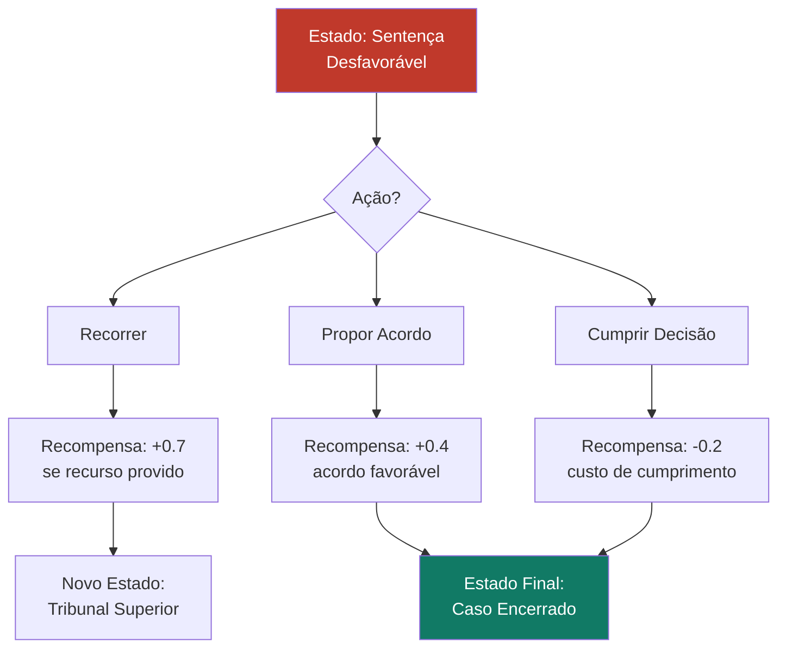

# Aprendizado por Reforço para Otimização de Estratégias Jurídicas

## Visão Geral

O **Aprendizado por Reforço (Reinforcement Learning — RL)** é a técnica de Machine Learning na qual um agente aprende a tomar decisões sequenciais ótimas em um ambiente, recebendo recompensas ou punições como feedback de suas ações. Diferente do aprendizado supervisionado, não há dados rotulados — o agente aprende pela experimentação, por tentativa e erro.

No SJIF, o RL é explorado como uma fronteira avançada para a otimização de estratégias jurídicas, onde as decisões sequenciais (quando recorrer, quando propor acordo, qual argumento enfatizar) são modeladas como um processo de decisão que pode ser otimizado ao longo do tempo.

---

## Conceitos Fundamentais

| Conceito | Descrição | Analogia Jurídica |
|----------|-----------|-------------------|
| **Agente** | O sistema que toma decisões | O motor estratégico do SJIF |
| **Ambiente** | O contexto onde o agente opera | O sistema judicial e o caso concreto |
| **Estado** | Situação atual do ambiente | Fase processual, provas disponíveis, julgador |
| **Ação** | Decisão tomada pelo agente | Interpor recurso, propor acordo, juntar prova |
| **Recompensa** | Feedback da ação tomada | Resultado favorável, redução de custo |
| **Política** | Estratégia de decisão do agente | Plano de ação processual |

---

## Aplicações Jurídicas

### Otimização de Estratégias Processuais

### Negociação Automatizada

- Modelar estratégias de proposta e contraproposta em negociações
- Aprender a identificar o momento ótimo para fazer concessões
- Otimizar o valor de acordos com base em histórico de negociações

### Gestão de Portfólio de Processos

- Aprender a alocar recursos entre processos de forma a maximizar resultados totais
- Decidir quando investir mais recursos em um caso vs. buscar acordo
- Otimizar a sequência de ações em múltiplos processos simultâneos

### Seleção de Argumentos

- Aprender qual combinação de argumentos maximiza a probabilidade de acolhimento
- Adaptar a estratégia argumentativa ao perfil de cada julgador
- Otimizar a ordem de apresentação dos argumentos

---

## Algoritmos de RL Aplicáveis

| Algoritmo | Descrição | Aplicação |
|-----------|-----------|-----------|
| **Q-Learning** | Aprende valor de cada ação em cada estado | Decisões processuais simples |
| **Deep Q-Network (DQN)** | Q-Learning com redes neurais | Cenários com estados complexos |
| **Policy Gradient** | Otimiza diretamente a política de ação | Estratégias de negociação |
| **Actor-Critic (A3C)** | Combina estimativa de valor e política | Gestão dinâmica de portfólio |

---

## Desafios no Domínio Jurídico

> [!CAUTION]
> O Aprendizado por Reforço em contexto jurídico está em estágio experimental e requer extrema cautela.

- **Recompensas diferidas**: No Direito, o resultado final pode demorar anos para se materializar
- **Ambiente não estacionário**: Leis, jurisprudência e julgadores mudam ao longo do tempo
- **Exploração vs. Exploitação**: O dilema entre testar novas estratégias e usar as que funcionam
- **Escassez de dados**: Cada caso é único, dificultando a generalização
- **Questões éticas**: Otimização pura pode conflitar com valores éticos e de justiça
- **Simulação imperfeita**: Ambientes simulados podem não refletir a complexidade real do sistema judicial

---

## Estado Atual no SJIF

> [!NOTE]
> O RL é uma área de pesquisa e desenvolvimento no SJIF, com aplicações ainda experimentais. As decisões finais sempre permanecem com o profissional do Direito.

| Área | Maturidade | Status |
|------|-----------|--------|
| Simulação de cenários | 🟡 Protótipo | Em desenvolvimento |
| Negociação automatizada | 🟠 Pesquisa | Fase conceitual |
| Alocação de recursos | 🟡 Protótipo | Em teste |
| Seleção de argumentos | 🟠 Pesquisa | Fase conceitual |

---

## Integração com Motores do SJIF

| Motor | Uso do Aprendizado por Reforço |
|-------|-------------------------------|
| **Motor Estratégico** (Cap. 19) | Otimização de estratégias processuais |
| **Motor de Simulação** (Cap. 26) | Simulação de cenários com decisões sequenciais |
| **Motor de Negociação** (Cap. 26) | Otimização de propostas de acordo |
| **Motor Decisório Jurídico** (Cap. 24) | Simulação do raciocínio do julgador |

### Referências Cruzadas

- [Capítulo 30: Inteligência Artificial](../cap30_ia_direito.md)
- [Aprendizado Supervisionado](aprendizado_supervisionado.md)
- [Aprendizado Não Supervisionado](aprendizado_nao_supervisionado.md)
- [Modelo de Simulação de Cenários](../../10_MODELOS_MATEMATICOS/modelo_simulacao_cenarios.md)
- [Ética — Viés Algorítmico](../etica_ia/vies_algoritmico.md)

---
> Sigma—Juris Intelligence Framework (SJIF) v1.0 | Propriedade de Charles de Paula Eugênio — Sigma Sihf Soluções Analíticas Ltda
