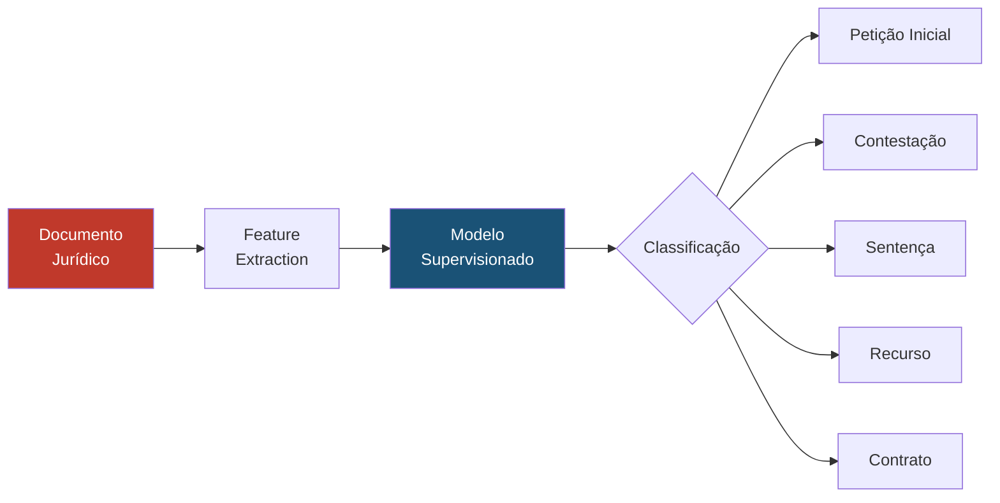

# Aprendizado Supervisionado para Classificação Jurídica

## Visão Geral

O **Aprendizado Supervisionado** é a técnica de Machine Learning que treina modelos com dados rotulados — ou seja, exemplos cuja resposta correta é conhecida — para que o modelo aprenda a realizar previsões sobre dados novos. No contexto do SJIF, o aprendizado supervisionado é aplicado extensivamente na classificação de documentos, previsão de resultados de litígios e identificação de padrões em decisões judiciais.

---

## Técnicas Principais

### Algoritmos de Classificação

| Algoritmo | Descrição | Uso no SJIF |
|-----------|-----------|------------|
| **Regressão Logística** | Classificação binária baseada em probabilidade | Prever vitória/derrota em litígio |
| **Random Forest** | Ensemble de árvores de decisão | Classificar tipos de ação, identificar variáveis influentes |
| **SVM (Support Vector Machine)** | Encontra hiperplano de separação ótimo | Classificação de documentos jurídicos |
| **Gradient Boosting (XGBoost)** | Ensemble sequencial de árvores | Previsão de valores de condenação |
| **Redes Neurais** | Camadas de neurônios para padrões complexos | PLN avançado, classificação de textos |

### Algoritmos de Regressão

| Algoritmo | Descrição | Uso no SJIF |
|-----------|-----------|------------|
| **Regressão Linear** | Previsão de valores contínuos | Estimativa de valor de indenização |
| **Ridge / Lasso** | Regressão com regularização | Previsão de tempo de tramitação |

---

## Aplicações Jurídicas

### Classificação de Documentos

### Previsão de Resultados

- **Variáveis de entrada**: Tipo de ação, tribunal, julgador, provas apresentadas, valor da causa, teses alegadas
- **Variável de saída**: Resultado (procedente, parcialmente procedente, improcedente)

### Classificação de Risco de Contingência

- **Entrada**: Características do processo, jurisprudência, fase processual
- **Saída**: Classificação de risco (provável, possível, remoto)

---

## Pipeline de Treinamento

1. **Coleta de Dados**: Obter corpus de documentos jurídicos rotulados
2. **Pré-processamento**: Limpeza, tokenização, remoção de stopwords
3. **Feature Engineering**: Criar variáveis a partir do texto (TF-IDF, embeddings, variáveis categóricas)
4. **Divisão**: Treino (70%), Validação (15%), Teste (15%)
5. **Treinamento**: Ajustar o modelo com dados de treino
6. **Avaliação**: Métricas de performance (acurácia, precisão, recall, F1-score, AUC-ROC)
7. **Deploy**: Integração com os motores do SJIF

### Métricas de Avaliação

| Métrica | O que mede | Importância no Direito |
|---------|-----------|----------------------|
| **Acurácia** | Proporção de predições corretas | Visão geral de performance |
| **Precisão** | Proporção de positivos corretos | Evitar falsos positivos |
| **Recall** | Proporção de positivos detectados | Não perder casos relevantes |
| **F1-Score** | Média harmônica de precisão e recall | Equilíbrio entre métricas |
| **AUC-ROC** | Capacidade de discriminação | Qualidade global do modelo |

---

## Desafios no Domínio Jurídico

> [!WARNING]
> O treinamento de modelos supervisionados em dados jurídicos requer atenção especial.

- **Dados desbalanceados**: Algumas classes de resultado são muito mais frequentes que outras
- **Viés histórico**: Modelos podem aprender preconceitos presentes nos dados de treinamento
- **Evolução temporal**: O Direito muda ao longo do tempo — modelos podem ficar obsoletos
- **Interpretabilidade**: Modelos complexos podem ser "caixas pretas"
- **Volume de dados**: Nem sempre há dados rotulados suficientes para treinamento robusto

---

## Integração com Motores do SJIF

| Motor | Uso do Aprendizado Supervisionado |
|-------|-----------------------------------|
| **Motor Decisório Jurídico** (Cap. 24) | Previsão de resultados e padrões decisórios |
| **Motor Jurisprudencial** (Cap. 26) | Classificação e categorização de decisões |
| **Motor de Gestão de Riscos** (Cap. 26) | Classificação automática de contingências |
| **Motor de Compliance** (Cap. 26) | Detecção de não conformidades |
| **MJF** (Cap. 25) | Classificação de documentos e extração de dados |

### Referências Cruzadas

- [Capítulo 30: Inteligência Artificial](../cap30_ia_direito.md)
- [Aprendizado Não Supervisionado](aprendizado_nao_supervisionado.md)
- [Aprendizado por Reforço](aprendizado_reforco.md)
- [Deep Learning — Redes Neurais](../deep_learning/redes_neurais.md)
- [Viés Algorítmico](../etica_ia/vies_algoritmico.md)

---
> Sigma—Juris Intelligence Framework (SJIF) v1.0 | Propriedade de Charles de Paula Eugênio — Sigma Sihf Soluções Analíticas Ltda
