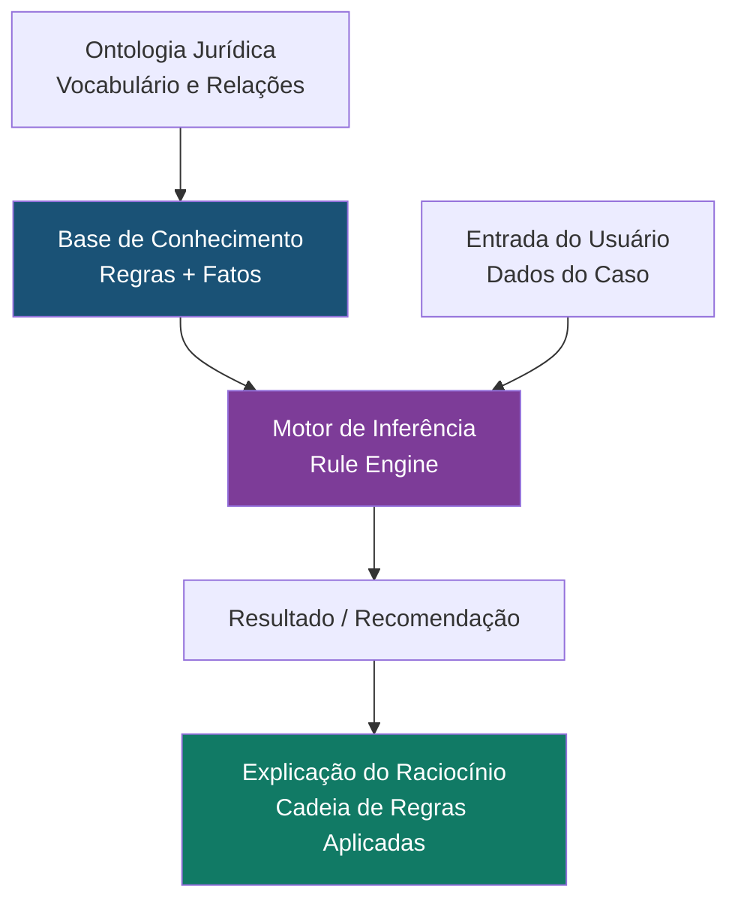

# Sistemas Especialistas e Rule Engines no SJIF

## Visão Geral

Os **Sistemas Especialistas** são sistemas de IA baseados em regras que emulam o conhecimento e o raciocínio de especialistas humanos em um domínio específico. Diferente dos modelos de Machine Learning que aprendem a partir de dados, os sistemas especialistas operam com **regras explícitas** codificadas por especialistas do domínio. Os **Rule Engines** (Motores de Regras) são a infraestrutura tecnológica que executa essas regras de forma eficiente e escalável.

No SJIF, os sistemas especialistas são fundamentais para a aplicação de regras jurídicas bem definidas — como prazos processuais, requisitos de admissibilidade recursal, verificação de conformidade e classificação de competência — onde o raciocínio é determinístico e as regras são explícitas.

---

## Estrutura de um Sistema Especialista Jurídico



### Componentes

| Componente | Descrição | Exemplo |
|-----------|-----------|---------|
| **Base de Conhecimento** | Regras jurídicas codificadas em formato IF-THEN | SE prazo > 15 dias E tipo = apelação ENTÃO tempestivo |
| **Motor de Inferência** | Aplica as regras aos fatos para derivar conclusões | Forward chaining, backward chaining |
| **Memória de Trabalho** | Dados do caso concreto em análise | Fatos, datas, partes, documentos |
| **Módulo de Explicação** | Rastreia quais regras levaram à conclusão | Cadeia de raciocínio transparente |

---

## Tipos de Regras Jurídicas

### Regras de Classificação

```
SE tipo_documento = "petição_inicial"
   E contém_pedido = TRUE
   E contém_causa_de_pedir = TRUE
   E contém_qualificação_partes = TRUE
ENTÃO classificar_como = "formalmente_adequada"
```

### Regras de Prazo

```
SE tipo_recurso = "apelação"
   E jurisdição = "justiça_estadual"
ENTÃO prazo_dias = 15
   E prazo_tipo = "úteis"
   E marco_inicial = "intimação_sentença"
```

### Regras de Competência

```
SE valor_causa <= 40 * salário_mínimo
   E não_é_matéria_exclusiva_vara_cível = TRUE
ENTÃO competência = "juizado_especial_cível"
```

### Regras de Admissibilidade

```
SE tipo_recurso = "recurso_especial"
   E questão_federal = TRUE
   E prequestionamento = TRUE
   E esgotamento_instâncias = TRUE
ENTÃO admissibilidade = "potencialmente_admissível"
SENÃO admissibilidade = "inadmissível"
   E motivo = regra_violada
```

---

## Aplicações no SJIF

| Aplicação | Tipo de Regras | Motor Integrado |
|-----------|---------------|-----------------|
| Verificação de prazos processuais | Regras de prazo + calendário | Motor Processual |
| Análise de admissibilidade recursal | Regras de admissibilidade | Motor Recursal |
| Classificação de competência | Regras de competência | Motor Processual |
| Checklist de conformidade | Regras de validação | Motor de Compliance |
| Validação de petições | Regras de forma | Motor de Coerência |
| Cálculos trabalhistas | Regras de cálculo | Motor Trabalhista |
| Verificação tributária | Regras de incidência | Motor Tributário |
| Análise de prescrição/decadência | Regras temporais | Motor Normativo |

---

## Vantagens dos Sistemas Especialistas

- **Transparência**: Cada conclusão pode ser rastreada até as regras que a produziram
- **Determinismo**: Mesma entrada sempre produz mesma saída
- **Explicabilidade**: O "porquê" de cada decisão é explícito
- **Velocidade**: Execução extremamente rápida para regras bem definidas
- **Manutenibilidade**: Regras podem ser atualizadas sem retreinar modelos
- **Auditabilidade**: Compatíveis com requisitos de auditoria e compliance

---

## Tecnologias de Rule Engine

| Tecnologia | Linguagem | Uso no SJIF |
|-----------|-----------|------------|
| **Drools** | Java | Motor de regras principal |
| **CLIPS** | C | Prototipagem rápida de sistemas especialistas |
| **Prolog** | Prolog | Raciocínio lógico e inferência |
| **OWL + SWRL** | XML/RDF | Regras semânticas sobre a ontologia |
| **Custom Python** | Python | Regras integradas aos módulos do SJIF |

---

## Limitações

> [!WARNING]
> Sistemas especialistas são poderosos, mas possuem limitações que devem ser compensadas com técnicas de ML.

- **Rigidez**: Não lidam bem com situações não previstas pelas regras
- **Manutenção**: À medida que o número de regras cresce, a manutenção se torna complexa
- **Conhecimento tácito**: Dificuldade em capturar o conhecimento intuitivo de especialistas
- **Escalabilidade**: Milhares de regras interdependentes podem gerar conflitos
- **Evolução do Direito**: Leis mudam, e regras precisam ser atualizadas manualmente
- **Casos inéditos**: Não conseguem lidar com situações que não foram contempladas nas regras

---

## Integração com Motores do SJIF

| Motor | Uso de Sistemas Especialistas |
|-------|-------------------------------|
| **Motor Processual** (Cap. 26) | Verificação de prazos e requisitos formais |
| **Motor Recursal** (Cap. 26) | Análise de admissibilidade |
| **Motor de Compliance** (Cap. 26) | Checklists automatizados de conformidade |
| **Motor Normativo** (Cap. 26) | Análise de vigência e aplicabilidade |
| **Motor de Coerência** (Cap. 23) | Validação formal de peças jurídicas |
| **Kernel Mestre Jurídico** (Cap. 40) | Gerenciamento de regras do sistema |

### Referências Cruzadas

- [Capítulo 30: Inteligência Artificial](../cap30_ia_direito.md)
- [Capítulo 27: Ontologia Jurídica](../../14_ONTOLOGIA_GRAFO/cap27_ontologia_juridica.md)
- [Explicabilidade (XAI)](../etica_ia/explicabilidade.md)
- [Aprendizado Supervisionado](../machine_learning/aprendizado_supervisionado.md)

---
> Sigma—Juris Intelligence Framework (SJIF) v1.0 | Propriedade de Charles de Paula Eugênio — Sigma Sihf Soluções Analíticas Ltda
