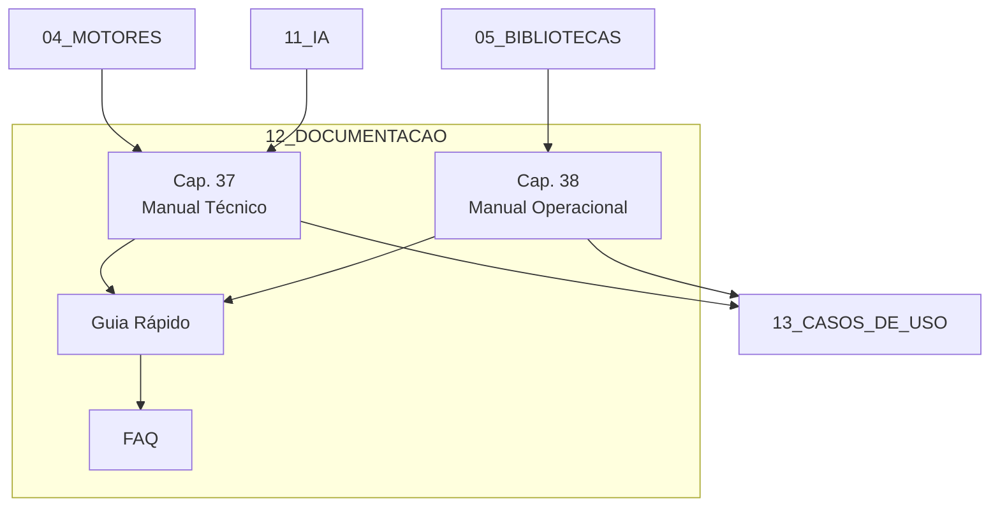

# 📚 12_DOCUMENTACAO — Documentação do Framework

## Visão Geral

O diretório **12_DOCUMENTACAO** concentra toda a documentação técnica e operacional do **Sigma—Juris Intelligence Framework (SJIF)**. Aqui estão os manuais, guias e referências necessários para implementar, configurar e utilizar o framework de forma eficaz.

A documentação é dividida em dois grandes eixos:

1. **Manual Técnico de Implementação** — Voltado para equipes de TI, engenheiros de dados e gestores de projetos
2. **Manual Operacional do Usuário** — Voltado para advogados, gestores jurídicos e usuários finais do sistema

## 📂 Estrutura do Diretório

```
12_DOCUMENTACAO/
├── README.md                          # Este arquivo
├── cap37_manual_implementacao.md      # Cap. 37 — Manual Técnico de Implementação
├── cap38_manual_operacional.md        # Cap. 38 — Manual Operacional do Usuário
└── guias/
    ├── guia_rapido.md                 # Guia Rápido — 10 passos para começar
    └── faq.md                         # FAQ — Perguntas frequentes
```

## 📖 Conteúdo dos Capítulos

| Capítulo | Título | Público-Alvo |
|----------|--------|-------------|
| **37** | [Manual Técnico de Implementação](cap37_manual_implementacao.md) | Equipes de TI, DevOps, Engenheiros de Dados |
| **38** | [Manual Operacional do Usuário](cap38_manual_operacional.md) | Advogados, Gestores Jurídicos, Usuários Finais |

## 🚀 Guias Complementares

| Guia | Descrição |
|------|-----------|
| [Guia Rápido](guias/guia_rapido.md) | Como começar a usar o SJIF em 10 passos práticos |
| [FAQ](guias/faq.md) | Respostas para as 15+ perguntas mais frequentes sobre o SJIF |

## 🔗 Referências Cruzadas

- **Arquitetura e Motores**: [04_MOTORES/](../04_MOTORES/) — Detalhamento dos 23+ motores especializados
- **Bibliotecas**: [05_BIBLIOTECAS/](../05_BIBLIOTECAS/) — Bibliotecas de conhecimento jurídico
- **Casos de Uso**: [13_CASOS_DE_USO/](../13_CASOS_DE_USO/) — Aplicações práticas do framework
- **Inteligência Artificial**: [11_INTELIGENCIA_ARTIFICIAL/](../11_INTELIGENCIA_ARTIFICIAL/) — IA aplicada ao Direito
- **Evolução**: [99_EVOLUCAO/](../99_EVOLUCAO/) — Roadmap e versões do framework

## 🔧 Diagrama de Contexto



> **Nota**: A documentação é um recurso vivo e será atualizada conforme novas versões e funcionalidades forem incorporadas ao SJIF.

---
> Sigma—Juris Intelligence Framework (SJIF) v1.0 | Propriedade de Charles de Paula Eugênio — Sigma Sihf Soluções Analíticas Ltda
