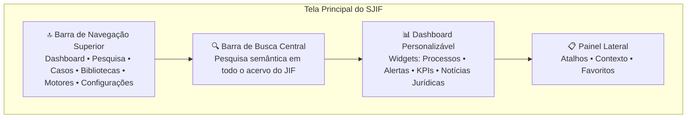
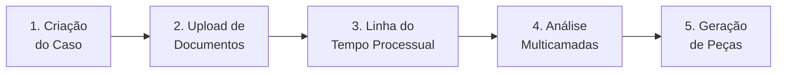

# Capítulo 38: Manual Operacional do Usuário

## 38.1 Navegando na Inteligência Jurídica: Um Guia para o Usuário do JIF

O Juris Intelligence Framework (JIF) foi concebido para ser uma ferramenta poderosa e intuitiva, capacitando profissionais do Direito a otimizar suas tarefas diárias, aprofundar suas análises e tomar decisões mais estratégicas.

Este Manual Operacional do Usuário é o seu guia prático para explorar todas as funcionalidades do JIF, desde as operações básicas de pesquisa até a utilização dos motores de inteligência artificial mais avançados. Ele foi elaborado para garantir que **advogados, gestores jurídicos, pesquisadores e outros usuários** possam aproveitar ao máximo o potencial do JIF, transformando a complexidade do Direito em inteligência acionável.

> [!TIP]
> Para uma introdução rápida, consulte o [Guia Rápido — 10 Passos](guias/guia_rapido.md). Para questões frequentes, acesse o [FAQ](guias/faq.md).

---

## 38.2 Interface do Usuário (UI) do JIF

A interface do JIF é projetada para ser limpa, organizada e fácil de navegar, permitindo que os usuários acessem rapidamente as ferramentas e informações de que necessitam.

### 38.2.1 Visão Geral da Tela Principal

Ao acessar o JIF, o usuário será recebido por uma tela principal que inclui:

| Elemento | Descrição |
|----------|-----------|
| **Barra de Navegação Superior** | Links para as principais seções: Dashboard, Pesquisa, Casos, Bibliotecas, Motores, Configurações |
| **Barra de Busca Central** | Campo de busca proeminente para pesquisas rápidas em todo o acervo do JIF |
| **Dashboard Personalizável** | Área com widgets configuráveis: processos em andamento, alertas de compliance, KPIs de desempenho, notícias jurídicas |
| **Painel Lateral (Opcional)** | Atalhos para funcionalidades frequentes e informações contextuais |

### 38.2.2 Elementos de Interação

- **Menus e Submenus** — Organização lógica das funcionalidades para fácil acesso
- **Filtros e Opções de Classificação** — Refinamento dos resultados de pesquisa conforme as necessidades do usuário
- **Visualizações Gráficas** — Gráficos, tabelas e diagramas que apresentam dados complexos de forma clara
- **Alertas e Notificações** — Mensagens pop-up ou ícones que informam sobre eventos importantes:
  - 📅 Novos prazos processuais
  - 📄 Novos documentos recebidos
  - ⚠️ Riscos identificados
  - ✅ Análises concluídas

---

## 38.3 Funcionalidades Essenciais

As funcionalidades essenciais do JIF são a base para qualquer operação jurídica, permitindo a localização de informações, a análise de documentos e a gestão eficiente de processos.

### 38.3.1 Pesquisa Jurídica Avançada

O JIF oferece uma poderosa ferramenta de pesquisa que vai além da busca por palavras-chave:

1. **Busca Semântica** — Digite termos ou conceitos jurídicos e o JIF retornará resultados relevantes de legislação, jurisprudência, doutrina e documentos internos, compreendendo o **significado por trás das palavras** (Capítulos 26 e 27)

2. **Filtros Inteligentes** — Refine sua busca por:
   - Tipo de documento (lei, sentença, artigo, contrato)
   - Data de publicação ou julgamento
   - Tribunal ou órgão emissor
   - Autor ou relator
   - Área do Direito

3. **Busca por Relações** — Utilize o Grafo de Conhecimento Jurídico (Cap. 28) para explorar conexões:
   - Todas as decisões que citam uma determinada lei
   - Todos os artigos que analisam um princípio específico
   - Precedentes relacionados a uma tese

### 38.3.2 Análise Documental Integral

Ao abrir um documento no JIF, você terá acesso a ferramentas de análise aprofundada:

| Funcionalidade | Descrição |
|----------------|-----------|
| **Visualização Contextual** | Destaque de termos jurídicos, citações e referências, com links diretos para fontes originais |
| **Extração de Entidades** | Identificação automática de pessoas, datas, valores, locais e elementos relevantes |
| **Sumarização Automática** | Geração de resumos concisos de documentos longos, destacando pontos importantes |
| **Auditoria de Coerência** | O Motor de Coerência Jurídica (Cap. 23) analisa omissões, contradições e fragilidades |

### 38.3.3 Gestão de Casos — Módulo Jurídico Forense (MJF)

O MJF (Capítulo 25) centraliza todas as informações e ferramentas para a gestão de um processo:

1. **Criação de Casos** — Inicie um novo caso, inserindo informações básicas (partes, objeto, fase processual)
2. **Upload de Documentos** — Anexe todos os documentos relacionados (petições, provas, decisões)
3. **Linha do Tempo Processual** — Visualize a cronologia dos eventos e movimentações
4. **Análise Multicamadas** — O MJF aplica suas camadas de análise:
   - Engenharia Reversa da Decisão
   - Auditoria Jurídica
   - Pesquisa Jurisprudencial e Doutrinária
5. **Geração de Peças** — Utilize a Biblioteca de Templates (Cap. 33) para gerar petições, recursos e outras peças pré-preenchidas

---

## 38.4 Utilização dos Módulos Especializados

O JIF oferece diversas bibliotecas e motores especializados para otimizar tarefas específicas e aprimorar a atuação jurídica.

### 38.4.1 Biblioteca de Briefings (Cap. 32)

| Ação | Como Fazer |
|------|-----------|
| **Acessar Briefings Existentes** | Navegue pela biblioteca para encontrar resumos de casos, legislações, jurisprudências ou análises de risco |
| **Gerar Novo Briefing** | Utilize a geração automática a partir de um documento ou tema específico e personalize conforme necessário |

### 38.4.2 Biblioteca de Templates (Cap. 33)

1. **Selecionar Template** — Escolha o modelo desejado (petição, contrato, parecer, recurso, notificação)
2. **Preenchimento Guiado** — Responda às perguntas do sistema para preencher automaticamente e ativar/desativar cláusulas condicionais
3. **Personalizar e Finalizar** — Edite o documento gerado, adicionando informações específicas e revisando o conteúdo

> [!NOTE]
> A Biblioteca de Templates conta com modelos para: Petições, Recursos, Pareceres, Memoriais, Relatórios, Auditorias, Notificações, Contratos, Acordos, Laudos, Checklists, Planos Estratégicos, Due Diligence, Compliance, Governança e Consultoria.

### 38.4.3 Biblioteca de Checklists (Cap. 34)

- **Aplicar Checklist** — Selecione um checklist para a tarefa específica (due diligence, auditoria, fase processual)
- **Marcar Itens Concluídos** — Registre a conclusão de cada item, com observações e anexos
- **Monitorar Progresso** — Acompanhe o status e receba alertas sobre prazos ou itens pendentes

### 38.4.4 Biblioteca de Estratégias (Cap. 36)

- **Consultar Estratégias** — Explore planos de ação para diferentes cenários jurídicos
- **Receber Sugestões** — O JIF sugere estratégias adequadas com base na análise do caso
- **Adaptar Plano de Ação** — Personalize a estratégia sugerida, definindo responsáveis, prazos e recursos

---

## 38.5 Interpretando os Insights Gerados

O JIF não apenas processa dados, mas gera **insights valiosos** para a tomada de decisão. Compreender como interpretar esses insights é fundamental.

### 38.5.1 Análise de Padrões Decisórios (Motor Decisório Jurídico — Cap. 24)

- **Compreendendo o Julgador** — O JIF apresenta um perfil do julgador com base em decisões públicas:
  - Frequência de acolhimento de teses
  - Valoração de provas
  - Estrutura de fundamentação

- **Simulações** — As simulações do julgador e da parte contrária fornecem perspectivas sobre possíveis desfechos

> [!WARNING]
> As análises de padrões decisórios devem ser utilizadas para adaptar a **forma** de apresentação dos argumentos, jamais para distorcer fatos ou fundamentos. A ética é inegociável.

### 38.5.2 Indicadores de Performance e Risco (Cap. 35)

| Tipo | Indicadores | Uso |
|------|-------------|-----|
| **KPIs** | Taxa de sucesso, tempo médio de processo, custo por litígio | Avaliar eficiência e qualidade da atuação |
| **KRIs** | Contingências, não conformidades, prazos críticos | Sinalizar potenciais riscos jurídicos |

### 38.5.3 Visualizações do Grafo de Conhecimento Jurídico (Cap. 28)

- **Explorando Conexões** — Utilize a visualização do grafo para entender relações complexas entre leis, decisões, doutrinas, partes e fatos
- **Identificando Influências** — Veja como um precedente ou autor doutrinário influencia outros elementos do sistema jurídico

---

## 38.6 Suporte e Treinamento

O JIF é uma ferramenta em constante evolução. Para garantir o máximo aproveitamento:

| Recurso | Descrição |
|---------|-----------|
| **Base de Conhecimento Online** | Artigos, tutoriais e FAQs sobre o uso do JIF |
| **Suporte Técnico** | Canais de comunicação para dúvidas e problemas técnicos |
| **Treinamentos Periódicos** | Sessões de treinamento para aprofundamento de funcionalidades |
| **Comunidade** | Fórum para troca de experiências e melhores práticas |

> [!TIP]
> Para dúvidas rápidas, consulte o [FAQ](guias/faq.md). Para uma introdução prática, siga o [Guia Rápido em 10 Passos](guias/guia_rapido.md).

---

Ao dominar o uso do Juris Intelligence Framework, você estará equipado com uma ferramenta de ponta para navegar na complexidade do Direito, otimizar sua prática e alcançar resultados superiores. O JIF é seu parceiro na construção de uma inteligência jurídica estratégica e eficaz.

## Referências Cruzadas

- ← [Capítulo 37: Manual Técnico de Implementação](cap37_manual_implementacao.md)
- → [Capítulo 39: Casos de Uso e Aplicações Práticas](../13_CASOS_DE_USO/cap39_casos_de_uso.md)
- ↗ [Capítulo 25: Módulo Jurídico Forense (MJF)](../04_MOTORES/)
- ↗ [Capítulo 23: Motor de Coerência Jurídica](../04_MOTORES/)
- ↗ [Capítulo 28: Grafo de Conhecimento Jurídico](../03_FRAMEWORK/)

---
> Sigma—Juris Intelligence Framework (SJIF) v1.0 | Propriedade de Charles de Paula Eugênio — Sigma Sihf Soluções Analíticas Ltda
