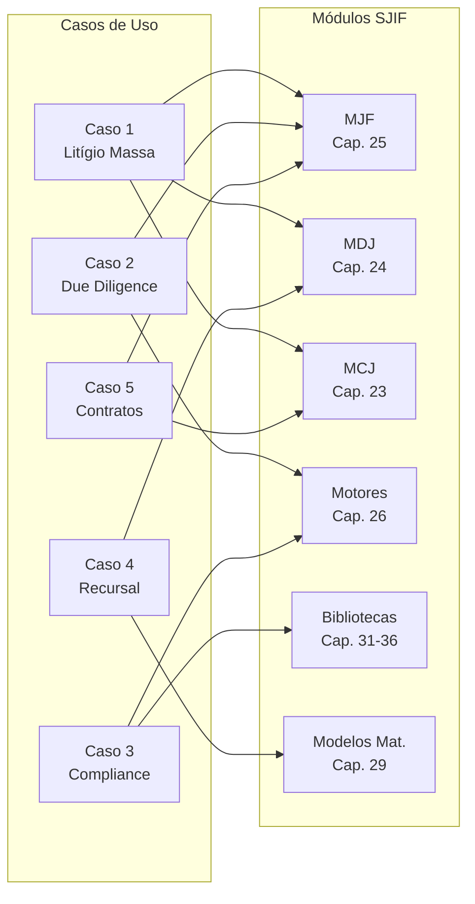

# 🎯 13_CASOS_DE_USO — Casos de Uso e Aplicações Práticas

## Visão Geral

O diretório **13_CASOS_DE_USO** demonstra a aplicação prática do **Sigma—Juris Intelligence Framework (SJIF)** em cenários reais da prática jurídica. Cada caso de uso ilustra como os diversos módulos e motores do framework se combinam para resolver problemas complexos enfrentados por advogados, departamentos jurídicos e instituições.

> [!IMPORTANT]
> Os casos de uso são baseados no **Capítulo 39** do SJIF e demonstram a sinergia entre os componentes do framework, destacando como a teoria se traduz em resultados tangíveis.

## 📂 Estrutura do Diretório

```
13_CASOS_DE_USO/
├── README.md                          # Este arquivo
├── cap39_casos_de_uso.md              # Cap. 39 — Visão geral dos 5 casos
├── caso_litigio_complexo.md           # Caso 1 — Litígio em Massa/Complexo
├── caso_due_diligence.md              # Caso 2 — Due Diligence M&A
├── caso_compliance_lgpd.md            # Caso 3 — Compliance LGPD
├── caso_estrategia_recursal.md        # Caso 4 — Estratégia Recursal
└── caso_analise_contratos.md          # Caso 5 — Análise de Contratos
```

## 📊 Resumo dos Casos de Uso

| # | Caso de Uso | Setor | Módulos Principais |
|---|------------|-------|-------------------|
| **1** | [Gestão de Litígios em Massa/Complexos](caso_litigio_complexo.md) | Bancário / Grandes empresas | MJF, MDJ, MCJ, KPIs |
| **2** | [Due Diligence Legal em M&A](caso_due_diligence.md) | Fusões e Aquisições | MJF, Motor de Auditoria, Checklists |
| **3** | [Compliance Preventivo — LGPD](caso_compliance_lgpd.md) | Tecnologia / Empresas | Motor de Compliance, Checklists, Templates |
| **4** | [Estratégia Recursal](caso_estrategia_recursal.md) | Contencioso | Eng. Reversa, MDJ, Modelos Matemáticos |
| **5** | [Análise de Contratos e Negociação](caso_analise_contratos.md) | Empresarial / Contratual | MJF, MCJ, Motor de Risco |

## 🔗 Módulos do SJIF Utilizados nos Casos



## 🔗 Referências Cruzadas

- **Documentação**: [12_DOCUMENTACAO/](../12_DOCUMENTACAO/) — Manuais técnico e operacional
- **Motores**: [04_MOTORES/](../04_MOTORES/) — Detalhamento dos 23+ motores
- **Bibliotecas**: [05_BIBLIOTECAS/](../05_BIBLIOTECAS/) — Templates, Checklists, Estratégias
- **Modelos Matemáticos**: [10_MODELOS_MATEMATICOS/](../10_MODELOS_MATEMATICOS/) — Modelos de análise quantitativa
- **Indicadores**: [09_INDICADORES/](../09_INDICADORES/) — KPIs e KRIs jurídicos

---
> Sigma—Juris Intelligence Framework (SJIF) v1.0 | Propriedade de Charles de Paula Eugênio — Sigma Sihf Soluções Analíticas Ltda
