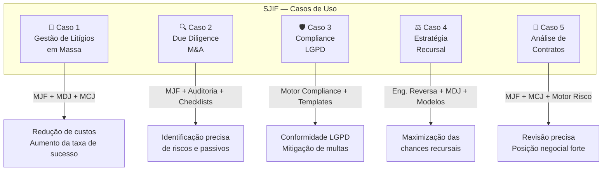

# Capítulo 39: Casos de Uso e Aplicações Práticas

## 39.1 Da Teoria à Realidade: O JIF em Ação

O Juris Intelligence Framework (JIF) é uma arquitetura robusta e multifacetada, concebida para integrar inteligência artificial, gestão do conhecimento e análise estratégica no domínio jurídico. No entanto, a verdadeira medida de sua eficácia reside em sua capacidade de ser aplicado em cenários práticos, transformando desafios jurídicos complexos em oportunidades para uma atuação mais eficiente, precisa e estratégica.

Este capítulo apresenta **cinco casos de uso** que demonstram como os diversos módulos e motores do JIF podem ser combinados para resolver problemas reais enfrentados por advogados, departamentos jurídicos, órgãos públicos e outras instituições.

> [!NOTE]
> Cada caso de uso possui um documento detalhado separado. Consulte os links abaixo para a análise completa.

---

## Mapa dos Casos de Uso

---

## 39.2 Caso de Uso 1: Otimização da Gestão de Litígios em Massa

**📄 Documento completo**: [caso_litigio_complexo.md](caso_litigio_complexo.md)

### Cenário
Um grande banco enfrenta milhares de ações judiciais de consumidores, com características semelhantes mas com nuances que exigem análise individualizada. A gestão manual é custosa, lenta e propensa a erros.

### Módulos Acionados
1. **MJF** (Cap. 25) — Coleta e análise documental integral
2. **Ontologia Jurídica** (Cap. 27) — Classificação e categorização automática
3. **Motor Decisório Jurídico** (Cap. 24) — Análise de padrões decisórios
4. **Biblioteca de Templates** (Cap. 33) — Geração automatizada de peças
5. **Motor de Coerência Jurídica** (Cap. 23) — Auditoria de qualidade
6. **Motor de Gestão de Riscos** (Cap. 26) — Monitoramento de portfólio
7. **Biblioteca de Indicadores** (Cap. 35) — Dashboards e KPIs em tempo real

### Benefícios
- ✅ Redução drástica do tempo de análise e elaboração de peças
- ✅ Aumento da taxa de sucesso
- ✅ Otimização de custos
- ✅ Maior previsibilidade e controle sobre o passivo judicial

---

## 39.3 Caso de Uso 2: Due Diligence Legal em Fusões e Aquisições (M&A)

**📄 Documento completo**: [caso_due_diligence.md](caso_due_diligence.md)

### Cenário
Uma empresa planeja adquirir outra e precisa realizar uma due diligence legal abrangente para identificar riscos, passivos e contingências ocultas.

### Módulos Acionados
1. **MJF** (Cap. 25) — Ingestão e análise de documentos da empresa-alvo
2. **Motor de Auditoria Jurídica** (Cap. 22) — Auditoria automatizada com checklists
3. **Motor de Gestão de Riscos** (Cap. 26) — Identificação de passivos e contingências
4. **Análise de Propriedade Intelectual** — Verificação de marcas, patentes e ativos
5. **Biblioteca de Briefings** (Cap. 32) — Geração de relatório de due diligence
6. **Modelos Matemáticos** (Cap. 29) — Simulação de cenários de impacto financeiro

### Benefícios
- ✅ Agilidade na análise de grandes volumes de documentos
- ✅ Identificação precisa de riscos e passivos
- ✅ Redução de custos com due diligence
- ✅ Maior segurança na tomada de decisão de M&A

---

## 39.4 Caso de Uso 3: Consultoria Jurídica Preventiva e Compliance (LGPD)

**📄 Documento completo**: [caso_compliance_lgpd.md](caso_compliance_lgpd.md)

### Cenário
Uma empresa de tecnologia precisa garantir que suas operações estejam em conformidade com a Lei Geral de Proteção de Dados (LGPD) e outras regulamentações de privacidade, além de mitigar riscos de não conformidade.

### Módulos Acionados
1. **Motor Normativo** (Cap. 26) — Mapeamento de obrigações regulatórias
2. **Motor de Compliance** (Cap. 26) — Auditoria de processos internos
3. **Motor de Gestão de Riscos** (Cap. 26) — Análise de riscos de privacidade
4. **Biblioteca de Templates** (Cap. 33) — Geração de políticas e contratos
5. **Biblioteca de Briefings** (Cap. 32) — Treinamento e comunicação
6. **Monitoramento Contínuo** — Acompanhamento do ambiente regulatório

### Benefícios
- ✅ Garantia de conformidade com a LGPD
- ✅ Redução de riscos de multas e sanções
- ✅ Proteção da reputação da empresa
- ✅ Otimização da elaboração de documentos de privacidade

---

## 39.5 Caso de Uso 4: Formulação de Estratégias Recursais

**📄 Documento completo**: [caso_estrategia_recursal.md](caso_estrategia_recursal.md)

### Cenário
Um advogado precisa decidir se vale a pena interpor um recurso contra uma decisão desfavorável, e qual a melhor estratégia para maximizar as chances de sucesso.

### Módulos Acionados
1. **MJF — Engenharia Reversa** (Cap. 25) — Desconstrução da decisão desfavorável
2. **Motor Jurisprudencial** (Cap. 26) — Pesquisa aprofundada de precedentes
3. **Motor Decisório Jurídico** (Cap. 24) — Perfil dos julgadores do tribunal superior
4. **MJF — Simulação** (Cap. 25) — Simulação da parte contrária
5. **Biblioteca de Estratégias** (Cap. 36) e **Modelos Matemáticos** (Cap. 29) — Seleção e otimização
6. **Biblioteca de Templates** (Cap. 33) — Geração da peça recursal

### Benefícios
- ✅ Aumento significativo das chances de sucesso em recursos
- ✅ Otimização da argumentação
- ✅ Redução do tempo de pesquisa e elaboração
- ✅ Maior segurança na decisão sobre interpor recurso

---

## 39.6 Caso de Uso 5: Análise de Contratos e Negociação

**📄 Documento completo**: [caso_analise_contratos.md](caso_analise_contratos.md)

### Cenário
Uma empresa precisa revisar um contrato complexo com um novo fornecedor, identificando cláusulas de risco, oportunidades de melhoria e preparando-se para a negociação.

### Módulos Acionados
1. **MJF** (Cap. 25) — Análise documental integral do contrato
2. **Motor de Coerência Jurídica** (Cap. 23) — Auditoria de cláusulas
3. **Motor de Gestão de Riscos** (Cap. 26) — Identificação de cláusulas de risco
4. **Motores Jurisprudencial e Doutrinário** (Cap. 26) — Pesquisa de subsídios
5. **Biblioteca de Estratégias** (Cap. 36) — Preparação para negociação
6. **Biblioteca de Templates** (Cap. 33) — Geração de minuta revisada

### Benefícios
- ✅ Revisão contratual mais rápida e precisa
- ✅ Identificação proativa de riscos
- ✅ Fortalecimento da posição negocial
- ✅ Garantia de conformidade e otimização contratual

---

## 39.7 O JIF como Catalisador da Transformação Jurídica

Os casos de uso apresentados demonstram a **versatilidade e o poder** do Juris Intelligence Framework em diversas áreas da prática jurídica. Ao integrar inteligência artificial, gestão do conhecimento e análise estratégica, o JIF não apenas automatiza tarefas e otimiza processos, mas também eleva a capacidade analítica e estratégica dos profissionais do Direito.

Ele transforma a forma como o conhecimento jurídico é acessado, processado e aplicado, permitindo uma atuação mais inteligente, eficiente e orientada para resultados. O JIF é, portanto, um catalisador para a transformação digital e estratégica do setor jurídico, preparando-o para os desafios e oportunidades do futuro.

## Referências Cruzadas

- ← [Capítulo 38: Manual Operacional do Usuário](../12_DOCUMENTACAO/cap38_manual_operacional.md)
- → [Capítulo 40: Kernel Mestre Jurídico](../01_KERNEL/)
- ↗ [Capítulo 25: Módulo Jurídico Forense (MJF)](../04_MOTORES/)
- ↗ [Capítulo 26: Motores Especializados](../04_MOTORES/)
- ↗ [Capítulo 29: Modelos Matemáticos](../10_MODELOS_MATEMATICOS/)

---
> Sigma—Juris Intelligence Framework (SJIF) v1.0 | Propriedade de Charles de Paula Eugênio — Sigma Sihf Soluções Analíticas Ltda
