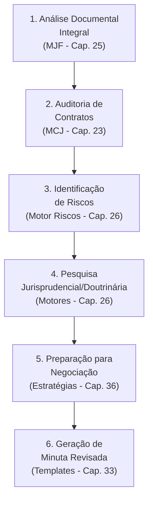

# Caso de Uso 5: Análise de Contratos e Negociação

## Visão Geral

| Campo | Detalhe |
|-------|---------|
| **Cenário** | Revisão de contrato complexo e preparação para negociação |
| **Setor** | Empresarial, fornecedores, parceiros comerciais, todos os setores |
| **Desafio** | Identificar cláusulas de risco, oportunidades e fortalecer posição negocial |
| **Objetivo** | Revisão precisa, identificação de riscos e negociação estratégica |

---

## Descrição do Cenário

Uma empresa precisa **revisar um contrato complexo com um novo fornecedor**, identificando cláusulas de risco, oportunidades de melhoria e preparando-se para a negociação. Os desafios incluem:

- Volume e complexidade das cláusulas contratuais
- Identificação de cláusulas desequilibradas ou que gerem riscos excessivos
- Necessidade de verificar conformidade com legislação aplicável
- Preparação de argumentos sólidos para a mesa de negociação
- Elaboração de minuta revisada que atenda aos interesses da empresa

---

## Aplicação do JIF — Fluxo Completo



### Etapa 1: Análise Documental Integral (MJF — Cap. 25)

O JIF ingere o contrato e extrai automaticamente:

| Elemento Extraído | Detalhamento |
|-------------------|-------------|
| **Partes** | Qualificação completa, representantes legais |
| **Objeto** | Escopo do contrato, bens ou serviços envolvidos |
| **Cláusulas** | Identificação e classificação de cada cláusula |
| **Prazos** | Vigência, renovação, notificação, carência |
| **Valores** | Preço, forma de pagamento, reajuste, multas |
| **Obrigações** | De cada parte, acessórias e principais |
| **Garantias** | Seguro, fiança, caução, penhor |
| **Termos Jurídicos** | Definições e seus significados específicos |

O **Motor de PLN** identifica termos jurídicos e suas definições, criando um mapa completo do contrato.

### Etapa 2: Auditoria de Contratos (Motor de Coerência Jurídica — Cap. 23)

O MCJ audita o contrato em múltiplas dimensões:

#### Comparação com Padrões
- Cotejo com modelos padrão da **Biblioteca de Templates** (Cap. 33)
- Identificação de cláusulas **atípicas** ou **ausentes**

#### Análise de Coerência
- ✅ Coerência interna entre cláusulas
- ❌ Contradições entre disposições
- ⚠️ Ambiguidades na redação
- ❌ Cláusulas desequilibradas

#### Verificação de Conformidade (Motor Normativo — Cap. 26)
- Conformidade com o Código Civil (arts. 421-480)
- Conformidade com o Código de Defesa do Consumidor (se aplicável)
- Conformidade com legislação setorial específica
- Conformidade com a LGPD (cláusulas de dados)

### Etapa 3: Identificação de Riscos (Motor de Gestão de Riscos — Cap. 26)

O JIF identifica e classifica cláusulas de risco:

| Cláusula | Risco Identificado | Nível | Sugestão |
|----------|-------------------|-------|----------|
| **Multa rescisória** | Valor desproporcional (200% do contrato) | 🔴 Alto | Limitar a 20% do valor remanescente |
| **Responsabilidade** | Ilimitada para o contratante | 🔴 Alto | Incluir cap de responsabilidade |
| **Rescisão unilateral** | Apenas em favor do fornecedor | 🟡 Médio | Incluir reciprocidade |
| **Propriedade intelectual** | Cessão ampla sem compensação | 🔴 Alto | Licenciamento em vez de cessão |
| **Foro** | Foro distante e inconveniente | 🟡 Médio | Negociar foro neutro ou arbitragem |
| **Confidencialidade** | Prazo insuficiente (1 ano) | 🟡 Médio | Estender para 3-5 anos |
| **SLA** | Sem penalidades por descumprimento | 🟡 Médio | Incluir SLA com multas progressivas |
| **Renovação automática** | Sem opt-out claro | 🟢 Baixo | Incluir mecanismo de opt-out |

### Etapa 4: Pesquisa Jurisprudencial e Doutrinária (Motores — Cap. 26)

O JIF busca subsídios para fortalecer a posição negocial:

- **Jurisprudência** sobre cláusulas abusivas em contratos semelhantes
- **Doutrina** sobre interpretação de cláusulas controversas
- **Precedentes** sobre validade de limitações de responsabilidade
- **Tendências** decisórias em disputas contratuais do setor

> [!NOTE]
> A pesquisa jurisprudencial e doutrinária fornece argumentos embasados para solicitar alterações nas cláusulas de risco, demonstrando ao fornecedor que as cláusulas propostas podem ser invalidadas judicialmente.

### Etapa 5: Preparação para Negociação (Biblioteca de Estratégias — Cap. 36)

O JIF auxilia na formulação da **estratégia de negociação**:

```
ESTRATÉGIA DE NEGOCIAÇÃO
═══════════════════════════
┌────────────────────────────────────────────────┐
│ ANÁLISE DE INTERESSES                          │
│ ├── Nossos interesses prioritários             │
│ │   ├── Limitação de responsabilidade          │
│ │   ├── Propriedade intelectual preservada     │
│ │   └── Cláusula de rescisão equilibrada       │
│ ├── Interesses do fornecedor                   │
│ │   ├── Garantia de receita (prazo mínimo)     │
│ │   ├── Proteção contra inadimplência          │
│ │   └── Escopo definido                        │
│ └── Interesses comuns                          │
│     ├── Relação de longo prazo                 │
│     ├── Qualidade do serviço                   │
│     └── Previsibilidade                        │
├────────────────────────────────────────────────┤
│ BATNA (Melhor Alternativa)                     │
│ → Fornecedor alternativo identificado          │
│ → Custo de troca estimado: R$ X.XXX            │
│ → Prazo para implementação: X meses            │
├────────────────────────────────────────────────┤
│ PONTOS DE ALAVANCAGEM                          │
│ → Volume de contratação relevante              │
│ → Jurisprudência favorável sobre cláusulas     │
│ → Cláusulas anuladas em contratos semelhantes  │
│ → Referência de mercado (benchmark)            │
├────────────────────────────────────────────────┤
│ ZONA DE POSSÍVEL ACORDO (ZOPA)                 │
│ → Multa rescisória: 10-30% do remanescente     │
│ → Cap de responsabilidade: 1-3x valor anual    │
│ → Prazo de confidencialidade: 3-5 anos         │
└────────────────────────────────────────────────┘
```

O JIF gera **briefings** (Biblioteca de Briefings — Cap. 32) com:
- Pontos críticos do contrato e propostas de alteração
- Argumentos jurídicos para cada solicitação de mudança
- Cenários de negociação (melhor caso, caso base, pior caso)
- Limites de aceitação para cada cláusula

### Etapa 6: Geração de Minuta Revisada (Biblioteca de Templates — Cap. 33)

O JIF permite a **edição colaborativa** do contrato:

1. **Track changes** automático com todas as alterações propostas
2. **Justificativa** jurídica para cada alteração sugerida
3. **Versões comparativas** (original vs. proposta)
4. **Auditoria final** pelo Motor de Coerência Jurídica
5. Verificação de conformidade com a legislação aplicável
6. Exportação da minuta revisada para negociação

---

## Resultados Esperados

| Métrica | Benefício |
|---------|-----------|
| **Velocidade** | Revisão contratual 60-75% mais rápida |
| **Riscos** | Identificação proativa de cláusulas de risco |
| **Negociação** | Posição negocial fortalecida com argumentos jurídicos |
| **Conformidade** | Garantia de adequação à legislação vigente |
| **Qualidade** | Minuta revisada coerente e equilibrada |
| **Rastreabilidade** | Histórico de todas as alterações e justificativas |

---

## Referências

- [Capítulo 39: Visão Geral dos Casos de Uso](cap39_casos_de_uso.md)
- [Capítulo 23: Motor de Coerência Jurídica](../04_MOTORES/)
- [Capítulo 25: Módulo Jurídico Forense (MJF)](../04_MOTORES/)
- [Capítulo 26: Motores Especializados](../04_MOTORES/)
- [Capítulo 33: Biblioteca de Templates](../07_TEMPLATES/)
- [Capítulo 36: Biblioteca de Estratégias](../05_BIBLIOTECAS/)

---
> Sigma—Juris Intelligence Framework (SJIF) v1.0 | Propriedade de Charles de Paula Eugênio — Sigma Sihf Soluções Analíticas Ltda
