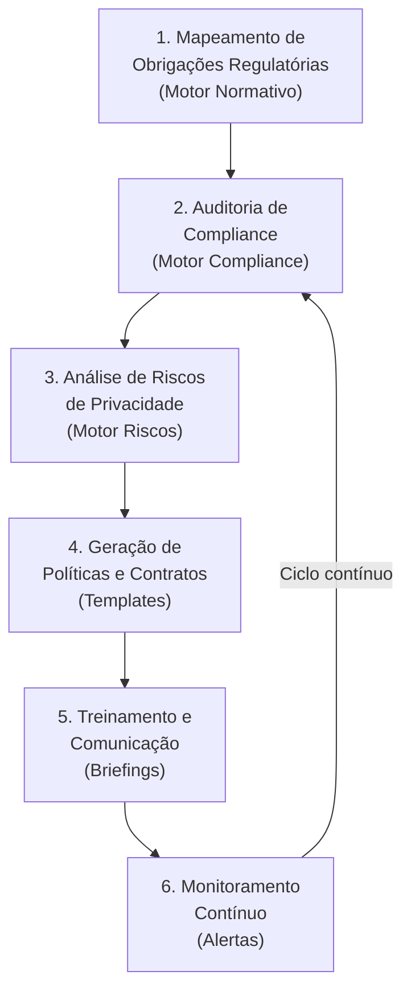

# Caso de Uso 3: Compliance Preventivo — LGPD

## Visão Geral

| Campo | Detalhe |
|-------|---------|
| **Cenário** | Adequação e manutenção da conformidade com a LGPD |
| **Setor** | Tecnologia, e-commerce, fintechs, empresas com tratamento de dados |
| **Desafio** | Garantir conformidade regulatória contínua e mitigar riscos de sanções |
| **Objetivo** | Implementar e monitorar programa de compliance LGPD com o SJIF |

---

## Descrição do Cenário

Uma empresa de tecnologia precisa garantir que suas operações estejam em **conformidade com a Lei Geral de Proteção de Dados (LGPD)** e outras regulamentações de privacidade, além de mitigar riscos de não conformidade. Os desafios incluem:

- Mapeamento de todos os fluxos de dados pessoais
- Identificação de bases legais para cada tratamento
- Elaboração de políticas, contratos e termos adequados
- Treinamento contínuo dos colaboradores
- Monitoramento de alterações regulatórias
- Prevenção de incidentes e resposta a violações

---

## Aplicação do JIF — Fluxo Completo



### Etapa 1: Mapeamento de Obrigações Regulatórias (Motor Normativo — Cap. 26)

O JIF identifica **todas as normas aplicáveis**:

| Norma | Âmbito | Aspectos Cobertos |
|-------|--------|-------------------|
| **LGPD** (Lei 13.709/2018) | Federal | Proteção de dados pessoais |
| **Decreto 8.771/2016** | Federal | Marco Civil da Internet |
| **Regulamentos ANPD** | Federal | Regulamentações setoriais |
| **GDPR** | Internacional | Se houver operações na UE |
| **Normas Setoriais** | Específico | BACEN, CVM, ANATEL, etc. |

O Motor Normativo realiza:
- Identificação das obrigações legais aplicáveis
- Mapeamento de requisitos por tipo de tratamento de dados
- Análise de vigência e atualizações legislativas
- Comparação com melhores práticas internacionais

### Etapa 2: Auditoria de Compliance (Motor de Compliance — Cap. 26)

O JIF utiliza **checklists de compliance LGPD** (Biblioteca de Checklists — Cap. 34):

#### Checklist de Compliance LGPD

**Governança e Organização:**
- [ ] Nomeação de Encarregado (DPO) — Art. 41 LGPD
- [ ] Estrutura de governança de dados definida
- [ ] Registro de Atividades de Tratamento (ROPA) elaborado
- [ ] Canal de comunicação com titulares estabelecido

**Base Legal e Consentimento:**
- [ ] Bases legais mapeadas para cada tratamento — Art. 7° LGPD
- [ ] Termos de consentimento adequados e específicos
- [ ] Mecanismo de revogação de consentimento implementado
- [ ] Tratamento de dados de menores com consentimento parental

**Segurança e Técnica:**
- [ ] Medidas técnicas e administrativas implementadas — Art. 46
- [ ] Política de segurança da informação vigente
- [ ] Controle de acesso baseado no princípio do menor privilégio
- [ ] Criptografia de dados sensíveis em trânsito e repouso
- [ ] Anonimização/pseudonimização quando aplicável

**Direitos dos Titulares:**
- [ ] Processo para atendimento de requisições — Art. 18
- [ ] Confirmação de tratamento disponível
- [ ] Acesso, correção e eliminação de dados operacionais
- [ ] Portabilidade de dados implementada

**Incidentes e Resposta:**
- [ ] Plano de Resposta a Incidentes documentado
- [ ] Procedimento de notificação à ANPD — Art. 48
- [ ] Procedimento de comunicação aos titulares afetados
- [ ] Registro de incidentes de segurança

### Etapa 3: Análise de Riscos de Privacidade (Motor de Gestão de Riscos — Cap. 26)

O JIF avalia e classifica riscos:

| Risco | Probabilidade | Impacto | Nível | Medida de Mitigação |
|-------|---------------|---------|-------|---------------------|
| Vazamento de dados pessoais | Média | Crítico | 🔴 Alto | Criptografia + monitoramento |
| Tratamento sem base legal | Baixa | Alto | 🟡 Médio | Revisão de bases legais |
| Compartilhamento indevido | Média | Alto | 🔴 Alto | Contratos com operadores |
| Retenção excessiva | Alta | Médio | 🟡 Médio | Política de retenção |
| Multa ANPD | Baixa | Crítico | 🟡 Médio | Programa de compliance |
| Dano reputacional | Média | Crítico | 🔴 Alto | Plano de resposta |

### Etapa 4: Geração de Políticas e Contratos (Biblioteca de Templates — Cap. 33)

O JIF auxilia na elaboração de documentos essenciais:

```
DOCUMENTOS GERADOS PELO SJIF
═══════════════════════════════
📄 Política de Privacidade
📄 Termos de Uso
📄 Aviso de Cookies
📄 Termo de Consentimento para Tratamento de Dados
📄 Contrato com Operador de Dados (DPA)
📄 Cláusulas Contratuais Padrão (Transferência Internacional)
📄 Política de Segurança da Informação
📄 Plano de Resposta a Incidentes
📄 Relatório de Impacto à Proteção de Dados (RIPD)
📄 Registro de Atividades de Tratamento (ROPA)
```

Todos os documentos são:
- Pré-preenchidos com dados da empresa
- Auditados pelo Motor de Coerência Jurídica
- Atualizados conforme alterações legislativas

### Etapa 5: Treinamento e Comunicação (Biblioteca de Briefings — Cap. 32)

O JIF gera **briefings de treinamento** sobre:
- Princípios da LGPD e conceitos fundamentais
- Direitos dos titulares e como atendê-los
- Procedimentos internos de privacidade
- Como identificar e reportar incidentes
- Boas práticas no tratamento de dados

### Etapa 6: Monitoramento Contínuo

O JIF mantém **vigilância permanente**:
- 🔍 Monitoramento de alterações na legislação e regulamentações
- 📊 Dashboard de compliance com indicadores em tempo real
- ⚠️ Alertas sobre novas não conformidades identificadas
- 📅 Lembretes de prazos regulatórios e revisões periódicas
- 🔄 Ciclo contínuo de auditoria e melhoria

---

## Resultados Esperados

- ✅ **Conformidade**: Garantia de adequação à LGPD e regulamentações correlatas
- ✅ **Prevenção**: Redução significativa do risco de multas (até 2% do faturamento)
- ✅ **Reputação**: Proteção da imagem da empresa no mercado
- ✅ **Eficiência**: Otimização na elaboração de documentos e políticas
- ✅ **Continuidade**: Monitoramento contínuo garante conformidade sustentável

---

## Referências

- [Capítulo 39: Visão Geral dos Casos de Uso](cap39_casos_de_uso.md)
- [Capítulo 21: Compliance e Governança](../00_GOVERNANCA/)
- [Capítulo 26: Motores Especializados](../04_MOTORES/)
- [Capítulo 33: Biblioteca de Templates](../07_TEMPLATES/)
- [Capítulo 34: Biblioteca de Checklists](../08_CHECKLISTS/)

---
> Sigma—Juris Intelligence Framework (SJIF) v1.0 | Propriedade de Charles de Paula Eugênio — Sigma Sihf Soluções Analíticas Ltda
