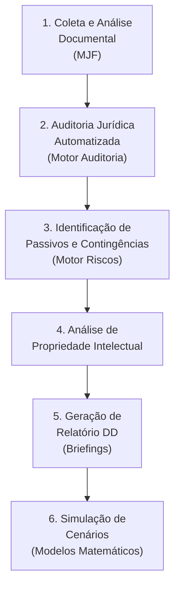

# Caso de Uso 2: Due Diligence Legal em Fusões e Aquisições (M&A)

## Visão Geral

| Campo | Detalhe |
|-------|---------|
| **Cenário** | Aquisição de empresa com due diligence legal abrangente |
| **Setor** | Fusões e Aquisições (M&A), Private Equity, Investimentos |
| **Desafio** | Identificar riscos, passivos e contingências ocultas em grande volume de documentos |
| **Objetivo** | Automatizar e aprimorar o processo de due diligence para decisões mais seguras |

---

## Descrição do Cenário

Uma empresa planeja **adquirir outra** e precisa realizar uma due diligence legal abrangente para identificar riscos, passivos e contingências ocultas. O volume de documentos é massivo e o prazo é restrito, exigindo eficiência e precisão na análise.

### Desafios Típicos
- Volume massivo de documentos (milhares de contratos, processos, licenças)
- Prazo curto para conclusão da análise
- Necessidade de identificar passivos ocultos e contingências
- Múltiplas áreas do Direito envolvidas (trabalhista, tributário, ambiental, regulatório)
- Necessidade de quantificar riscos para negociação do preço

---

## Aplicação do JIF — Fluxo Completo



### Etapa 1: Coleta e Análise Documental (MJF — Cap. 25)

O JIF ingere **todos os documentos da empresa-alvo**:

| Tipo de Documento | Análise Realizada |
|-------------------|-------------------|
| **Contratos** | Cláusulas de risco, prazos, obrigações, penalidades |
| **Processos Judiciais** | Status, probabilidade de perda, valores envolvidos |
| **Licenças e Alvarás** | Validade, conformidade, restrições |
| **Propriedade Intelectual** | Marcas, patentes, direitos autorais, titularidade |
| **Políticas Internas** | Compliance, governança, procedimentos |
| **Registros Societários** | Atos constitutivos, alterações, participações |

O **PLN** extrai informações relevantes e as organiza no **Grafo de Conhecimento Jurídico**.

### Etapa 2: Auditoria Jurídica Automatizada (Motor de Auditoria — Cap. 22)

O JIF aplica **checklists de due diligence** (Biblioteca de Checklists — Cap. 34):

#### Checklist de Due Diligence — Áreas Verificadas

- [ ] **Societário**: Atos constitutivos, composição acionária, deliberações
- [ ] **Trabalhista**: Passivo trabalhista, compliance CLT, terceirizações
- [ ] **Tributário**: Obrigações fiscais, débitos, incentivos, planejamento
- [ ] **Ambiental**: Licenças ambientais, passivos, remediação
- [ ] **Regulatório**: Autorizações setoriais, conformidade regulatória
- [ ] **Contratual**: Contratos vigentes, cláusulas de change of control
- [ ] **Propriedade Intelectual**: Titularidade, validade, proteção
- [ ] **Imobiliário**: Imóveis, ônus, restrições de uso
- [ ] **Anticorrupção**: Compliance anticorrupção, investigações
- [ ] **Proteção de Dados**: LGPD, políticas de privacidade, incidentes

O **Motor de Compliance** (Cap. 26) identifica não conformidades em cada área.

### Etapa 3: Identificação de Passivos e Contingências (Motor de Gestão de Riscos — Cap. 26)

O JIF analisa contratos e processos para classificar riscos:

| Classificação | Probabilidade | Ação |
|---------------|---------------|------|
| **Passivo Certo** | Condenações definitivas | Provisionar integralmente |
| **Contingência Provável** | >50% de perda | Provisionar e monitorar |
| **Contingência Possível** | 25-50% de perda | Divulgar em notas explicativas |
| **Contingência Remota** | <25% de perda | Documentar apenas |

### Etapa 4: Análise de Propriedade Intelectual

O JIF verifica:
- **Validade** de marcas e patentes registradas
- **Titularidade** e correto registro em nome da empresa-alvo
- **Riscos de infração** a PI de terceiros
- **Caducidade** por falta de uso ou pagamento de anuidades
- **Contratos de licenciamento** e suas condições

### Etapa 5: Geração de Relatório de Due Diligence (Biblioteca de Briefings — Cap. 32)

O JIF gera um **relatório estruturado** contendo:

```
RELATÓRIO DE DUE DILIGENCE LEGAL
═══════════════════════════════════
1. Sumário Executivo
2. Escopo e Metodologia
3. Achados por Área
   3.1 Societário
   3.2 Trabalhista
   3.3 Tributário
   3.4 Ambiental
   3.5 Regulatório
   3.6 Contratual
   3.7 Propriedade Intelectual
   3.8 Proteção de Dados
4. Mapa de Riscos Consolidado
5. Passivos Quantificados
6. Contingências Classificadas
7. Recomendações de Mitigação
8. Impacto na Valoração
9. Anexos e Evidências
```

### Etapa 6: Simulação de Cenários (Modelos Matemáticos — Cap. 29)

O JIF simula o **impacto financeiro** de diferentes cenários:

| Cenário | Descrição | Impacto Estimado |
|---------|-----------|-----------------|
| **Otimista** | Contingências resolvidas favoravelmente | Mínimo impacto no preço |
| **Base** | Perda parcial de contingências | Desconto moderado |
| **Pessimista** | Materialização de todos os riscos | Desconto significativo |
| **Catastrófico** | Riscos ocultos não identificados | Reavaliação do negócio |

---

## Resultados Esperados

- ✅ **Agilidade**: Redução de 60-80% no tempo de análise documental
- ✅ **Precisão**: Identificação sistemática de riscos com classificação padronizada
- ✅ **Custos**: Redução significativa nos custos com due diligence
- ✅ **Segurança**: Decisões de M&A baseadas em dados precisos e quantificados
- ✅ **Negociação**: Argumentos sólidos para ajuste de preço com base em riscos identificados

---

## Referências

- [Capítulo 39: Visão Geral dos Casos de Uso](cap39_casos_de_uso.md)
- [Capítulo 22: Auditoria Jurídica](../04_MOTORES/)
- [Capítulo 25: Módulo Jurídico Forense (MJF)](../04_MOTORES/)
- [Capítulo 29: Modelos Matemáticos](../10_MODELOS_MATEMATICOS/)
- [Capítulo 34: Biblioteca de Checklists](../08_CHECKLISTS/)

---
> Sigma—Juris Intelligence Framework (SJIF) v1.0 | Propriedade de Charles de Paula Eugênio — Sigma Sihf Soluções Analíticas Ltda
