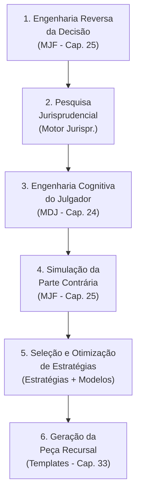

# Caso de Uso 4: Formulação de Estratégias Recursais

## Visão Geral

| Campo | Detalhe |
|-------|---------|
| **Cenário** | Decisão sobre interposição de recurso e formulação de estratégia recursal |
| **Setor** | Contencioso cível, trabalhista, tributário, todos os ramos |
| **Desafio** | Maximizar chances de sucesso recursal com argumentação otimizada |
| **Objetivo** | Desconstruir a decisão, identificar vulnerabilidades e formular estratégia vencedora |

---

## Descrição do Cenário

Um advogado precisa decidir se vale a pena **interpor um recurso contra uma decisão desfavorável**, e qual a melhor estratégia para maximizar as chances de sucesso. Os desafios incluem:

- Analisar a decisão para identificar erros e vulnerabilidades
- Pesquisar precedentes favoráveis nos tribunais superiores
- Compreender o perfil dos julgadores que analisarão o recurso
- Antecipar os argumentos da parte contrária
- Quantificar a probabilidade de sucesso vs. custo do recurso
- Elaborar a peça recursal com argumentação otimizada

---

## Aplicação do JIF — Fluxo Completo



### Etapa 1: Engenharia Reversa da Decisão (MJF — Cap. 25)

O JIF realiza uma **desconstrução completa** da decisão desfavorável:

```
ENGENHARIA REVERSA DA DECISÃO
═══════════════════════════════
┌─────────────────────────────────────────────┐
│ TESE DO JULGADOR                            │
│ → Qual a tese jurídica acolhida?            │
│ → Quais os fundamentos utilizados?          │
│ → Quais precedentes foram citados?          │
├─────────────────────────────────────────────┤
│ PROVAS VALORADAS                            │
│ → Quais provas foram consideradas?          │
│ → Quais provas foram ignoradas?             │
│ → Como foi feita a valoração?               │
├─────────────────────────────────────────────┤
│ ARGUMENTOS REJEITADOS                       │
│ → Quais argumentos não foram acolhidos?     │
│ → Quais argumentos não foram analisados?    │
│ → Há omissão sobre questões relevantes?     │
├─────────────────────────────────────────────┤
│ VULNERABILIDADES IDENTIFICADAS              │
│ → Omissões na fundamentação                 │
│ → Contradições internas                     │
│ → Saltos lógicos                            │
│ → Fundamentação insuficiente                │
│ → Erro na valoração de provas               │
│ → Violação de precedentes vinculantes       │
└─────────────────────────────────────────────┘
```

O **Motor de Coerência Jurídica** (Cap. 23) aponta sistematicamente:
- ❌ Omissões na fundamentação
- ❌ Contradições internas
- ❌ Saltos lógicos no raciocínio
- ❌ Fundamentação insuficiente
- ❌ Erro material ou de premissa

### Etapa 2: Pesquisa Jurisprudencial (Motor Jurisprudencial — Cap. 26)

O JIF realiza uma **pesquisa aprofundada** em múltiplos tribunais:

| Tribunal | Pesquisa Realizada |
|----------|--------------------|
| **STF** | Repercussão geral, súmulas vinculantes, teses firmadas |
| **STJ** | Recursos repetitivos, súmulas, jurisprudência dominante |
| **TST** | Súmulas, OJs, IRRs (se trabalhista) |
| **TRFs / TJs** | Jurisprudência regional e local |
| **Tribunais Superiores** | Precedentes sobre a matéria específica |

O **Grafo de Conhecimento Jurídico** (Cap. 28) visualiza as relações entre:
- A decisão recorrida ↔ Normas aplicadas
- Precedentes favoráveis ↔ Teses vencedoras
- Precedentes desfavoráveis ↔ Distinções possíveis

### Etapa 3: Engenharia Cognitiva do Julgador (Motor Decisório Jurídico — Cap. 24)

O MDJ analisa o **padrão decisório** de dois grupos de julgadores:

#### Julgador da Decisão Recorrida
- Teses mais frequentemente acolhidas e rejeitadas
- Fundamentação típica utilizada
- Provas mais valoradas

#### Julgadores do Tribunal Superior (Recurso)
- Perfil de acolhimento de teses semelhantes
- Preferências argumentativas
- Tipos de argumento mais eficazes
- Probabilidade de reforma em matérias análogas

> [!WARNING]
> A análise de padrões decisórios é baseada exclusivamente em **dados públicos e objetivos**. Jamais deve ser utilizada para especular sobre preferências pessoais do julgador ou para distorcer fatos e fundamentos.

### Etapa 4: Simulação da Parte Contrária (MJF — Cap. 25)

O JIF simula a **melhor defesa possível** da parte contrária:

- Quais contrarrazões a parte adversa provavelmente apresentará?
- Quais argumentos ela utilizará para sustentar a decisão?
- Quais precedentes ela citará em seu favor?
- Como ela tentará distinguir os precedentes do recorrente?

**Resultado**: O advogado antecipa objeções e prepara **refutações previamente elaboradas**.

### Etapa 5: Seleção e Otimização de Estratégias

#### Biblioteca de Estratégias (Cap. 36)

O JIF sugere as estratégias recursais mais adequadas:

| Estratégia | Quando Utilizar | Fundamento |
|------------|----------------|------------|
| **Violação de lei federal** | Erro na aplicação da norma | Art. 1.022 CPC |
| **Dissídio jurisprudencial** | Divergência entre tribunais | Art. 1.022 CPC |
| **Negativa de vigência** | Norma não aplicada | REsp |
| **Violação constitucional** | Afronta a princípios constitucionais | RE |
| **Error in judicando** | Erro no julgamento de mérito | Apelação |
| **Error in procedendo** | Erro processual | Agravo |
| **Embargos de Declaração** | Omissão, contradição, obscuridade | Art. 1.022 CPC |

#### Modelos Matemáticos (Cap. 29)

O JIF quantifica a análise recursal:

```
MODELO PROBABILÍSTICO RECURSAL
═══════════════════════════════
┌────────────────────────────────────────────┐
│ Probabilidade de conhecimento:     85%     │
│ Probabilidade de provimento:       62%     │
│ Probabilidade de provimento parcial: 18%   │
│ Custo estimado do recurso:    R$ X.XXX     │
│ Valor em risco:              R$ XX.XXX     │
│ Relação custo-benefício:      Favorável    │
│                                            │
│ RECOMENDAÇÃO: ✅ INTERPOR RECURSO          │
│ Estratégia: Violação de lei federal +      │
│             Dissídio jurisprudencial        │
└────────────────────────────────────────────┘
```

Modelos aplicados:
- **Modelo Probabilístico** — Chances de sucesso com base em precedentes
- **Modelo Bayesiano** — Atualização de probabilidades com novas evidências
- **Modelo de Sensibilidade** — Impacto de cada argumento no resultado
- **Modelo de Custo-Benefício** — Viabilidade econômica do recurso

### Etapa 6: Geração da Peça Recursal (Biblioteca de Templates — Cap. 33)

O JIF auxilia na **elaboração da peça recursal**:

1. Seleção automática do **template adequado** (apelação, agravo, RE, REsp, embargos)
2. **Pré-preenchimento** com dados do processo e argumentos estratégicos
3. **Verificação de requisitos formais** (tempestividade, preparo, cabimento)
4. **Auditoria de coerência** pela MCJ antes da finalização
5. Exportação em formato adequado para protocolo

---

## Resultados Esperados

| Métrica | Benefício |
|---------|-----------|
| **Chances de sucesso** | Aumento de 20-35% na taxa de provimento |
| **Qualidade argumentativa** | Argumentação otimizada para o perfil dos julgadores |
| **Tempo de pesquisa** | Redução de 70% no tempo de pesquisa jurisprudencial |
| **Tempo de elaboração** | Redução de 50% no tempo de redação da peça |
| **Decisão informada** | Quantificação objetiva do custo-benefício recursal |

---

## Referências

- [Capítulo 39: Visão Geral dos Casos de Uso](cap39_casos_de_uso.md)
- [Capítulo 11: Engenharia Reversa das Decisões](../03_FRAMEWORK/)
- [Capítulo 12: Engenharia Recursal](../03_FRAMEWORK/)
- [Capítulo 24: Motor Decisório Jurídico](../04_MOTORES/)
- [Capítulo 29: Modelos Matemáticos](../10_MODELOS_MATEMATICOS/)
- [Capítulo 36: Biblioteca de Estratégias](../05_BIBLIOTECAS/)

---
> Sigma—Juris Intelligence Framework (SJIF) v1.0 | Propriedade de Charles de Paula Eugênio — Sigma Sihf Soluções Analíticas Ltda
