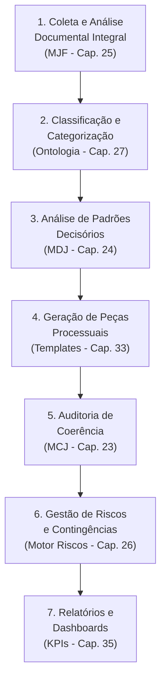

# Caso de Uso 1: Otimização da Gestão de Litígios em Massa e Complexos

## Visão Geral

| Campo | Detalhe |
|-------|---------|
| **Cenário** | Gestão de milhares de ações judiciais com características semelhantes |
| **Setor** | Bancário, seguradoras, telecomunicações, grandes empresas |
| **Desafio** | Gestão manual custosa, lenta e propensa a erros |
| **Objetivo** | Automatizar análise, reduzir custos, aumentar taxa de sucesso |

---

## Descrição do Cenário

Um grande banco enfrenta **milhares de ações judiciais de consumidores**, com características semelhantes, mas com nuances que exigem análise individualizada. A gestão manual é custosa, lenta e propensa a erros, gerando:

- Alto custo operacional com equipes jurídicas extensas
- Inconsistência nas contestações e estratégias de defesa
- Dificuldade em prever contingências e provisionar adequadamente
- Perda de prazos e oportunidades estratégicas
- Incapacidade de identificar padrões decisórios favoráveis

---

## Aplicação do JIF — Fluxo Completo

### Etapa 1: Coleta e Análise Documental Integral (MJF — Cap. 25)

O JIF ingere automaticamente todos os documentos de cada processo:

- **Petições iniciais** — Extração de pedidos, causa de pedir, valores
- **Contestações** — Análise de teses de defesa utilizadas
- **Provas** — Classificação e valoração automática
- **Decisões** — Engenharia reversa do raciocínio do julgador

O **Motor de PLN** (Cap. 30) extrai entidades (partes, valores, datas, objetos da ação) e relações, alimentando o **Grafo de Conhecimento Jurídico** (Cap. 28) para cada caso.

### Etapa 2: Classificação e Categorização (Ontologia Jurídica — Cap. 27)

Os casos são **automaticamente classificados** por:

| Critério | Exemplo |
|----------|---------|
| **Tipo de Ação** | Revisional, indenizatória, consignatória |
| **Tema Jurídico** | Juros abusivos, cobrança indevida, danos morais |
| **Valor da Causa** | Faixas de valor para priorização |
| **Tribunal/Vara** | Distribuição geográfica dos litígios |
| **Fase Processual** | Inicial, instrução, sentença, recurso |

### Etapa 3: Análise de Padrões Decisórios (Motor Decisório Jurídico — Cap. 24)

O MDJ analisa o **histórico de decisões dos julgadores** envolvidos:

- Frequência de acolhimento de teses específicas
- Valoração de tipos de prova
- Valores médios de condenação em casos semelhantes
- Precedentes e fundamentos mais citados
- **Resultado**: Previsão de probabilidade de sucesso e valor esperado para cada litígio

### Etapa 4: Geração de Peças Processuais (Biblioteca de Templates — Cap. 33)

Com base na classificação e nos padrões decisórios:

1. O JIF **sugere o template** de contestação mais adequado
2. **Pré-preenche** com dados extraídos automaticamente do processo
3. **Ativa/desativa cláusulas condicionais** conforme as especificidades do caso
4. Adapta a argumentação ao **perfil do julgador**

### Etapa 5: Auditoria de Coerência (Motor de Coerência Jurídica — Cap. 23)

O MCJ audita cada peça gerada **antes do protocolo**:

- ✅ Verifica coerência entre fatos alegados e provas referenciadas
- ✅ Identifica omissões de argumentos relevantes
- ✅ Detecta contradições internas
- ✅ Avalia a aderência pedidos-fundamentos
- ✅ Confirma requisitos formais e processuais

### Etapa 6: Gestão de Riscos e Contingências (Motor de Gestão de Riscos — Cap. 26)

O JIF monitora continuamente o portfólio de litígios:

- **Atualização automática** de contingências passivas
- **Alertas** sobre casos de alto risco ou que exigem atenção imediata
- **Classificação** por probabilidade de perda (provável, possível, remota)
- **Quantificação** do impacto financeiro total

### Etapa 7: Relatórios e Dashboards (Biblioteca de Indicadores — Cap. 35)

Gestores têm acesso a **dashboards em tempo real**:

| KPI | Descrição |
|-----|-----------|
| **Taxa de Sucesso** | Percentual de casos com resultado favorável |
| **Tempo Médio de Processo** | Duração média dos litígios |
| **Custo por Litígio** | Investimento médio por processo |
| **Valor Total de Contingências** | Soma das contingências provisionadas |
| **Volume por Tribunal** | Distribuição geográfica dos casos |
| **Tendência de Decisões** | Evolução dos padrões decisórios ao longo do tempo |

---

## Resultados Esperados

| Métrica | Antes do JIF | Com o JIF | Melhoria |
|---------|-------------|-----------|----------|
| **Tempo de análise por caso** | 4-6 horas | 30-60 min | ~85% |
| **Consistência das peças** | Variável | Padronizada | Alta |
| **Taxa de sucesso** | Baseline | +15-25% | Significativa |
| **Custo operacional** | Alto | Otimizado | -40-60% |
| **Previsibilidade de contingências** | Baixa | Alta | Substancial |

---

## Referências

- [Capítulo 39: Visão Geral dos Casos de Uso](cap39_casos_de_uso.md)
- [Capítulo 25: Módulo Jurídico Forense (MJF)](../04_MOTORES/)
- [Capítulo 24: Motor Decisório Jurídico](../04_MOTORES/)
- [Capítulo 23: Motor de Coerência Jurídica](../04_MOTORES/)
- [Capítulo 35: Biblioteca de Indicadores](../09_INDICADORES/)

---
> Sigma—Juris Intelligence Framework (SJIF) v1.0 | Propriedade de Charles de Paula Eugênio — Sigma Sihf Soluções Analíticas Ltda
