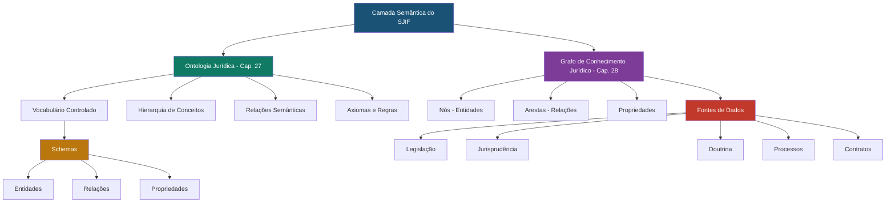
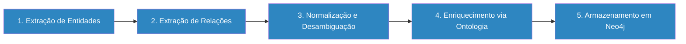

# 🕸️ 14_ONTOLOGIA_GRAFO — Ontologia Jurídica e Grafo de Conhecimento

## Visão Geral

Este diretório contém a documentação da **Ontologia Jurídica** e do **Grafo de Conhecimento Jurídico** do Sigma—Juris Intelligence Framework (SJIF). Juntos, estes componentes formam a camada semântica do framework — a estrutura que permite aos sistemas computacionais compreender, interpretar e raciocinar sobre o Direito com precisão e consistência.

> [!NOTE]
> A Ontologia Jurídica define **o que o Direito é** (conceitos, relações, regras), enquanto o Grafo de Conhecimento registra **como o Direito se manifesta** (instâncias concretas de normas, decisões, partes e suas interconexões).

## Arquitetura Semântica do SJIF

## Conteúdo do Diretório

### Capítulos Principais

| Arquivo | Descrição |
|---------|-----------|
| [cap27_ontologia_juridica.md](cap27_ontologia_juridica.md) | **Capítulo 27** — OWL/RDF, Hierarquia de Conceitos, Relações Semânticas |
| [cap28_grafo_conhecimento.md](cap28_grafo_conhecimento.md) | **Capítulo 28** — Nós/Arestas/Propriedades, Fontes de Dados, Construção em 5 Etapas, Neo4j |

### Vocabulário e Schemas

| Arquivo | Descrição |
|---------|-----------|
| [vocabulario_controlado.md](vocabulario_controlado.md) | Vocabulário controlado de termos jurídicos do SJIF |
| [schemas/entidades.md](schemas/entidades.md) | Tipos de entidades (Partes, Processos, Normas, Decisões, etc.) |
| [schemas/relacoes.md](schemas/relacoes.md) | Tipos de relações (hierárquicas, causais, temporais, etc.) |
| [schemas/propriedades.md](schemas/propriedades.md) | Definições de propriedades para entidades e relações |

## Capítulos Relacionados

- [Capítulo 23: Motor de Coerência Jurídica](../04_MOTORES/)
- [Capítulo 24: Motor Decisório Jurídico](../04_MOTORES/)
- [Capítulo 26: Motores Especializados](../04_MOTORES/)
- [Capítulo 29: Modelos Matemáticos](../10_MODELOS_MATEMATICOS/cap29_modelos_matematicos.md)
- [Capítulo 30: Inteligência Artificial](../11_INTELIGENCIA_ARTIFICIAL/cap30_ia_direito.md)
- [Capítulo 37: Manual Técnico de Implementação](../12_DOCUMENTACAO/)
- [Capítulo 40: Kernel Mestre Jurídico](../01_KERNEL/)

## Tecnologias Utilizadas

| Tecnologia | Papel |
|-----------|-------|
| **OWL** (Web Ontology Language) | Representação formal da ontologia |
| **RDF** (Resource Description Framework) | Modelagem de relações semânticas |
| **SPARQL** | Consultas semânticas sobre a ontologia |
| **Neo4j** | Banco de dados de grafo para armazenamento do GCJ |
| **Amazon Neptune** | Alternativa cloud para o banco de dados de grafo |
| **SpaCy / NLTK** | Extração de entidades e relações de textos |

## Fluxo de Construção do Grafo

---
> Sigma—Juris Intelligence Framework (SJIF) v1.0 | Propriedade de Charles de Paula Eugênio — Sigma Sihf Soluções Analíticas Ltda
