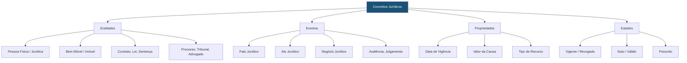

# Capítulo 27: Ontologia Jurídica

## 27.1 A Estrutura do Conhecimento Jurídico: Fundamento da Inteligência Artificial no Direito

A **Ontologia Jurídica**, no contexto do Sigma—Juris Intelligence Framework (SJIF), é a disciplina que se dedica à representação formal e explícita do conhecimento jurídico, estabelecendo as categorias, conceitos, relações e propriedades que definem o universo do Direito. Em um cenário onde a inteligência artificial (IA) e o processamento de linguagem natural (PLN) são cada vez mais aplicados ao campo jurídico, uma ontologia robusta e bem estruturada é fundamental para permitir que sistemas computacionais compreendam, interpretem e raciocinem sobre informações legais de forma precisa e consistente.

> [!IMPORTANT]
> A Ontologia Jurídica é a **base semântica** de todo o SJIF. Sem ela, os motores de IA não conseguem compreender o *significado* dos termos jurídicos, limitando-se à correspondência de palavras-chave.

---

## 27.2 Definição e Importância da Ontologia Jurídica

Uma ontologia é, em essência, uma **especificação formal de um domínio de conhecimento**. No Direito, ela serve como um vocabulário compartilhado e uma estrutura conceitual que permite a comunicação e a interoperabilidade entre diferentes sistemas e agentes, sejam eles humanos ou artificiais.

### 27.2.1 O que é uma Ontologia?

| Componente | Descrição |
|-----------|-----------|
| **Vocabulário Compartilhado** | Define os termos e conceitos relevantes em um domínio |
| **Representação Formal** | Expressa conceitos e relações de forma legível por máquina (OWL, RDF) |
| **Estrutura Hierárquica** | Organiza conceitos em taxonomias (hierarquias de classes e subclasses) |
| **Relações Semânticas** | Define como os conceitos se conectam (ex.: "é-parte-de", "causa", "tem-como-efeito") |
| **Axiomas e Regras** | Regras lógicas que governam o comportamento dos conceitos e suas relações |

### 27.2.2 Importância da Ontologia Jurídica para o SJIF

A ontologia jurídica é a base que permite:

- **Compreensão Semântica**: Capacitar os motores do SJIF a entender o *significado* dos termos jurídicos, e não apenas a correspondência de palavras
- **Raciocínio Jurídico Automatizado**: Permitir que os sistemas de IA realizem inferências e deduções lógicas sobre o Direito
- **Interoperabilidade**: Facilitar a troca de informações entre diferentes módulos do SJIF e com sistemas externos
- **Consistência**: Garantir que os conceitos jurídicos sejam utilizados de forma uniforme em todo o framework
- **Precisão**: Reduzir ambiguidades e imprecisões na interpretação e aplicação do Direito
- **Geração de Conhecimento**: Extrair novos conhecimentos a partir da análise de dados jurídicos estruturados

---

## 27.3 Estruturação de Conceitos e Relações no Direito

A construção de uma ontologia jurídica envolve a identificação e a formalização dos conceitos fundamentais do Direito e das relações que os conectam.

### 27.3.1 Conceitos Jurídicos Fundamentais

### 27.3.2 Relações Semânticas no Direito

As relações definem como os conceitos se conectam:

| Tipo de Relação | Exemplo | Notação |
|----------------|---------|---------|
| **Hierárquica (is-a)** | `Lei` *is-a* `Norma Jurídica` | Taxonomia |
| **Parte-Todo (part-of)** | `Cláusula` *part-of* `Contrato` | Mereologia |
| **Causal** | `Fato Jurídico` *causa* `Efeito Jurídico` | Causalidade |
| **Temporal** | `Lei` *entra-em-vigor-em* `Data` | Cronologia |
| **Atributiva** | `Pessoa` *tem* `Nome` | Atribuição |
| **Funcional** | `Advogado` *representa* `Cliente` | Papel |

> Para a especificação completa das relações, consulte [schemas/relacoes.md](schemas/relacoes.md).

### 27.3.3 Desafios na Construção de Ontologias Jurídicas

> [!WARNING]
> A construção de ontologias jurídicas apresenta desafios significativos que devem ser considerados no projeto.

- **Ambiguidade e Vagueza**: A linguagem jurídica é frequentemente ambígua e vaga, dificultando a formalização precisa
- **Dinamicidade do Direito**: O Direito está em constante evolução, exigindo atualizações regulares na ontologia
- **Complexidade**: O domínio jurídico é vasto e complexo, tornando a construção de uma ontologia abrangente um desafio
- **Diferenças Culturais e Jurisdicionais**: Ontologias podem precisar ser adaptadas para diferentes sistemas jurídicos e culturas

---

## 27.4 Aplicação da Ontologia na Construção de Sistemas de IA Jurídica

A ontologia jurídica é um componente habilitador para diversas aplicações de inteligência artificial no Direito.

### 27.4.1 Raciocínio Baseado em Ontologia

- **Inferência e Dedução**: Se um `Contrato de Compra e Venda` *is-a* `Contrato`, e um `Contrato` *requer* `Capacidade das Partes`, então um `Contrato de Compra e Venda` *requer* `Capacidade das Partes`
- **Verificação de Consistência**: O [Motor de Coerência Jurídica](../04_MOTORES/) (Capítulo 23) usa a ontologia para identificar contradições ou omissões
- **Resolução de Conflitos**: Auxilia na identificação e resolução de conflitos entre normas, aplicando regras de hierarquia e especialidade

### 27.4.2 Processamento de Linguagem Natural (PLN) Aprimorado

- **Extração de Informação**: A ontologia guia a extração de entidades e relações de textos jurídicos não estruturados
- **Classificação e Categorização**: Ajuda a classificar documentos e casos em categorias ontológicas
- **Geração de Resumos**: Permite a criação de resumos mais inteligentes, focando nos conceitos e relações mais relevantes

### 27.4.3 Motores do SJIF Impulsionados pela Ontologia

| Motor | Uso da Ontologia |
|-------|-----------------|
| **Motor Normativo** (Cap. 26) | Mapear hierarquia das normas, analisar vigência e eficácia |
| **Motor Jurisprudencial** (Cap. 26) | Classificar decisões, identificar precedentes, analisar padrões |
| **Motor Doutrinário** (Cap. 26) | Organizar e buscar conhecimento doutrinário |
| **Motor Decisório Jurídico** (Cap. 24) | Mapear como conceitos são utilizados em decisões |
| **Motor de Gestão de Riscos** (Cap. 26) | Identificar e classificar riscos por categorias ontológicas |

---

## 27.5 O Papel da Ontologia Jurídica no Kernel Mestre Jurídico

A Ontologia Jurídica é um componente central do **Kernel Mestre Jurídico** (Capítulo 40), atuando como o modelo conceitual que unifica e organiza todo o conhecimento do SJIF. Ela garante que todos os motores e módulos operem com uma compreensão compartilhada do Direito, promovendo a coerência, a precisão e a interoperabilidade.

> [!TIP]
> Ao fornecer uma representação formal do conhecimento jurídico, a ontologia capacita o SJIF a transcender a mera automação de tarefas, alcançando um nível de inteligência que permite **raciocinar** e **gerar insights jurídicos** de forma autônoma e confiável.

### Referências Cruzadas

- [Capítulo 23: Motor de Coerência Jurídica](../04_MOTORES/)
- [Capítulo 24: Motor Decisório Jurídico](../04_MOTORES/)
- [Capítulo 26: Motores Especializados](../04_MOTORES/)
- [Capítulo 28: Grafo de Conhecimento Jurídico](cap28_grafo_conhecimento.md)
- [Capítulo 30: Inteligência Artificial Aplicada ao Direito](../11_INTELIGENCIA_ARTIFICIAL/cap30_ia_direito.md)
- [Capítulo 40: Kernel Mestre Jurídico](../01_KERNEL/)
- [Vocabulário Controlado](vocabulario_controlado.md)
- [Schemas de Entidades](schemas/entidades.md)
- [Schemas de Relações](schemas/relacoes.md)
- [Schemas de Propriedades](schemas/propriedades.md)

---
> Sigma—Juris Intelligence Framework (SJIF) v1.0 | Propriedade de Charles de Paula Eugênio — Sigma Sihf Soluções Analíticas Ltda
