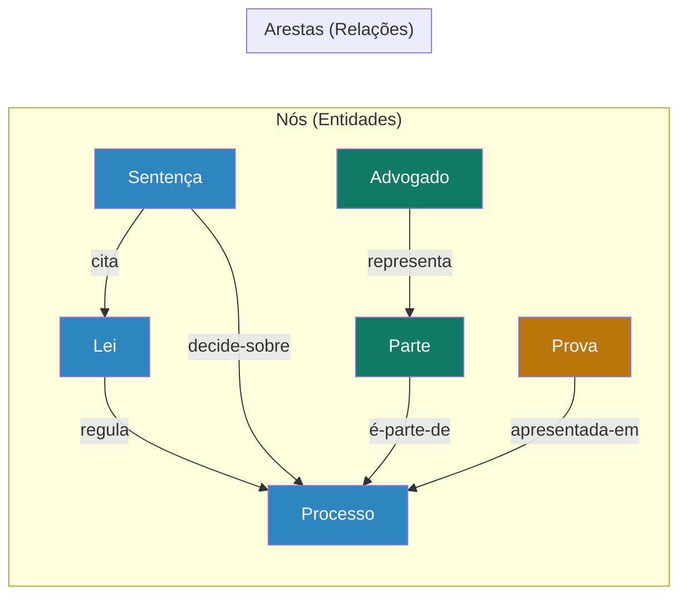
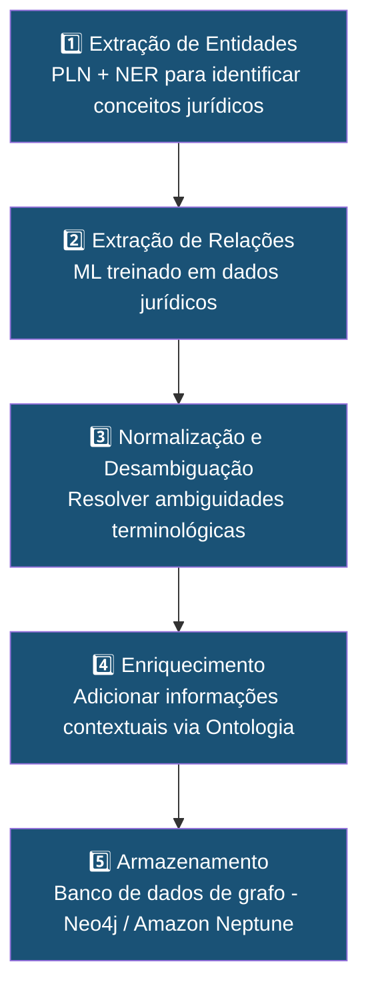

# Capítulo 28: Grafo de Conhecimento Jurídico

## 28.1 A Rede do Conhecimento: Visualizando o Direito como um Grafo

O Direito, em sua essência, é uma vasta rede de entidades interconectadas: leis que regulam fatos, decisões que interpretam normas, doutrinas que analisam princípios, e pessoas que interagem sob o manto de direitos e deveres. O **Grafo de Conhecimento Jurídico (GCJ)**, no contexto do Sigma—Juris Intelligence Framework (SJIF), é uma representação estruturada e visual dessas interconexões, transformando o conhecimento jurídico de um conjunto fragmentado de documentos em uma **rede semântica navegável e analisável**.

> [!NOTE]
> O GCJ permite explorar as relações complexas entre conceitos, documentos e entidades, revelando padrões e insights que seriam invisíveis em abordagens tradicionais de busca por palavras-chave.

---

## 28.2 Construção e Importância do Grafo de Conhecimento Jurídico

Um grafo de conhecimento é uma base de dados que armazena informações em formato de grafo, onde os dados são representados como **nós** (entidades) e **arestas** (relações) entre esses nós.

### 28.2.1 Componentes de um Grafo de Conhecimento Jurídico

| Componente | Descrição | Exemplos |
|-----------|-----------|----------|
| **Nós (Entidades)** | Conceitos e objetos do domínio jurídico | Lei, Artigo, Processo, Sentença, Parte, Advogado, Tribunal, Fato, Prova, Doutrina, Princípio, Jurisprudência |
| **Arestas (Relações)** | Conexões e interações entre entidades | `regula`, `interpreta`, `cita`, `é-parte-de`, `decide`, `aplica`, `fundamenta`, `referencia`, `é-sócio-de`, `representa` |
| **Propriedades** | Atributos que descrevem nós e arestas | `data_vigencia`, `valor_causa`, `tipo_relacao`, `grau_confianca` |

### 28.2.2 Importância do GCJ para o SJIF

O GCJ é fundamental para o SJIF, pois permite:

- **Contextualização do Conhecimento**: Entender o Direito como um sistema interconectado, onde cada elemento influencia e é influenciado por outros
- **Descoberta de Relações Ocultas**: Revelar conexões indiretas entre entidades que seriam difíceis de identificar em bases de dados tradicionais
- **Raciocínio Jurídico Aprimorado**: Facilitar a inferência e a dedução, permitindo que os motores do SJIF naveguem pelas relações para responder a perguntas complexas
- **Visualização Intuitiva**: Oferecer uma representação visual do conhecimento jurídico, tornando-o mais acessível
- **Suporte à Análise de Casos**: Ajudar a mapear todos os elementos de um caso e suas interconexões
- **Base para IA Explicável**: Ao mostrar as relações entre dados, o GCJ contribui para a explicabilidade das decisões da IA

---

## 28.3 Representação de Entidades e Relações Jurídicas

A construção do GCJ no SJIF se baseia na [Ontologia Jurídica](cap27_ontologia_juridica.md) (Capítulo 27), que fornece o vocabulário e a estrutura conceitual.

### 28.3.1 Fontes de Dados para o GCJ

| Fonte | Tipos de Dados | Relações Típicas |
|-------|---------------|------------------|
| **Legislação** | Leis, decretos, portarias, artigos, parágrafos, incisos | `regula`, `altera`, `revoga`, `cita` |
| **Jurisprudência** | Sentenças, acórdãos, súmulas, precedentes vinculantes | `decide-sobre`, `cita`, `interpreta`, `aplica` |
| **Doutrina** | Livros, artigos, pareceres, autores, temas | `analisa`, `critica`, `fundamenta`, `referencia` |
| **Processos Judiciais** | Petições, provas, decisões, partes, advogados | `envolve`, `apresenta`, `contém`, `é-parte-de` |
| **Contratos** | Cláusulas, partes, objetos, prazos | `vincula`, `estabelece`, `tem-cláusula` |

### 28.3.2 Processo de Construção do Grafo — 5 Etapas

1. **Extração de Entidades**: Utilização de técnicas de Processamento de Linguagem Natural (PLN) e Reconhecimento de Entidades Nomeadas (NER) para identificar conceitos jurídicos nos textos
2. **Extração de Relações**: Identificação das conexões semânticas entre as entidades, com auxílio de modelos de aprendizado de máquina treinados em dados jurídicos
3. **Normalização e Desambiguação**: Garantir que entidades e relações sejam representadas de forma consistente, resolvendo ambiguidades (ex.: "ação" pode ser processo ou participação societária)
4. **Enriquecimento**: Adicionar informações contextuais e propriedades aos nós e arestas, utilizando a [Ontologia Jurídica](cap27_ontologia_juridica.md) como guia
5. **Armazenamento**: Utilização de bancos de dados de grafo (ex.: **Neo4j**, **Amazon Neptune**) para armazenar e gerenciar o GCJ

---

## 28.4 Aplicação do Grafo na Análise de Casos e Descoberta de Conhecimento

O Grafo de Conhecimento Jurídico é uma ferramenta analítica poderosa que permite ao SJIF realizar análises complexas e descobrir insights valiosos.

### 28.4.1 Análise de Casos

- **Mapeamento de Litígios**: Visualizar todas as partes, provas, normas e precedentes citados, e como tudo se conecta
- **Identificação de Conflitos de Interesse**: Detectar relações ocultas entre partes, advogados ou julgadores
- **Análise de Impacto**: Avaliar como uma nova decisão judicial ou alteração legislativa pode impactar outros casos
- **Descoberta de Argumentos**: Identificar argumentos que foram bem-sucedidos em casos semelhantes

### 28.4.2 Descoberta de Conhecimento

- **Identificação de Tendências Jurisprudenciais**: Analisar padrões de decisões ao longo do tempo
- **Mapeamento de Influência Doutrinária**: Visualizar como as ideias de um jurista influenciam outros autores e decisões
- **Análise de Redes de Colaboração**: Identificar redes de advogados, escritórios ou tribunais que interagem em determinados tipos de casos
- **Previsão de Resultados**: Fornecer insights sobre a probabilidade de sucesso de uma tese, com base na análise de relações semelhantes

### 28.4.3 Visualização e Interação

O SJIF oferece interfaces visuais para explorar o GCJ, permitindo que os usuários naveguem pelas entidades e relações, filtrem informações e descubram conexões de forma intuitiva. Isso transforma a complexidade do Direito em um **mapa compreensível**.

> [!TIP]
> A visualização do grafo é particularmente útil para apresentações a clientes, permitindo demonstrar de forma visual as conexões entre normas, decisões e estratégias.

---

## 28.5 O Grafo de Conhecimento Jurídico como Pilar do SJIF

O Grafo de Conhecimento Jurídico é um pilar fundamental do SJIF, pois transforma a forma como o conhecimento jurídico é armazenado, acessado e analisado. Ao fornecer uma representação rica e interconectada do Direito, o GCJ capacita os motores do SJIF a realizar análises mais profundas, identificar padrões complexos e gerar insights mais precisos.

Ele é a base para o **raciocínio contextual e relacional** que diferencia o SJIF — a ponte entre os dados brutos e a inteligência acionável, essencial para a construção de uma verdadeira inteligência jurídica semântica e preditiva.

### Referências Cruzadas

- [Capítulo 23: Motor de Coerência Jurídica](../04_MOTORES/)
- [Capítulo 24: Motor Decisório Jurídico](../04_MOTORES/)
- [Capítulo 25: Módulo Jurídico Forense](../04_MOTORES/)
- [Capítulo 27: Ontologia Jurídica](cap27_ontologia_juridica.md)
- [Capítulo 29: Modelos Matemáticos](../10_MODELOS_MATEMATICOS/cap29_modelos_matematicos.md)
- [Capítulo 30: Inteligência Artificial](../11_INTELIGENCIA_ARTIFICIAL/cap30_ia_direito.md)
- [Capítulo 37: Manual Técnico de Implementação](../12_DOCUMENTACAO/)
- [Schemas de Entidades](schemas/entidades.md)
- [Schemas de Relações](schemas/relacoes.md)
- [Schemas de Propriedades](schemas/propriedades.md)

---
> Sigma—Juris Intelligence Framework (SJIF) v1.0 | Propriedade de Charles de Paula Eugênio — Sigma Sihf Soluções Analíticas Ltda
