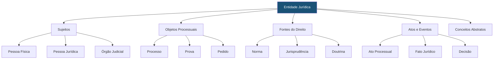

# Schema de Entidades do SJIF

## Visão Geral

Este documento define os **tipos de entidades** (nós) utilizados na [Ontologia Jurídica](../cap27_ontologia_juridica.md) e no [Grafo de Conhecimento Jurídico](../cap28_grafo_conhecimento.md) do SJIF. Cada entidade representa um conceito do domínio jurídico com seus atributos e classificações.

---

## Taxonomia de Entidades

---

## 1. Sujeitos

### 1.1 Pessoa Física (`PessoaFisica`)

| Atributo | Tipo | Obrigatório | Descrição |
|----------|------|:-:|-----------|
| `nome` | String | ✅ | Nome completo |
| `cpf` | String | ⬜ | CPF (anonimizável) |
| `data_nascimento` | Date | ⬜ | Data de nascimento |
| `nacionalidade` | String | ⬜ | Nacionalidade |
| `estado_civil` | Enum | ⬜ | Solteiro, Casado, Divorciado, Viúvo, União Estável |
| `profissao` | String | ⬜ | Profissão |
| `endereco` | String | ⬜ | Endereço (anonimizável) |
| `papel_processual` | Enum | ✅ | Autor, Réu, Testemunha, Perito, etc. |

### 1.2 Pessoa Jurídica (`PessoaJuridica`)

| Atributo | Tipo | Obrigatório | Descrição |
|----------|------|:-:|-----------|
| `razao_social` | String | ✅ | Razão social |
| `cnpj` | String | ⬜ | CNPJ |
| `nome_fantasia` | String | ⬜ | Nome fantasia |
| `tipo` | Enum | ⬜ | S.A., Ltda., EIRELI, Associação, etc. |
| `porte` | Enum | ⬜ | ME, EPP, Médio, Grande |
| `setor` | String | ⬜ | Setor de atuação |

### 1.3 Órgão Judicial (`OrgaoJudicial`)

| Atributo | Tipo | Obrigatório | Descrição |
|----------|------|:-:|-----------|
| `nome` | String | ✅ | Nome do órgão (ex.: "1ª Vara Cível de BH") |
| `tipo` | Enum | ✅ | Vara, Turma, Câmara, Seção, Plenário |
| `tribunal` | String | ✅ | Tribunal (ex.: TJMG, TRT3, STJ) |
| `jurisdicao` | String | ✅ | Estadual, Federal, Trabalhista, Militar |
| `instancia` | Enum | ✅ | 1ª, 2ª, Superior, Supremo |
| `comarca` | String | ⬜ | Comarca |

### 1.4 Advogado (`Advogado`)

| Atributo | Tipo | Obrigatório | Descrição |
|----------|------|:-:|-----------|
| `nome` | String | ✅ | Nome completo |
| `oab` | String | ✅ | Número da OAB e seccional |
| `escritorio` | String | ⬜ | Escritório de advocacia |
| `especialidade` | String[] | ⬜ | Áreas de atuação |

---

## 2. Objetos Processuais

### 2.1 Processo (`Processo`)

| Atributo | Tipo | Obrigatório | Descrição |
|----------|------|:-:|-----------|
| `numero` | String | ✅ | Número unificado (CNJ) |
| `tipo_acao` | String | ✅ | Tipo de ação (Ordinária, Mandado de Segurança, etc.) |
| `ramo_direito` | Enum | ✅ | Civil, Trabalhista, Tributário, etc. |
| `valor_causa` | Decimal | ⬜ | Valor da causa |
| `fase` | Enum | ✅ | Conhecimento, Execução, Recursal, etc. |
| `status` | Enum | ✅ | Ativo, Suspenso, Arquivado, Transitado |
| `data_ajuizamento` | Date | ✅ | Data de ajuizamento |
| `data_distribuicao` | Date | ⬜ | Data de distribuição |
| `comarca` | String | ⬜ | Comarca de tramitação |
| `segredo_justica` | Boolean | ✅ | Se tramita em segredo de justiça |

### 2.2 Prova (`Prova`)

| Atributo | Tipo | Obrigatório | Descrição |
|----------|------|:-:|-----------|
| `tipo` | Enum | ✅ | Documental, Testemunhal, Pericial, etc. |
| `descricao` | String | ✅ | Descrição da prova |
| `data_juntada` | Date | ⬜ | Data de juntada aos autos |
| `peso_probatorio` | Float | ⬜ | Score do [Modelo de Peso das Provas](../../10_MODELOS_MATEMATICOS/modelo_peso_provas.md) |
| `status` | Enum | ⬜ | Admitida, Impugnada, Indeferida |

### 2.3 Pedido (`Pedido`)

| Atributo | Tipo | Obrigatório | Descrição |
|----------|------|:-:|-----------|
| `tipo` | Enum | ✅ | Principal, Subsidiário, Alternativo, Cumulativo |
| `descricao` | String | ✅ | Descrição do pedido |
| `valor_estimado` | Decimal | ⬜ | Valor estimado |
| `fundamento` | String | ⬜ | Base legal do pedido |
| `status` | Enum | ⬜ | Pendente, Deferido, Indeferido, Parcialmente Deferido |

---

## 3. Fontes do Direito

### 3.1 Norma (`Norma`)

| Atributo | Tipo | Obrigatório | Descrição |
|----------|------|:-:|-----------|
| `tipo` | Enum | ✅ | Constituição, Lei Complementar, Lei Ordinária, Decreto, etc. |
| `numero` | String | ✅ | Número da norma |
| `data_publicacao` | Date | ✅ | Data de publicação |
| `ementa` | String | ✅ | Ementa da norma |
| `status` | Enum | ✅ | Vigente, Revogada, Parcialmente Revogada |
| `esfera` | Enum | ✅ | Federal, Estadual, Municipal |
| `orgao_emissor` | String | ⬜ | Órgão que emitiu a norma |

### 3.2 Decisão Judicial (`Decisao`)

| Atributo | Tipo | Obrigatório | Descrição |
|----------|------|:-:|-----------|
| `tipo` | Enum | ✅ | Sentença, Acórdão, Decisão Interlocutória, Despacho |
| `data` | Date | ✅ | Data da decisão |
| `julgador` | String | ✅ | Nome do julgador/relator |
| `orgao` | String | ✅ | Órgão que proferiu a decisão |
| `resultado` | Enum | ✅ | Procedente, Improcedente, Parcialmente Procedente, etc. |
| `ementa` | String | ⬜ | Ementa da decisão |
| `inteiro_teor` | Text | ⬜ | Texto completo da decisão |

### 3.3 Doutrina (`Doutrina`)

| Atributo | Tipo | Obrigatório | Descrição |
|----------|------|:-:|-----------|
| `tipo` | Enum | ✅ | Livro, Artigo, Parecer, Tese, Dissertação |
| `titulo` | String | ✅ | Título da obra |
| `autor` | String[] | ✅ | Autor(es) |
| `ano` | Integer | ⬜ | Ano de publicação |
| `editora` | String | ⬜ | Editora |
| `area` | String | ⬜ | Área do Direito |

---

## 4. Atos e Eventos

### 4.1 Ato Processual (`AtoProcessual`)

| Atributo | Tipo | Obrigatório | Descrição |
|----------|------|:-:|-----------|
| `tipo` | Enum | ✅ | Petição, Citação, Intimação, Audiência, etc. |
| `data` | Date | ✅ | Data do ato |
| `descricao` | String | ✅ | Descrição do ato |
| `prazo` | Integer | ⬜ | Prazo associado (em dias) |
| `responsavel` | String | ⬜ | Quem realizou o ato |

### 4.2 Fato Jurídico (`FatoJuridico`)

| Atributo | Tipo | Obrigatório | Descrição |
|----------|------|:-:|-----------|
| `descricao` | String | ✅ | Descrição do fato |
| `data` | Date | ⬜ | Data do fato |
| `tipo` | Enum | ⬜ | Natural, Humano, Voluntário, Involuntário |
| `comprovacao` | String | ⬜ | Provas que comprovam o fato |

---

## Referências Cruzadas

- [Capítulo 27: Ontologia Jurídica](../cap27_ontologia_juridica.md)
- [Capítulo 28: Grafo de Conhecimento Jurídico](../cap28_grafo_conhecimento.md)
- [Vocabulário Controlado](../vocabulario_controlado.md)
- [Schema de Relações](relacoes.md)
- [Schema de Propriedades](propriedades.md)

---
> Sigma—Juris Intelligence Framework (SJIF) v1.0 | Propriedade de Charles de Paula Eugênio — Sigma Sihf Soluções Analíticas Ltda
