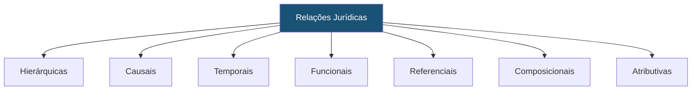

# Schema de Relações do SJIF

## Visão Geral

Este documento define os **tipos de relações** (arestas) utilizados no [Grafo de Conhecimento Jurídico](../cap28_grafo_conhecimento.md) do SJIF. As relações conectam as [entidades](entidades.md), formando a rede semântica que permite ao SJIF raciocinar sobre o Direito de forma contextual e relacional.

---

## Taxonomia de Relações

---

## 1. Relações Hierárquicas

Definem relações de classificação e generalização entre conceitos.

| Relação | Descrição | Exemplo | Direção |
|---------|-----------|---------|---------|
| `is-a` (é-um) | Relação taxonômica | Lei Ordinária *is-a* Norma | Entidade → Classe |
| `subtipo-de` | Especialização de conceito | Apelação *subtipo-de* Recurso | Específico → Geral |
| `instancia-de` | Instanciação de classe | Processo 0001234 *instancia-de* Processo | Instância → Classe |
| `generaliza` | Inverso de subtipo | Recurso *generaliza* Apelação | Geral → Específico |

---

## 2. Relações Causais

Definem relações de causa e efeito entre eventos e atos jurídicos.

| Relação | Descrição | Exemplo | Direção |
|---------|-----------|---------|---------|
| `causa` | Evento que origina outro | Fato Jurídico *causa* Efeito Jurídico | Causa → Efeito |
| `resulta-em` | Ato que gera consequência | Sentença *resulta-em* Coisa Julgada | Ato → Consequência |
| `fundamenta` | Base jurídica de decisão | Art. 186/CC *fundamenta* Sentença | Fundamento → Decisão |
| `motiva` | Razão de um ato | Dano *motiva* Pedido de Indenização | Motivo → Ato |
| `impugna` | Questiona ou contesta | Apelação *impugna* Sentença | Recurso → Decisão |
| `reforma` | Modifica decisão anterior | Acórdão *reforma* Sentença | Decisão Superior → Decisão Inferior |
| `mantém` | Confirma decisão anterior | Acórdão *mantém* Sentença | Decisão Superior → Decisão Inferior |
| `anula` | Invalida ato ou decisão | Acórdão *anula* Sentença | Decisão → Ato Anulado |

---

## 3. Relações Temporais

Definem a cronologia e sequência de eventos.

| Relação | Descrição | Exemplo | Direção |
|---------|-----------|---------|---------|
| `anterior-a` | Precedência temporal | Petição Inicial *anterior-a* Contestação | Anterior → Posterior |
| `posterior-a` | Subsequência temporal | Sentença *posterior-a* Instrução | Posterior → Anterior |
| `simultâneo-a` | Ocorrência no mesmo momento | — | Evento ↔ Evento |
| `vigente-desde` | Início de vigência | Lei *vigente-desde* Data | Norma → Data |
| `vigente-até` | Fim de vigência | Lei *vigente-até* Data (se revogada) | Norma → Data |
| `prazo-de` | Prazo associado ao ato | Contestação *prazo-de* 15 dias úteis | Ato → Prazo |

---

## 4. Relações Funcionais

Definem papéis e funções entre entidades.

| Relação | Descrição | Exemplo | Direção |
|---------|-----------|---------|---------|
| `representa` | Representação processual | Advogado *representa* Parte | Representante → Representado |
| `julga` | Ato de julgar | Juiz *julga* Processo | Julgador → Processo |
| `relata` | Função de relator | Desembargador *relata* Recurso | Relator → Processo |
| `propõe` | Iniciativa processual | Autor *propõe* Ação | Proponente → Ação |
| `contesta` | Defesa processual | Réu *contesta* Ação | Réu → Ação |
| `produz` | Produção de prova | Perito *produz* Laudo | Produtor → Produto |
| `distribui` | Distribuição de processo | Vara *distribui* Processo | Distribuidor → Processo |

---

## 5. Relações Referenciais

Definem citações, referências e conexões entre fontes.

| Relação | Descrição | Exemplo | Direção |
|---------|-----------|---------|---------|
| `cita` | Referência direta | Sentença *cita* Súmula 331/TST | Citador → Citado |
| `aplica` | Aplicação de norma | Sentença *aplica* Art. 5º/CF | Decisão → Norma |
| `interpreta` | Interpretação de norma | Acórdão *interpreta* Art. 37/CF | Decisão → Norma |
| `revoga` | Revogação de norma | Lei Nova *revoga* Lei Antiga | Nova → Antiga |
| `altera` | Modificação de norma | Lei *altera* Art. 10 da Lei X | Alteradora → Alterada |
| `referencia` | Referência indireta | Doutrina *referencia* Jurisprudência | Referenciador → Referenciado |
| `contradiz` | Contradição entre fontes | Acórdão A *contradiz* Acórdão B | Decisão ↔ Decisão |
| `confirma` | Convergência entre fontes | Doutrina *confirma* Jurisprudência | Confirmador → Confirmado |

---

## 6. Relações Composicionais (Parte-Todo)

Definem estrutura e composição.

| Relação | Descrição | Exemplo | Direção |
|---------|-----------|---------|---------|
| `parte-de` | Componente de um todo | Artigo *parte-de* Lei | Parte → Todo |
| `contém` | Inverso de parte-de | Lei *contém* Artigos | Todo → Parte |
| `composto-por` | Composição | Processo *composto-por* Peças | Todo → Componentes |
| `cláusula-de` | Componente contratual | Cláusula Penal *cláusula-de* Contrato | Cláusula → Contrato |
| `seção-de` | Subdivisão | Seção I *seção-de* Capítulo | Seção → Capítulo |

---

## 7. Relações Atributivas

Definem características e propriedades.

| Relação | Descrição | Exemplo | Direção |
|---------|-----------|---------|---------|
| `tem` | Posse de atributo | Processo *tem* Valor da Causa | Entidade → Atributo |
| `é-de` | Pertencimento | Decisão *é-de* Tribunal | Entidade → Proprietário |
| `classifica-se-como` | Classificação | Processo *classifica-se-como* Cível | Entidade → Classe |
| `tramita-em` | Local de tramitação | Processo *tramita-em* Vara | Processo → Órgão |
| `versa-sobre` | Tema do processo | Processo *versa-sobre* Danos Morais | Processo → Tema |

---

## Propriedades das Relações

Cada relação pode ter [propriedades](propriedades.md) adicionais:

| Propriedade | Tipo | Descrição |
|------------|------|-----------|
| `data` | Date | Quando a relação foi estabelecida |
| `confianca` | Float (0-1) | Grau de confiança da extração |
| `fonte` | String | De onde a relação foi extraída |
| `tipo_extracao` | Enum | Manual, Automática, Semi-automática |
| `verificada` | Boolean | Se foi verificada por humano |

---

## Referências Cruzadas

- [Capítulo 27: Ontologia Jurídica](../cap27_ontologia_juridica.md)
- [Capítulo 28: Grafo de Conhecimento Jurídico](../cap28_grafo_conhecimento.md)
- [Schema de Entidades](entidades.md)
- [Schema de Propriedades](propriedades.md)
- [Vocabulário Controlado](../vocabulario_controlado.md)

---
> Sigma—Juris Intelligence Framework (SJIF) v1.0 | Propriedade de Charles de Paula Eugênio — Sigma Sihf Soluções Analíticas Ltda
