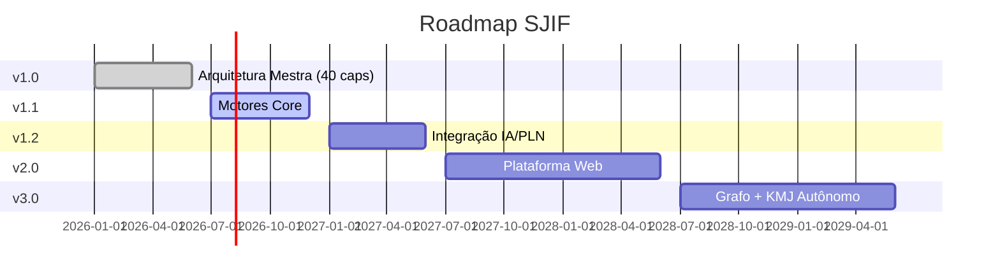

# 🔄 99_EVOLUCAO — Evolução e Roadmap do Framework

## Visão Geral

O diretório **99_EVOLUCAO** documenta a **evolução contínua** do Sigma—Juris Intelligence Framework (SJIF), incluindo notas de versão, roadmap de desenvolvimento, diretrizes de contribuição e registros de mudanças.

O SJIF é um framework vivo, em constante aprimoramento, e este diretório serve como memória institucional de sua evolução.

## 📂 Estrutura do Diretório

```
99_EVOLUCAO/
├── README.md                          # Este arquivo
├── versoes/
│   └── v1.0.0.md                      # Release notes — Versão 1.0.0
└── contribuicao/
    └── CONTRIBUTING.md                 # Guia de contribuição
```

## 📊 Linha do Tempo de Evolução



## 📖 Versões Publicadas

| Versão | Data | Descrição |
|--------|------|-----------|
| [v1.0.0](versoes/v1.0.0.md) | 2026-06-27 | Versão inaugural — Arquitetura completa com 40 capítulos |

## 📋 Documentos de Evolução

| Documento | Descrição |
|-----------|-----------|
| [CONTRIBUTING.md](contribuicao/CONTRIBUTING.md) | Como contribuir para o SJIF |
| [CHANGELOG.md](../../CHANGELOG.md) | Registro de todas as mudanças |
| [ROADMAP.md](../../ROADMAP.md) | Plano de evolução futura |
| [LICENSE.md](../../LICENSE.md) | Licença e propriedade intelectual |

## 🔗 Referências Cruzadas

- **Governança**: [00_GOVERNANCA/](../00_GOVERNANCA/) — Governança e filosofia do framework
- **Documentação**: [12_DOCUMENTACAO/](../12_DOCUMENTACAO/) — Manuais técnico e operacional
- **Casos de Uso**: [13_CASOS_DE_USO/](../13_CASOS_DE_USO/) — Aplicações práticas

---
> Sigma—Juris Intelligence Framework (SJIF) v1.0 | Propriedade de Charles de Paula Eugênio — Sigma Sihf Soluções Analíticas Ltda
