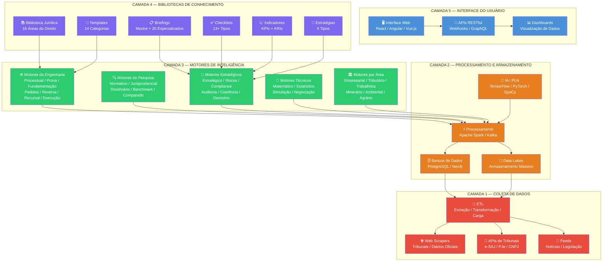
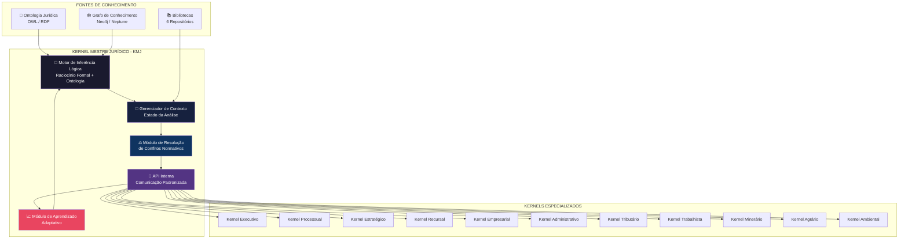
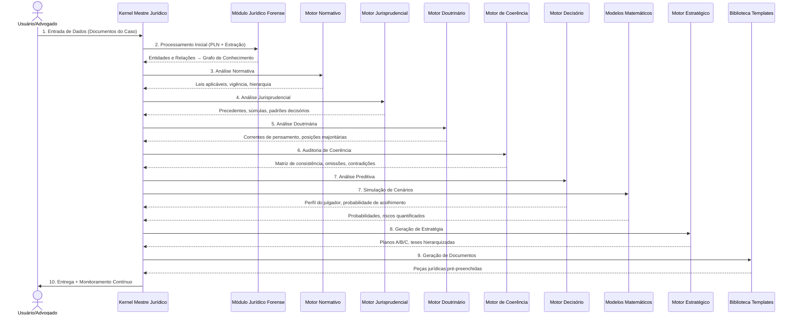
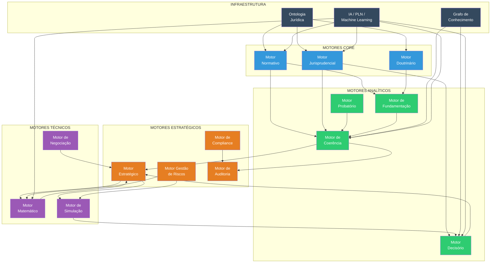
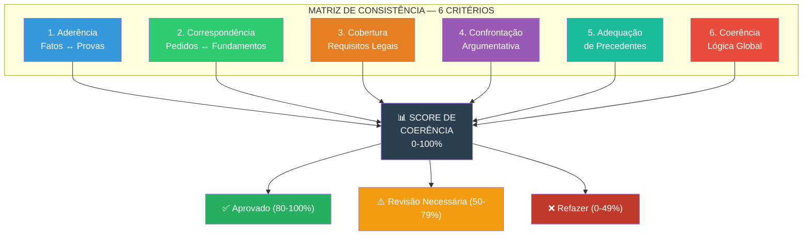
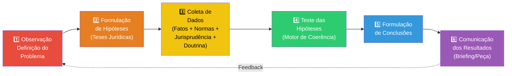
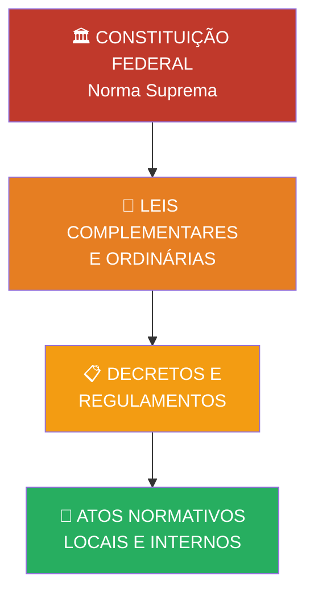

# ARCHITECTURE.md — Arquitetura Mestra do SJIF

## Sigma—Juris Intelligence Framework — Visão Arquitetural Completa

Este documento apresenta os diagramas visuais da arquitetura do SJIF, seus fluxos de operação e as interdependências entre componentes.

---

## 1. Diagrama de Camadas do SJIF

A arquitetura do SJIF é organizada em **5 camadas** hierárquicas, da infraestrutura de dados até a interface do usuário:

---

## 2. Arquitetura do Kernel Mestre Jurídico (KMJ)

O KMJ é o núcleo orquestrador que coordena todos os componentes do SJIF:

---

## 3. Fluxo de Orquestração — Pipeline de Análise Jurídica

Fluxo completo de 10 passos do KMJ ao processar uma demanda:

---

## 4. Pipeline do Módulo Jurídico Forense (MJF) — 10 Camadas

O MJF é o motor mais complexo do SJIF, operando em 10 camadas sequenciais:

**Detalhamento das Camadas:**

| Camada | Função | Entrada | Saída |
|:------:|--------|---------|-------|
| 1 | Instrução Processual | Documentos do caso | Tipo de ação, fase, competência, partes, pedidos |
| 2 | Análise Documental Integral | Todos os documentos | Mapa completo do processo (linha por linha) |
| 3 | Engenharia Reversa da Decisão | Decisões judiciais | Teses, provas aceitas/ignoradas, fundamentos |
| 4 | Auditoria Jurídica | Saídas anteriores | Vulnerabilidades, contradições, omissões |
| 5 | Pesquisa Jurisprudencial | Temas identificados | Precedentes, súmulas, temas repetitivos |
| 6 | Pesquisa Doutrinária | Temas identificados | Posições majoritárias/minoritárias |
| 7 | Análise Estratégica | Todas as saídas | Melhor tese, 2ª melhor, subsidiárias, Planos A/B/C |
| 8 | Simulação do Julgador | Perfil decisório | Probabilidade de acolhimento por tese |
| 9 | Simulação Parte Contrária | Análise estratégica | Melhor defesa possível, pontos de ataque |
| 10 | Construção da Peça | Estratégia definida | Petição, recurso, parecer (template preenchido) |

---

## 5. Mapa de Interdependências dos Motores

---

## 6. Matriz de Coerência Jurídica (MCJ)

O Motor de Coerência avalia 6 critérios para pontuar a qualidade técnica:

---

## 7. Fluxo do Método Científico Aplicado ao Direito

---

## 8. Pirâmide de Kelsen — Hierarquia Normativa

---

## 9. Tecnologias Subjacentes

| Camada | Tecnologias |
|--------|------------|
| **Frontend** | React.js / Angular / Vue.js, D3.js, Chart.js |
| **Backend** | Python, Node.js, APIs RESTful, GraphQL |
| **IA/ML** | scikit-learn, TensorFlow, PyTorch, NLTK, SpaCy |
| **Bancos de Dados** | PostgreSQL (relacional), Neo4j / Amazon Neptune (grafo) |
| **Processamento** | Apache Spark, Apache Kafka, Redis |
| **Infraestrutura** | Docker, Kubernetes, CI/CD |
| **Ontologia** | OWL, RDF, SPARQL |

---

## 10. Matriz de Risco — Probabilidade × Impacto

| | **Impacto Baixo** | **Impacto Médio** | **Impacto Alto** |
|---|:---:|:---:|:---:|
| **Probabilidade Alta** | 🟡 Médio | 🟠 Alto | 🔴 Crítico |
| **Probabilidade Média** | 🟢 Baixo | 🟡 Médio | 🟠 Alto |
| **Probabilidade Baixa** | 🟢 Baixo | 🟢 Baixo | 🟡 Médio |

---

> Sigma—Juris Intelligence Framework (SJIF) v1.0 | Propriedade de Charles de Paula Eugênio — Sigma Sihf Soluções Analíticas Ltda
