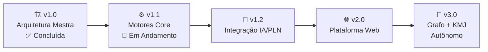

# 🛣️ ROADMAP — Sigma—Juris Intelligence Framework (SJIF)

## Plano de Evolução do Framework

Este documento apresenta o **roadmap de evolução** do Sigma—Juris Intelligence Framework (SJIF), delineando as futuras etapas de desenvolvimento, desde a implementação dos motores core até a plataforma web autônoma com Grafo de Conhecimento integrado.

---

## Visão de Longo Prazo



---

## v1.0 — Arquitetura Mestra ✅

**Status**: Concluída  
**Data**: Junho 2026

A versão inaugural do SJIF consolida toda a arquitetura mestra do framework:

- ✅ 40 capítulos completos em 7 blocos temáticos
- ✅ 14 diretórios organizacionais
- ✅ Especificação de 23+ motores especializados
- ✅ 6 bibliotecas de conhecimento
- ✅ 12 kernels (1 Principal + 11 Especializados)
- ✅ 5 casos de uso detalhados
- ✅ Documentação completa (manuais, guias, FAQ)
- ✅ Modelos matemáticos aplicados ao Direito
- ✅ Ontologia jurídica e especificação do Grafo de Conhecimento

Para detalhes, veja as [Release Notes v1.0.0](99_EVOLUCAO/versoes/v1.0.0.md).

---

## v1.1 — Implementação dos Motores Core ⚙️

**Status**: Planejado  
**Previsão**: Julho — Dezembro 2026

### Objetivos
Implementar os motores core do SJIF como módulos de software funcionais, capazes de processar dados jurídicos reais.

### Entregas Planejadas

| Motor | Prioridade | Descrição |
|-------|-----------|-----------|
| **Motor Normativo** | 🔴 Alta | Pesquisa e análise legislativa automatizada |
| **Motor Jurisprudencial** | 🔴 Alta | Pesquisa e análise de precedentes |
| **Motor de Coerência Jurídica (MCJ)** | 🔴 Alta | Auditoria de argumentação e consistência |
| **Motor Decisório Jurídico (MDJ)** | 🔴 Alta | Análise de padrões decisórios de julgadores |
| **Motor Probatório** | 🟡 Média | Classificação e valoração de provas |
| **Motor Processual** | 🟡 Média | Mapeamento e análise de fluxos processuais |
| **Motor de Gestão de Riscos** | 🟡 Média | Identificação e classificação de riscos |
| **Motor de Compliance** | 🟡 Média | Auditoria de conformidade regulatória |

### Marcos
- [ ] Arquitetura de microserviços definida
- [ ] Motor Normativo funcional (MVP)
- [ ] Motor Jurisprudencial funcional (MVP)
- [ ] MCJ e MDJ funcionais (MVP)
- [ ] APIs RESTful documentadas
- [ ] Testes de integração entre motores
- [ ] Documentação técnica atualizada

---

## v1.2 — Integração IA/PLN 🤖

**Status**: Planejado  
**Previsão**: Janeiro — Junho 2027

### Objetivos
Integrar modelos de **Inteligência Artificial** e **Processamento de Linguagem Natural** para potencializar os motores existentes e habilitar funcionalidades avançadas.

### Entregas Planejadas

| Funcionalidade | Descrição |
|----------------|-----------|
| **Busca Semântica** | Pesquisa por significado, não apenas palavras-chave |
| **Extração de Entidades Jurídicas (NER)** | Identificação automática de partes, datas, valores, normas |
| **Sumarização de Documentos** | Geração automática de resumos de documentos longos |
| **Classificação de Documentos** | Categorização automática por tipo, área, relevância |
| **Análise de Sentimento Jurídico** | Detecção de posicionamento em decisões e pareceres |
| **Modelos de Linguagem Especializados** | Fine-tuning de LLMs para domínio jurídico brasileiro |
| **OCR Avançado** | Extração de texto de documentos digitalizados |

### Tecnologias Alvo
- Hugging Face Transformers (modelos em pt-BR)
- SpaCy (pipeline de PLN jurídico)
- Sentence-BERT (embeddings semânticos)
- Fine-tuning de modelos de linguagem para domínio jurídico
- RAG (Retrieval Augmented Generation) com base de conhecimento jurídica

### Marcos
- [ ] Pipeline de PLN jurídico funcional
- [ ] Modelo NER jurídico treinado e validado
- [ ] Busca semântica integrada aos motores
- [ ] Sumarização automática funcional
- [ ] Avaliação de performance dos modelos
- [ ] Documentação de IA atualizada

---

## v2.0 — Plataforma Web 🌐

**Status**: Planejado  
**Previsão**: Julho 2027 — Junho 2028

### Objetivos
Desenvolver uma **plataforma web completa** com interface moderna, interativa e acessível para todos os módulos do SJIF.

### Entregas Planejadas

| Componente | Descrição |
|------------|-----------|
| **Dashboard Central** | Painel personalizável com KPIs, alertas e atalhos |
| **Gestão de Casos (MJF Web)** | Interface para criação, gestão e análise de casos |
| **Pesquisa Integrada** | Busca semântica com filtros inteligentes e visualização |
| **Editor de Documentos** | Editor integrado com templates, preenchimento guiado |
| **Visualizador de Grafo** | Interface interativa para explorar o Grafo de Conhecimento |
| **Sistema de Checklists** | Checklists interativos com tracking de progresso |
| **Relatórios e Analytics** | Geração de relatórios personalizados com gráficos |
| **Gestão de Usuários** | RBAC, perfis, preferências, logs de auditoria |
| **Notificações** | Sistema de alertas para prazos, riscos e eventos |
| **Mobile Responsive** | Interface adaptada para tablets e smartphones |

### Tecnologias Alvo
- **Frontend**: React/Next.js ou Vue.js/Nuxt
- **Backend**: Python (FastAPI) / Node.js
- **Banco de Dados**: PostgreSQL + Neo4j + Elasticsearch
- **Infraestrutura**: Docker + Kubernetes em nuvem
- **Autenticação**: OAuth 2.0 / SAML / LDAP

### Marcos
- [ ] Design system e protótipos de UI/UX
- [ ] Backend API completo
- [ ] Frontend funcional (MVP)
- [ ] Dashboard e gestão de casos
- [ ] Integração com motores v1.1
- [ ] Integração com IA v1.2
- [ ] Testes de aceitação do usuário (UAT)
- [ ] Beta fechado com usuários selecionados
- [ ] Lançamento público da plataforma

---

## v3.0 — Grafo de Conhecimento + KMJ Autônomo 🧠

**Status**: Planejado  
**Previsão**: Julho 2028 — Junho 2029

### Objetivos
Implementar o **Grafo de Conhecimento Jurídico** completo com Neo4j e o **Kernel Mestre Jurídico (KMJ) Autônomo**, capaz de orquestrar análises jurídicas de forma independente.

### Entregas Planejadas

| Componente | Descrição |
|------------|-----------|
| **Grafo de Conhecimento Completo** | Milhões de nós e relações entre entidades jurídicas |
| **Ontologia Jurídica Viva** | Ontologia que se adapta e evolui automaticamente |
| **KMJ Autônomo** | Kernel que orquestra análises sem intervenção manual |
| **Análise Preditiva** | Previsão de resultados jurídicos com ML avançado |
| **Recomendação de Estratégias** | Sugestão automática de estratégias baseada em histórico |
| **Aprendizado Contínuo** | Modelos que aprendem com o feedback dos usuários |
| **Integração com Tribunais** | Conexão direta com sistemas de tribunais (APIs) |
| **Multi-jurisdição** | Suporte a múltiplas jurisdições e sistemas jurídicos |

### Marcos
- [ ] Grafo de Conhecimento com 1M+ nós
- [ ] Ontologia com 10.000+ conceitos
- [ ] KMJ capaz de análise autônoma básica
- [ ] Modelos preditivos com >80% de acurácia
- [ ] Integração com pelo menos 5 tribunais
- [ ] Sistema de feedback e aprendizado contínuo
- [ ] Suporte multi-jurisdição (pelo menos 3 estados)

---

## Linha do Tempo Consolidada

```
2026 S1  │ v1.0 — Arquitetura Mestra ✅
         │
2026 S2  │ v1.1 — Motores Core ⚙️
         │
2027 S1  │ v1.2 — Integração IA/PLN 🤖
         │
2027 S2  │ v2.0 — Plataforma Web (Fase 1) 🌐
         │
2028 S1  │ v2.0 — Plataforma Web (Fase 2) 🌐
         │
2028 S2  │ v3.0 — Grafo + KMJ (Fase 1) 🧠
         │
2029 S1  │ v3.0 — Grafo + KMJ (Fase 2) 🧠
         │
2029 S2+ │ v4.0+ — Expansão e Inovação 🚀
```

---

## Como Contribuir

Quer ajudar a construir o futuro do SJIF? Consulte o [Guia de Contribuição](99_EVOLUCAO/contribuicao/CONTRIBUTING.md) para saber como participar.

---
> Sigma—Juris Intelligence Framework (SJIF) v1.0 | Propriedade de Charles de Paula Eugênio — Sigma Sihf Soluções Analíticas Ltda
