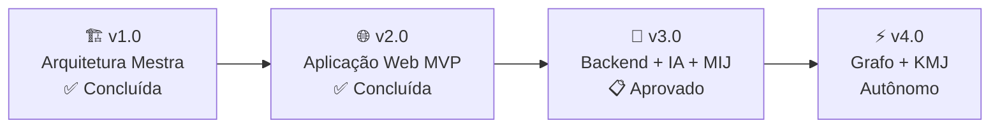

# 🛣️ ROADMAP — Sigma—Juris Intelligence Framework (SJIF)

## Plano de Evolução do Framework

Este documento apresenta o **roadmap de evolução** do Sigma—Juris Intelligence Framework (SJIF), delineando as etapas de desenvolvimento, desde a arquitetura mestra até a plataforma com Motor de Inteligência Judicial integrado.

---

## Visão de Longo Prazo



---

## v1.0 — Arquitetura Mestra ✅

**Status**: Concluída  
**Data**: Junho 2026

A versão inaugural do SJIF consolida toda a arquitetura mestra do framework:

- ✅ 40 capítulos completos em 7 blocos temáticos
- ✅ 16 diretórios organizacionais (227 arquivos)
- ✅ Especificação de 23+ motores especializados
- ✅ 6 bibliotecas de conhecimento (16 áreas do Direito)
- ✅ 12 kernels (1 Principal + 11 Especializados)
- ✅ 5 casos de uso detalhados
- ✅ Documentação completa (manuais, guias, FAQ)
- ✅ 10 modelos matemáticos aplicados ao Direito
- ✅ Ontologia jurídica e especificação do Grafo de Conhecimento
- ✅ Identidade visual (logo SVG + brand guidelines HTML)

---

## v2.0 — Aplicação Web MVP ✅

**Status**: Concluída  
**Data**: Junho 2026

Aplicação web funcional (SPA) com 18 arquivos (~344KB):

- ✅ Sistema de login com autenticação (2 perfis)
- ✅ Dashboard com 4 KPIs, gráficos Chart.js
- ✅ Upload & análise de documentos com drag-and-drop
- ✅ Classificador automático (30+ patterns de peças processuais)
- ✅ Motor de análise SJIF (9 elementos da Diretiva Mestra + MCJ)
- ✅ Taxonomia completa de 80 tipos de peças processuais em 6 categorias
- ✅ Gestão de processos com CRUD
- ✅ Portal de navegação da documentação
- ✅ Design premium dark mode (Navy Blue + Ouro Imperial)

### Taxonomia v2.0 — 80 tipos em 6 categorias

| Categoria | Tipos | Exemplos |
|-----------|-------|----------|
| Processo Judicial | 29 | Petição Inicial, Contestação, Apelação, RE, REsp, HC, MS |
| Processo Administrativo | 10 | Defesa Prévia, Recurso JARI/DRJ, Impugnação de Edital |
| Direito Tributário | 11 | Repetição de Indébito, Embargos à Execução Fiscal, CARF |
| Direito Ambiental | 10 | ACP Ambiental, PRAD, Licenciamento LP/LI/LO |
| Direito Minerário | 13 | Concessão de Lavra, PAE, RAL, Recurso à ANM |
| Ações Constitucionais | 7 | ADI, ADC, ADPF, Reclamação, Monitória |

---

## v3.0 — Backend + IA + Motor de Inteligência Judicial 🧠

**Status**: 📋 Aprovado  
**Previsão**: Julho — Outubro 2026 (~13 semanas)

### Decisões Aprovadas

| Questão | Decisão |
|---------|---------|
| **Tribunais Piloto** | TJMG + STJ + TJPA + TJMA |
| **Frequência de Coleta** | Diariamente para DJE, semanalmente para jurisprudência consolidada |
| **Deploy** | Docker Compose local (dev) → Cloud (produção) |
| **Monetização** | MIJ como módulo premium separado |
| **Compliance LGPD** | Identificação interna apenas — sem exposição ao usuário ou terceiros |

### Posição sobre Dados de Magistrados

> Os dados coletados referem-se exclusivamente a **decisões proferidas no exercício da função jurisdicional**, que são **informação pública** por natureza constitucional. O sistema analisa a **postura decisória funcional** do magistrado (tendências, padrões, matérias), e não aspectos de sua vida pessoal. Trata-se de **inteligência de dados cruzada a caso prático**, onde o histórico de decisões públicas fundamenta a estratégia processual. A identificação do magistrado é mantida **restrita internamente ao sistema**, sem exposição em interfaces de usuário ou compartilhamento com terceiros.

---

### 3.1 — Motor de Inteligência Judicial (MIJ) ⚖️

O **diferencial competitivo** do SJIF v3.0 — motor de análise preditiva baseado em histórico de decisões judiciais.

#### Fontes de Dados

| Fonte | Tribunais | Acesso |
|-------|-----------|--------|
| **DataJud (CNJ)** | Todos os tribunais brasileiros | API REST pública |
| **Diários de Justiça Eletrônicos** | TJMG, TJPA, TJMA, STJ | Scraping / API |
| **Jurisprudência dos Tribunais** | STJ, TJMG, TJPA, TJMA | APIs REST |
| **Consulta processual pública** | TJMG, TJPA, TJMA | Web scraping |

#### Módulos do MIJ

```
┌──────────────────────────────────────────────────────────┐
│            MOTOR DE INTELIGÊNCIA JUDICIAL (MIJ)           │
├───────────────┬──────────────────┬───────────────────────┤
│ COLETA        │ PROCESSAMENTO    │ ANÁLISE               │
│               │                  │                       │
│ • DataJud     │ • PLN/NER        │ • Perfil Magistrado   │
│ • DJE         │ • Classificação  │ • Score de Êxito      │
│ • APIs TJ     │ • Extração IA    │ • Simulador Recurso   │
│ • Web Scraping│ • Gemini API     │ • Relatório Estratég. │
└───────────────┴──────────────────┴───────────────────────┘
```

#### Métricas Matemáticas

**Score de Êxito por Tese (SET)**:

```
SET = Σ(wi × Ri) / Σ(wi) × 100

Onde:
  Ri = resultado do caso i (1=êxito, 0.5=parcial, 0=derrota)
  wi = peso baseado na recência (casos recentes pesam mais)
```

**Índice de Previsibilidade do Tribunal (IPT)**:

```
IPT = 1 - (σ_resultados / μ_resultados)

Quanto mais próximo de 1, mais previsível o tribunal na matéria.
```

**Taxa de Reforma (TR)**:

```
TR = Sentenças reformadas em 2ª instância / Total apeladas × 100
```

**Índice de Alinhamento Jurisprudencial (IAJ)**:

```
IAJ = Decisões alinhadas com STF/STJ / Total na matéria × 100
```

#### Telas do MIJ

| Tela | Descrição |
|------|-----------|
| **Dashboard Judicial** | Mapa de calor por tribunal, top teses, tendências |
| **Consulta de Magistrado** | Perfil com métricas, tendências, últimas decisões |
| **Simulador de Recurso** | Input → Score de êxito + teses + jurisprudência |
| **Relatório Estratégico** | PDF com análise completa + recomendações |

#### Integração com SJIF v2.0

```
Upload → Classificador → Analisador SJIF → MIJ → Relatório Integrado
                                              │
                                    ┌─────────┴─────────┐
                                    │ Score de Êxito +   │
                                    │ Perfil Magistrado + │
                                    │ Teses Recomendadas  │
                                    └─────────────────────┘
```

---

### 3.2 — Backend Real

| Componente | Tecnologia |
|-----------|-----------|
| API Server | Node.js + Express + TypeScript |
| Database | PostgreSQL (dados) + Redis (cache) |
| Queue | BullMQ (processamento assíncrono) |
| Auth | JWT + bcrypt |
| File Storage | MinIO / S3 |
| MIJ Scraping | Python (Scrapy/BeautifulSoup) |
| Deploy | Docker + Docker Compose |

### 3.3 — OCR de Documentos

| Feature | Tecnologia |
|---------|-----------|
| OCR de PDFs | Tesseract.js / Google Vision |
| Pré-processamento | Sharp / ImageMagick |
| Detecção de layout | Tesseract LSTM |
| Batch processing | Queue workers |

### 3.4 — Integração com IA

| Feature | Tecnologia |
|---------|-----------|
| Análise semântica | Gemini API |
| Sumarização | Gemini API |
| Classificação avançada | Fine-tuned model |
| NER especializado | Modelo treinado para Direito BR |

---

### Cronograma v3.0

```
Julho 2026    │ 3.1 Backend + Database + Auth JWT (2 sem)
              │
Julho 2026    │ 3.2 Migração frontend para React (1 sem)
              │
Agosto 2026   │ 3.3 OCR + IA Gemini/Tesseract (2 sem)
              │
Agosto 2026   │ 3.4 MIJ — Coleta: TJMG + STJ + TJPA + TJMA (2 sem)
              │
Setembro 2026 │ 3.5 MIJ — Processamento e análise (3 sem)
              │
Outubro 2026  │ 3.6 MIJ — Painel e relatórios (2 sem)
              │
Outubro 2026  │ 3.7 Testes e refinamento (1 sem)
```

---

## v4.0 — Grafo de Conhecimento + KMJ Autônomo ⚡

**Status**: Planejado  
**Previsão**: 2027

### Objetivos
Implementar o **Grafo de Conhecimento Jurídico** completo com Neo4j e o **Kernel Mestre Jurídico (KMJ) Autônomo**.

| Componente | Descrição |
|-----------|-----------|
| **Grafo de Conhecimento** | Milhões de nós e relações entre entidades jurídicas |
| **Ontologia Jurídica Viva** | Ontologia que se adapta e evolui automaticamente |
| **KMJ Autônomo** | Kernel que orquestra análises sem intervenção manual |
| **Análise Preditiva** | Previsão de resultados com ML avançado (>80% acurácia) |
| **Aprendizado Contínuo** | Modelos que aprendem com feedback dos usuários |
| **Multi-jurisdição** | Suporte a múltiplas jurisdições e sistemas jurídicos |
| **Integração com Tribunais** | Conexão direta via APIs oficiais |

---

## Linha do Tempo Consolidada

```
2026 Jun     │ v1.0 — Arquitetura Mestra ✅
             │
2026 Jun     │ v2.0 — Aplicação Web MVP ✅
             │
2026 Jul-Out │ v3.0 — Backend + IA + MIJ 📋
             │         ├─ TJMG + STJ + TJPA + TJMA
             │         ├─ OCR + Gemini API
             │         └─ Módulo Premium MIJ
             │
2027         │ v4.0 — Grafo + KMJ Autônomo
             │
2028+        │ v5.0+ — Expansão Nacional
```

---

## Como Contribuir

Quer ajudar a construir o futuro do SJIF? Consulte o [Guia de Contribuição](99_EVOLUCAO/contribuicao/CONTRIBUTING.md).

---
> Sigma—Juris Intelligence Framework (SJIF) v2.0 | Propriedade de Charles de Paula Eugênio — Sigma Sihf Soluções Analíticas Ltda — CNPJ: 01.851.824/0001-38
